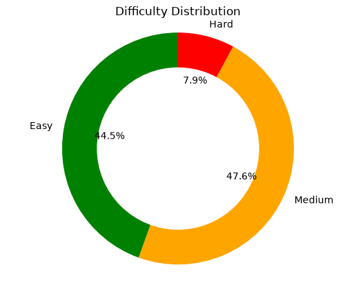

# 🧠 My LeetCode Solutions

Welcome to my LeetCode solutions repository!

---

## 🎯 Statistics

**Total Questions:** 486

### Difficulty Distribution

| Difficulty | Count |
|------------|-------|
| Easy | 251 |
| Medium | 204 |
| Hard | 31 |

### Topics Overview

| Topic | Number of Questions |
|-------|---------------------|
| [Array](#array) | 259 |
| [Backtracking](#backtracking) | 24 |
| [Binary Search](#binary-search) | 48 |
| [Binary Search Tree](#binary-search-tree) | 12 |
| [Binary Tree](#binary-tree) | 41 |
| [Bit Manipulation](#bit-manipulation) | 27 |
| [Bitmask](#bitmask) | 1 |
| [Brainteaser](#brainteaser) | 3 |
| [Breadth-First Search](#breadth-first-search) | 39 |
| [Bucket Sort](#bucket-sort) | 3 |
| [Combinatorics](#combinatorics) | 2 |
| [Counting](#counting) | 27 |
| [Counting Sort](#counting-sort) | 2 |
| [Data Stream](#data-stream) | 5 |
| [Database](#database) | 13 |
| [Depth-First Search](#depth-first-search) | 50 |
| [Design](#design) | 19 |
| [Divide and Conquer](#divide-and-conquer) | 14 |
| [Doubly-Linked List](#doubly-linked-list) | 2 |
| [Dynamic Programming](#dynamic-programming) | 49 |
| [Enumeration](#enumeration) | 6 |
| [Game Theory](#game-theory) | 3 |
| [Geometry](#geometry) | 1 |
| [Graph](#graph) | 5 |
| [Greedy](#greedy) | 27 |
| [Hash Function](#hash-function) | 4 |
| [Hash Table](#hash-table) | 102 |
| [Heap (Priority Queue)](#heap-(priority-queue)) | 16 |
| [Interactive](#interactive) | 2 |
| [Line Sweep](#line-sweep) | 1 |
| [Linked List](#linked-list) | 28 |
| [Math](#math) | 88 |
| [Matrix](#matrix) | 37 |
| [Memoization](#memoization) | 3 |
| [Merge Sort](#merge-sort) | 3 |
| [Monotonic Queue](#monotonic-queue) | 1 |
| [Monotonic Stack](#monotonic-stack) | 12 |
| [Number Theory](#number-theory) | 8 |
| [Ordered Set](#ordered-set) | 1 |
| [Prefix Sum](#prefix-sum) | 30 |
| [Queue](#queue) | 7 |
| [Quickselect](#quickselect) | 2 |
| [Radix Sort](#radix-sort) | 2 |
| [Recursion](#recursion) | 18 |
| [Rolling Hash](#rolling-hash) | 1 |
| [Shortest Path](#shortest-path) | 2 |
| [Simulation](#simulation) | 33 |
| [Sliding Window](#sliding-window) | 36 |
| [Sorting](#sorting) | 60 |
| [Stack](#stack) | 35 |
| [String](#string) | 101 |
| [String Matching](#string-matching) | 5 |
| [Tree](#tree) | 44 |
| [Trie](#trie) | 3 |
| [Two Pointers](#two-pointers) | 63 |
| [Union Find](#union-find) | 6 |

---

## 📚 Problems by Difficulty

<strong>Easy</strong> (Total: 251)

- **506. [Relative Ranks](./0506-relative-ranks)**
- **653. [Two Sum IV - Input is a BST](./0653-two-sum-iv-input-is-a-bst)**
- **1. [Two Sum](./1-two-sum)**
- **100. [Same Tree](./100-same-tree)**
- **101. [Symmetric Tree](./101-symmetric-tree)**
- **1013. [Fibonacci Number](./1013-fibonacci-number)**
- **1018. [Largest Perimeter Triangle](./1018-largest-perimeter-triangle)**
- **1019. [Squares of a Sorted Array](./1019-squares-of-a-sorted-array)**
- **1035. [Cousins in Binary Tree](./1035-cousins-in-binary-tree)**
- **104. [Maximum Depth of Binary Tree](./104-maximum-depth-of-binary-tree)**
- **1044. [Find Common Characters](./1044-find-common-characters)**
- **108. [Convert Sorted Array to Binary Search Tree](./108-convert-sorted-array-to-binary-search-tree)**
- **1086. [Divisor Game](./1086-divisor-game)**
- **110. [Balanced Binary Tree](./110-balanced-binary-tree)**
- **111. [Minimum Depth of Binary Tree](./111-minimum-depth-of-binary-tree)**
- **112. [Path Sum](./112-path-sum)**
- **1127. [Last Stone Weight](./1127-last-stone-weight)**
- **1128. [Remove All Adjacent Duplicates In String](./1128-remove-all-adjacent-duplicates-in-string)**
- **118. [Pascal's Triangle](./118-pascals-triangle)**
- **119. [Pascal's Triangle II](./119-pascals-triangle-ii)**
- **1195. [Distribute Candies to People](./1195-distribute-candies-to-people)**
- **121. [Best Time to Buy and Sell Stock](./121-best-time-to-buy-and-sell-stock)**
- **1210. [Mean of Array After Removing Some Elements](./1210-mean-of-array-after-removing-some-elements)**
- **1227. [Number of Equivalent Domino Pairs](./1227-number-of-equivalent-domino-pairs)**
- **1236. [N-th Tribonacci Number](./1236-n-th-tribonacci-number)**
- **125. [Valid Palindrome](./125-valid-palindrome)**
- **13. [Roman to Integer](./13-roman-to-integer)**
- **1329. [Minimum Cost to Move Chips to The Same Position](./1329-minimum-cost-to-move-chips-to-the-same-position)**
- **1349. [Check If It Is a Straight Line](./1349-check-if-it-is-a-straight-line)**
- **1353. [Find Resultant Array After Removing Anagrams](./1353-find-resultant-array-after-removing-anagrams)**
- **136. [Single Number](./136-single-number)**
- **1392. [Find the Difference of Two Arrays](./1392-find-the-difference-of-two-arrays)**
- **14. [Longest Common Prefix](./14-longest-common-prefix)**
- **141. [Linked List Cycle](./141-linked-list-cycle)**
- **144. [Binary Tree Preorder Traversal](./144-binary-tree-preorder-traversal)**
- **1448. [Maximum 69 Number](./1448-maximum-69-number)**
- **145. [Binary Tree Postorder Traversal](./145-binary-tree-postorder-traversal)**
- **1468. [Check If N and Its Double Exist](./1468-check-if-n-and-its-double-exist)**
- **1500. [Count Largest Group](./1500-count-largest-group)**
- **1510. [Find Lucky Integer in an Array](./1510-find-lucky-integer-in-an-array)**
- **160. [Intersection of Two Linked Lists](./160-intersection-of-two-linked-lists)**
- **1603. [Running Sum of 1d Array](./1603-running-sum-of-1d-array)**
- **1625. [Group Sold Products By The Date](./1625-group-sold-products-by-the-date)**
- **1646. [Kth Missing Positive Number](./1646-kth-missing-positive-number)**
- **1656. [Count Good Triplets](./1656-count-good-triplets)**
- **1677. [Matrix Diagonal Sum](./1677-matrix-diagonal-sum)**
- **168. [Excel Sheet Column Title](./168-excel-sheet-column-title)**
- **1682. [Most Visited Sector in  a Circular Track](./1682-most-visited-sector-in-a-circular-track)**
- **169. [Majority Element](./169-majority-element)**
- **1708. [Design Parking System](./1708-design-parking-system)**
- **171. [Excel Sheet Column Number](./171-excel-sheet-column-number)**
- **1720. [Crawler Log Folder](./1720-crawler-log-folder)**
- **1741. [Sort Array by Increasing Frequency](./1741-sort-array-by-increasing-frequency)**
- **175. [Combine Two Tables](./175-combine-two-tables)**
- **1755. [Defuse the Bomb](./1755-defuse-the-bomb)**
- **1781. [Check If Two String Arrays are Equivalent](./1781-check-if-two-string-arrays-are-equivalent)**
- **1791. [Richest Customer Wealth](./1791-richest-customer-wealth)**
- **181. [Employees Earning More Than Their Managers](./181-employees-earning-more-than-their-managers)**
- **182. [Duplicate Emails](./182-duplicate-emails)**
- **1829. [Maximum Units on a Truck](./1829-maximum-units-on-a-truck)**
- **183. [Customers Who Never Order](./183-customers-who-never-order)**
- **1848. [Sum of Unique Elements](./1848-sum-of-unique-elements)**
- **1873. [Longest Nice Substring](./1873-longest-nice-substring)**
- **1878. [Check if Array Is Sorted and Rotated](./1878-check-if-array-is-sorted-and-rotated)**
- **1894. [Merge Strings Alternately](./1894-merge-strings-alternately)**
- **190. [Reverse Bits](./190-reverse-bits)**
- **1908. [Recyclable and Low Fat Products](./1908-recyclable-and-low-fat-products)**
- **191. [Number of 1 Bits](./191-number-of-1-bits)**
- **1916. [Find Center of Star Graph](./1916-find-center-of-star-graph)**
- **196. [Delete Duplicate Emails](./196-delete-duplicate-emails)**
- **1965. [Sum of Digits in Base K](./1965-sum-of-digits-in-base-k)**
- **1970. [Sorting the Sentence](./1970-sorting-the-sentence)**
- **1993. [Sum of All Subset XOR Totals](./1993-sum-of-all-subset-xor-totals)**
- **20. [Valid Parentheses](./20-valid-parentheses)**
- **2010. [Check if Word Equals Summation of Two Words](./2010-check-if-word-equals-summation-of-two-words)**
- **202. [Happy Number](./202-happy-number)**
- **203. [Remove Linked List Elements](./203-remove-linked-list-elements)**
- **205. [Isomorphic Strings](./205-isomorphic-strings)**
- **206. [Reverse Linked List](./206-reverse-linked-list)**
- **21. [Merge Two Sorted Lists](./21-merge-two-sorted-lists)**
- **2106. [Find Greatest Common Divisor of Array](./2106-find-greatest-common-divisor-of-array)**
- **2121. [Find if Path Exists in Graph](./2121-find-if-path-exists-in-graph)**
- **2137. [Final Value of Variable After Performing Operations](./2137-final-value-of-variable-after-performing-operations)**
- **2144. [Maximum Difference Between Increasing Elements](./2144-maximum-difference-between-increasing-elements)**
- **217. [Contains Duplicate](./217-contains-duplicate)**
- **219. [Contains Duplicate II](./219-contains-duplicate-ii)**
- **222. [Count Complete Tree Nodes](./222-count-complete-tree-nodes)**
- **225. [Implement Stack using Queues](./225-implement-stack-using-queues)**
- **226. [Invert Binary Tree](./226-invert-binary-tree)**
- **2277. [Count Equal and Divisible Pairs in an Array](./2277-count-equal-and-divisible-pairs-in-an-array)**
- **228. [Summary Ranges](./228-summary-ranges)**
- **2308. [Divide Array Into Equal Pairs](./2308-divide-array-into-equal-pairs)**
- **231. [Power of Two](./231-power-of-two)**
- **232. [Implement Queue using Stacks](./232-implement-queue-using-stacks)**
- **2320. [Find All K-Distant Indices in an Array](./2320-find-all-k-distant-indices-in-an-array)**
- **2323. [Minimum Bit Flips to Convert Number](./2323-minimum-bit-flips-to-convert-number)**
- **2331. [Intersection of Multiple Arrays](./2331-intersection-of-multiple-arrays)**
- **234. [Palindrome Linked List](./234-palindrome-linked-list)**
- **2350. [Find Closest Number to Zero](./2350-find-closest-number-to-zero)**
- **2377. [Check if Number Has Equal Digit Count and Digit Value](./2377-check-if-number-has-equal-digit-count-and-digit-value)**
- **2383. [Add Two Integers](./2383-add-two-integers)**
- **2416. [Evaluate Boolean Binary Tree](./2416-evaluate-boolean-binary-tree)**
- **242. [Valid Anagram](./242-valid-anagram)**
- **2436. [Make Array Zero by Subtracting Equal Amounts](./2436-make-array-zero-by-subtracting-equal-amounts)**
- **2486. [Most Frequent Even Element](./2486-most-frequent-even-element)**
- **2532. [Remove Letter To Equalize Frequency](./2532-remove-letter-to-equalize-frequency)**
- **2551. [Apply Operations to an Array](./2551-apply-operations-to-an-array)**
- **257. [Binary Tree Paths](./257-binary-tree-paths)**
- **258. [Add Digits](./258-add-digits)**
- **2580. [Circular Sentence](./2580-circular-sentence)**
- **26. [Remove Duplicates from Sorted Array](./26-remove-duplicates-from-sorted-array)**
- **2614. [Maximum Count of Positive Integer and Negative Integer](./2614-maximum-count-of-positive-integer-and-negative-integer)**
- **263. [Ugly Number](./263-ugly-number)**
- **2630. [Alternating Digit Sum](./2630-alternating-digit-sum)**
- **2634. [Minimum Common Value](./2634-minimum-common-value)**
- **2645. [Pass the Pillow](./2645-pass-the-pillow)**
- **2650. [Split With Minimum Sum](./2650-split-with-minimum-sum)**
- **268. [Missing Number](./268-missing-number)**
- **27. [Remove Element](./27-remove-element)**
- **2714. [Left and Right Sum Differences](./2714-left-and-right-sum-differences)**
- **278. [First Bad Version](./278-first-bad-version)**
- **2791. [Find the Losers of the Circular Game](./2791-find-the-losers-of-the-circular-game)**
- **28. [Find the Index of the First Occurrence in a String](./28-find-the-index-of-the-first-occurrence-in-a-string)**
- **2812. [Find the Maximum Achievable Number](./2812-find-the-maximum-achievable-number)**
- **283. [Move Zeroes](./283-move-zeroes)**
- **2836. [Neither Minimum nor Maximum](./2836-neither-minimum-nor-maximum)**
- **2876. [Number of Employees Who Met the Target](./2876-number-of-employees-who-met-the-target)**
- **290. [Word Pattern](./290-word-pattern)**
- **292. [Nim Game](./292-nim-game)**
- **2998. [  Count Symmetric Integers](./2998-count-symmetric-integers)**
- **303. [Range Sum Query - Immutable](./303-range-sum-query-immutable)**
- **3154. [Maximum Value of an Ordered Triplet I](./3154-maximum-value-of-an-ordered-triplet-i)**
- **3236. [Smallest Missing Integer Greater Than Sequential Prefix Sum](./3236-smallest-missing-integer-greater-than-sequential-prefix-sum)**
- **3242. [Count Elements With Maximum Frequency](./3242-count-elements-with-maximum-frequency)**
- **326. [Power of Three](./326-power-of-three)**
- **3321. [Type of Triangle](./3321-type-of-triangle)**
- **3367. [Find the Sum of Encrypted Integers](./3367-find-the-sum-of-encrypted-integers)**
- **3379. [Score of a String](./3379-score-of-a-string)**
- **338. [Counting Bits](./338-counting-bits)**
- **3381. [Shortest Subarray With OR at Least K I](./3381-shortest-subarray-with-or-at-least-k-i)**
- **342. [Power of Four](./342-power-of-four)**
- **344. [Reverse String](./344-reverse-string)**
- **345. [Reverse Vowels of a String](./345-reverse-vowels-of-a-string)**
- **3450. [Find the Child Who Has the Ball After K Seconds](./3450-find-the-child-who-has-the-ball-after-k-seconds)**
- **349. [Intersection of Two Arrays](./349-intersection-of-two-arrays)**
- **35. [Search Insert Position](./35-search-insert-position)**
- **350. [Intersection of Two Arrays II](./350-intersection-of-two-arrays-ii)**
- **3533. [Snake in Matrix](./3533-snake-in-matrix)**
- **3581. [The Two Sneaky Numbers of Digitville](./3581-the-two-sneaky-numbers-of-digitville)**
- **3600. [Find the K-th Character in String Game I](./3600-find-the-k-th-character-in-string-game-i)**
- **3625. [Stone Removal Game](./3625-stone-removal-game)**
- **3644. [Minimum Positive Sum Subarray ](./3644-minimum-positive-sum-subarray)**
- **3656. [Minimum Number of Operations to Make Elements in Array Distinct](./3656-minimum-number-of-operations-to-make-elements-in-array-distinct)**
- **367. [Valid Perfect Square](./367-valid-perfect-square)**
- **3736. [Find Valid Pair of Adjacent Digits in String](./3736-find-valid-pair-of-adjacent-digits-in-string)**
- **374. [Guess Number Higher or Lower](./374-guess-number-higher-or-lower)**
- **3747. [Maximum Difference Between Adjacent Elements in a Circular Array](./3747-maximum-difference-between-adjacent-elements-in-a-circular-array)**
- **3753. [Maximum Difference Between Even and Odd Frequency I](./3753-maximum-difference-between-even-and-odd-frequency-i)**
- **3778. [Transform Array by Parity](./3778-transform-array-by-parity)**
- **3811. [Reverse Degree of a String](./3811-reverse-degree-of-a-string)**
- **383. [Ransom Note](./383-ransom-note)**
- **387. [First Unique Character in a String](./387-first-unique-character-in-a-string)**
- **3871. [Minimum Deletions for At Most K Distinct Characters](./3871-minimum-deletions-for-at-most-k-distinct-characters)**
- **3872. [Find Most Frequent Vowel and Consonant](./3872-find-most-frequent-vowel-and-consonant)**
- **389. [Find the Difference](./389-find-the-difference)**
- **392. [Is Subsequence](./392-is-subsequence)**
- **3973. [Flip Square Submatrix Vertically](./3973-flip-square-submatrix-vertically)**
- **401. [Binary Watch](./401-binary-watch)**
- **404. [Sum of Left Leaves](./404-sum-of-left-leaves)**
- **405. [Convert a Number to Hexadecimal](./405-convert-a-number-to-hexadecimal)**
- **409. [Longest Palindrome](./409-longest-palindrome)**
- **412. [Fizz Buzz](./412-fizz-buzz)**
- **414. [Third Maximum Number](./414-third-maximum-number)**
- **415. [Add Strings](./415-add-strings)**
- **434. [Number of Segments in a String](./434-number-of-segments-in-a-string)**
- **441. [Arranging Coins](./441-arranging-coins)**
- **448. [Find All Numbers Disappeared in an Array](./448-find-all-numbers-disappeared-in-an-array)**
- **455. [Assign Cookies](./455-assign-cookies)**
- **459. [Repeated Substring Pattern](./459-repeated-substring-pattern)**
- **461. [Hamming Distance](./461-hamming-distance)**
- **463. [Island Perimeter](./463-island-perimeter)**
- **482. [License Key Formatting](./482-license-key-formatting)**
- **485. [Max Consecutive Ones](./485-max-consecutive-ones)**
- **492. [Construct the Rectangle](./492-construct-the-rectangle)**
- **495. [Teemo Attacking](./495-teemo-attacking)**
- **496. [Next Greater Element I](./496-next-greater-element-i)**
- **500. [Keyboard Row](./500-keyboard-row)**
- **501. [Find Mode in Binary Search Tree](./501-find-mode-in-binary-search-tree)**
- **506. [Relative Ranks](./506-relative-ranks)**
- **507. [Perfect Number](./507-perfect-number)**
- **530. [Minimum Absolute Difference in BST](./530-minimum-absolute-difference-in-bst)**
- **541. [Reverse String II](./541-reverse-string-ii)**
- **543. [Diameter of Binary Tree](./543-diameter-of-binary-tree)**
- **557. [Reverse Words in a String III](./557-reverse-words-in-a-string-iii)**
- **561. [Array Partition](./561-array-partition)**
- **563. [Binary Tree Tilt](./563-binary-tree-tilt)**
- **572. [Subtree of Another Tree](./572-subtree-of-another-tree)**
- **575. [Distribute Candies](./575-distribute-candies)**
- **577. [Employee Bonus](./577-employee-bonus)**
- **58. [Length of Last Word](./58-length-of-last-word)**
- **594. [Longest Harmonious Subsequence](./594-longest-harmonious-subsequence)**
- **595. [Big Countries](./595-big-countries)**
- **598. [Range Addition II](./598-range-addition-ii)**
- **599. [Minimum Index Sum of Two Lists](./599-minimum-index-sum-of-two-lists)**
- **605. [Can Place Flowers](./605-can-place-flowers)**
- **617. [Merge Two Binary Trees](./617-merge-two-binary-trees)**
- **620. [Not Boring Movies](./620-not-boring-movies)**
- **628. [Maximum Product of Three Numbers](./628-maximum-product-of-three-numbers)**
- **637. [Average of Levels in Binary Tree](./637-average-of-levels-in-binary-tree)**
- **643. [Maximum Average Subarray I](./643-maximum-average-subarray-i)**
- **653. [Two Sum IV - Input is a BST](./653-two-sum-iv-input-is-a-bst)**
- **66. [Plus One](./66-plus-one)**
- **67. [Add Binary](./67-add-binary)**
- **674. [Longest Continuous Increasing Subsequence](./674-longest-continuous-increasing-subsequence)**
- **682. [Baseball Game](./682-baseball-game)**
- **69. [Sqrt(x)](./69-sqrtx)**
- **70. [Climbing Stairs](./70-climbing-stairs)**
- **724. [Find Pivot Index](./724-find-pivot-index)**
- **728. [Self Dividing Numbers](./728-self-dividing-numbers)**
- **733. [Flood Fill](./733-flood-fill)**
- **742. [To Lower Case](./742-to-lower-case)**
- **747. [Min Cost Climbing Stairs](./747-min-cost-climbing-stairs)**
- **774. [Maximum Depth of N-ary Tree](./774-maximum-depth-of-n-ary-tree)**
- **775. [N-ary Tree Preorder Traversal](./775-n-ary-tree-preorder-traversal)**
- **776. [N-ary Tree Postorder Traversal](./776-n-ary-tree-postorder-traversal)**
- **782. [Jewels and Stones](./782-jewels-and-stones)**
- **783. [Search in a Binary Search Tree](./783-search-in-a-binary-search-tree)**
- **789. [Kth Largest Element in a Stream](./789-kth-largest-element-in-a-stream)**
- **792. [Binary Search](./792-binary-search)**
- **799. [Minimum Distance Between BST Nodes](./799-minimum-distance-between-bst-nodes)**
- **812. [Rotate String](./812-rotate-string)**
- **816. [Design HashSet](./816-design-hashset)**
- **817. [Design HashMap](./817-design-hashmap)**
- **822. [Unique Morse Code Words](./822-unique-morse-code-words)**
- **83. [Remove Duplicates from Sorted List](./83-remove-duplicates-from-sorted-list)**
- **841. [Shortest Distance to a Character](./841-shortest-distance-to-a-character)**
- **861. [Flipping an Image](./861-flipping-an-image)**
- **874. [Backspace String Compare](./874-backspace-string-compare)**
- **88. [Merge Sorted Array](./88-merge-sorted-array)**
- **890. [Lemonade Change](./890-lemonade-change)**
- **898. [Transpose Matrix](./898-transpose-matrix)**
- **9. [Palindrome Number](./9-palindrome-number)**
- **908. [Middle of the Linked List](./908-middle-of-the-linked-list)**
- **94. [Binary Tree Inorder Traversal](./94-binary-tree-inorder-traversal)**
- **941. [Sort Array By Parity](./941-sort-array-by-parity)**
- **944. [Smallest Range I](./944-smallest-range-i)**
- **950. [X of a Kind in a Deck of Cards](./950-x-of-a-kind-in-a-deck-of-cards)**
- **958. [Sort Array By Parity II](./958-sort-array-by-parity-ii)**
- **961. [Long Pressed Name](./961-long-pressed-name)**
- **969. [Number of Recent Calls](./969-number-of-recent-calls)**
- **975. [Range Sum of BST](./975-range-sum-of-bst)**

<strong>Medium</strong> (Total: 204)

- **1009. [Pancake Sorting](./1009-pancake-sorting)**
- **102. [Binary Tree Level Order Traversal](./102-binary-tree-level-order-traversal)**
- **1028. [Interval List Intersections](./1028-interval-list-intersections)**
- **1033. [Broken Calculator](./1033-broken-calculator)**
- **1036. [Rotting Oranges](./1036-rotting-oranges)**
- **1046. [Max Consecutive Ones III](./1046-max-consecutive-ones-iii)**
- **105. [Construct Binary Tree from Preorder and Inorder Traversal](./105-construct-binary-tree-from-preorder-and-inorder-traversal)**
- **1056. [Capacity To Ship Packages Within D Days](./1056-capacity-to-ship-packages-within-d-days)**
- **1072. [Next Greater Node In Linked List](./1072-next-greater-node-in-linked-list)**
- **11. [Container With Most Water](./11-container-with-most-water)**
- **1129. [Longest String Chain](./1129-longest-string-chain)**
- **1159. [Smallest Subsequence of Distinct Characters](./1159-smallest-subsequence-of-distinct-characters)**
- **116. [Populating Next Right Pointers in Each Node](./116-populating-next-right-pointers-in-each-node)**
- **12. [Integer to Roman](./12-integer-to-roman)**
- **120. [Triangle](./120-triangle)**
- **1218. [Lowest Common Ancestor of Deepest Leaves](./1218-lowest-common-ancestor-of-deepest-leaves)**
- **122. [Best Time to Buy and Sell Stock II](./122-best-time-to-buy-and-sell-stock-ii)**
- **1242. [Matrix Block Sum](./1242-matrix-block-sum)**
- **1250. [Longest Common Subsequence](./1250-longest-common-subsequence)**
- **1254. [Deepest Leaves Sum](./1254-deepest-leaves-sum)**
- **128. [Longest Consecutive Sequence](./128-longest-consecutive-sequence)**
- **130. [Surrounded Regions](./130-surrounded-regions)**
- **131. [Palindrome Partitioning](./131-palindrome-partitioning)**
- **1320. [Remove All Adjacent Duplicates in String II](./1320-remove-all-adjacent-duplicates-in-string-ii)**
- **1321. [Get Equal Substrings Within Budget](./1321-get-equal-substrings-within-budget)**
- **1351. [Replace the Substring for Balanced String](./1351-replace-the-substring-for-balanced-string)**
- **1354. [Find Players With Zero or One Losses](./1354-find-players-with-zero-or-one-losses)**
- **1370. [Count Number of Nice Subarrays](./1370-count-number-of-nice-subarrays)**
- **1380. [Number of Closed Islands](./1380-number-of-closed-islands)**
- **1408. [Find the Smallest Divisor Given a Threshold](./1408-find-the-smallest-divisor-given-a-threshold)**
- **142. [Linked List Cycle II](./142-linked-list-cycle-ii)**
- **143. [Reorder List](./143-reorder-list)**
- **1477. [Product of the Last K Numbers](./1477-product-of-the-last-k-numbers)**
- **148. [Sort List](./148-sort-list)**
- **1497. [Design a Stack With Increment Operation](./1497-design-a-stack-with-increment-operation)**
- **15. [3Sum](./15-3sum)**
- **150. [Evaluate Reverse Polish Notation](./150-evaluate-reverse-polish-notation)**
- **153. [Find Minimum in Rotated Sorted Array](./153-find-minimum-in-rotated-sorted-array)**
- **155. [Min Stack](./155-min-stack)**
- **1567. [Maximum Number of Vowels in a Substring of Given Length](./1567-maximum-number-of-vowels-in-a-substring-of-given-length)**
- **1582. [Design Browser History](./1582-design-browser-history)**
- **1586. [Longest Subarray of 1's After Deleting One Element](./1586-longest-subarray-of-1s-after-deleting-one-element)**
- **16. [3Sum Closest](./16-3sum-closest)**
- **1605. [Minimum Number of Days to Make m Bouquets](./1605-minimum-number-of-days-to-make-m-bouquets)**
- **1615. [Range Sum of Sorted Subarray Sums](./1615-range-sum-of-sorted-subarray-sums)**
- **162. [Find Peak Element](./162-find-peak-element)**
- **1621. [Number of Subsequences That Satisfy the Given Sum Condition](./1621-number-of-subsequences-that-satisfy-the-given-sum-condition)**
- **164. [Maximum Gap](./164-maximum-gap)**
- **167. [Two Sum II - Input Array Is Sorted](./167-two-sum-ii-input-array-is-sorted)**
- **1675. [Magnetic Force Between Two Balls](./1675-magnetic-force-between-two-balls)**
- **17. [Letter Combinations of a Phone Number](./17-letter-combinations-of-a-phone-number)**
- **176. [Second Highest Salary](./176-second-highest-salary)**
- **177. [Nth Highest Salary](./177-nth-highest-salary)**
- **1776. [Minimum Operations to Reduce X to Zero](./1776-minimum-operations-to-reduce-x-to-zero)**
- **178. [Rank Scores](./178-rank-scores)**
- **1787. [Sum of Absolute Differences in a Sorted Array](./1787-sum-of-absolute-differences-in-a-sorted-array)**
- **18. [4Sum](./18-4sum)**
- **187. [Repeated DNA Sequences](./187-repeated-dna-sequences)**
- **1876. [Map of Highest Peak](./1876-map-of-highest-peak)**
- **189. [Rotate Array](./189-rotate-array)**
- **19. [Remove Nth Node From End of List](./19-remove-nth-node-from-end-of-list)**
- **1951. [Find the Winner of the Circular Game](./1951-find-the-winner-of-the-circular-game)**
- **198. [House Robber](./198-house-robber)**
- **199. [Binary Tree Right Side View](./199-binary-tree-right-side-view)**
- **2. [Add Two Numbers](./2-add-two-numbers)**
- **200. [Number of Islands](./200-number-of-islands)**
- **2000. [Minimum Speed to Arrive on Time](./2000-minimum-speed-to-arrive-on-time)**
- **204. [Count Primes](./204-count-primes)**
- **2047. [Find a Peak Element II](./2047-find-a-peak-element-ii)**
- **208. [Implement Trie (Prefix Tree)](./208-implement-trie-prefix-tree)**
- **209. [Minimum Size Subarray Sum](./209-minimum-size-subarray-sum)**
- **2103. [Find All Groups of Farmland](./2103-find-all-groups-of-farmland)**
- **213. [House Robber II](./213-house-robber-ii)**
- **2134. [Maximize the Confusion of an Exam](./2134-maximize-the-confusion-of-an-exam)**
- **215. [Kth Largest Element in an Array](./215-kth-largest-element-in-an-array)**
- **216. [Combination Sum III](./216-combination-sum-iii)**
- **22. [Generate Parentheses](./22-generate-parentheses)**
- **2211. [K Radius Subarray Averages](./2211-k-radius-subarray-averages)**
- **2245. [Destroying Asteroids](./2245-destroying-asteroids)**
- **2249. [Count the Hidden Sequences](./2249-count-the-hidden-sequences)**
- **2261. [All Divisions With the Highest Score of a Binary Array](./2261-all-divisions-with-the-highest-score-of-a-binary-array)**
- **2265. [Partition Array According to Given Pivot](./2265-partition-array-according-to-given-pivot)**
- **227. [Basic Calculator II](./227-basic-calculator-ii)**
- **2278. [Find Three Consecutive Integers That Sum to a Given Number](./2278-find-three-consecutive-integers-that-sum-to-a-given-number)**
- **229. [Majority Element II](./229-majority-element-ii)**
- **2294. [Minimum Time to Complete Trips](./2294-minimum-time-to-complete-trips)**
- **2342. [Minimum Average Difference](./2342-minimum-average-difference)**
- **2343. [Count Unguarded Cells in the Grid](./2343-count-unguarded-cells-in-the-grid)**
- **235. [Lowest Common Ancestor of a Binary Search Tree](./235-lowest-common-ancestor-of-a-binary-search-tree)**
- **2351. [Number of Ways to Buy Pens and Pencils](./2351-number-of-ways-to-buy-pens-and-pencils)**
- **2358. [Number of Ways to Split Array](./2358-number-of-ways-to-split-array)**
- **236. [Lowest Common Ancestor of a Binary Tree](./236-lowest-common-ancestor-of-a-binary-tree)**
- **238. [Product of Array Except Self](./238-product-of-array-except-self)**
- **24. [Swap Nodes in Pairs](./24-swap-nodes-in-pairs)**
- **240. [Search a 2D Matrix II](./240-search-a-2d-matrix-ii)**
- **2429. [Design a Food Rating System](./2429-design-a-food-rating-system)**
- **2465. [Shifting Letters II](./2465-shifting-letters-ii)**
- **2470. [Removing Stars From a String](./2470-removing-stars-from-a-string)**
- **2478. [Longest Nice Subarray](./2478-longest-nice-subarray)**
- **2530. [Minimize Maximum of Array](./2530-minimize-maximum-of-array)**
- **2546. [Number of Subarrays With GCD Equal to K](./2546-number-of-subarrays-with-gcd-equal-to-k)**
- **2552. [Maximum Sum of Distinct Subarrays With Length K](./2552-maximum-sum-of-distinct-subarrays-with-length-k)**
- **2557. [Number of Subarrays With LCM Equal to K](./2557-number-of-subarrays-with-lcm-equal-to-k)**
- **2581. [Divide Players Into Teams of Equal Skill](./2581-divide-players-into-teams-of-equal-skill)**
- **2599. [Take K of Each Character From Left and Right](./2599-take-k-of-each-character-from-left-and-right)**
- **2609. [Distinct Prime Factors of Product of Array](./2609-distinct-prime-factors-of-product-of-array)**
- **2626. [Count the Number of Good Subarrays](./2626-count-the-number-of-good-subarrays)**
- **264. [Ugly Number II](./264-ugly-number-ii)**
- **2721. [Sum of Distances](./2721-sum-of-distances)**
- **2751. [Sliding Subarray Beauty](./2751-sliding-subarray-beauty)**
- **2871. [Double a Number Represented as a Linked List](./2871-double-a-number-represented-as-a-linked-list)**
- **299. [Bulls and Cows](./299-bulls-and-cows)**
- **3. [Longest Substring Without Repeating Characters](./3-longest-substring-without-repeating-characters)**
- **300. [Longest Increasing Subsequence](./300-longest-increasing-subsequence)**
- **304. [Range Sum Query 2D - Immutable](./304-range-sum-query-2d-immutable)**
- **31. [Next Permutation](./31-next-permutation)**
- **316. [Remove Duplicate Letters](./316-remove-duplicate-letters)**
- **319. [Bulb Switcher](./319-bulb-switcher)**
- **3213. [Count Subarrays Where Max Element Appears at Least K Times](./3213-count-subarrays-where-max-element-appears-at-least-k-times)**
- **322. [Coin Change](./322-coin-change)**
- **3234. [Double Modular Exponentiation](./3234-double-modular-exponentiation)**
- **33. [Search in Rotated Sorted Array](./33-search-in-rotated-sorted-array)**
- **34. [Find First and Last Position of Element in Sorted Array](./34-find-first-and-last-position-of-element-in-sorted-array)**
- **347. [Top K Frequent Elements](./347-top-k-frequent-elements)**
- **355. [Design Twitter](./355-design-twitter)**
- **3558. [Find a Safe Walk Through a Grid](./3558-find-a-safe-walk-through-a-grid)**
- **36. [Valid Sudoku](./36-valid-sudoku)**
- **365. [Water and Jug Problem](./365-water-and-jug-problem)**
- **368. [Largest Divisible Subset](./368-largest-divisible-subset)**
- **372. [Super Pow](./372-super-pow)**
- **3849. [Equal Sum Grid Partition I](./3849-equal-sum-grid-partition-i)**
- **386. [Lexicographical Numbers](./386-lexicographical-numbers)**
- **39. [Combination Sum](./39-combination-sum)**
- **40. [Combination Sum II](./40-combination-sum-ii)**
- **402. [Remove K Digits](./402-remove-k-digits)**
- **416. [Partition Equal Subset Sum](./416-partition-equal-subset-sum)**
- **424. [Longest Repeating Character Replacement](./424-longest-repeating-character-replacement)**
- **43. [Multiply Strings](./43-multiply-strings)**
- **438. [Find All Anagrams in a String](./438-find-all-anagrams-in-a-string)**
- **442. [Find All Duplicates in an Array](./442-find-all-duplicates-in-an-array)**
- **450. [Delete Node in a BST](./450-delete-node-in-a-bst)**
- **46. [Permutations](./46-permutations)**
- **47. [Permutations II](./47-permutations-ii)**
- **48. [Rotate Image](./48-rotate-image)**
- **49. [Group Anagrams](./49-group-anagrams)**
- **494. [Target Sum](./494-target-sum)**
- **498. [Diagonal Traverse](./498-diagonal-traverse)**
- **5. [Longest Palindromic Substring](./5-longest-palindromic-substring)**
- **50. [Pow(x, n)](./50-powx-n)**
- **503. [Next Greater Element II](./503-next-greater-element-ii)**
- **513. [Find Bottom Left Tree Value](./513-find-bottom-left-tree-value)**
- **516. [Longest Palindromic Subsequence](./516-longest-palindromic-subsequence)**
- **518. [Coin Change II](./518-coin-change-ii)**
- **523. [Continuous Subarray Sum](./523-continuous-subarray-sum)**
- **525. [Contiguous Array](./525-contiguous-array)**
- **528. [Swapping Nodes in a Linked List](./528-swapping-nodes-in-a-linked-list)**
- **54. [Spiral Matrix](./54-spiral-matrix)**
- **540. [Single Element in a Sorted Array](./540-single-element-in-a-sorted-array)**
- **542. [01 Matrix](./542-01-matrix)**
- **56. [Merge Intervals](./56-merge-intervals)**
- **560. [Subarray Sum Equals K](./560-subarray-sum-equals-k)**
- **567. [Permutation in String](./567-permutation-in-string)**
- **583. [Delete Operation for Two Strings](./583-delete-operation-for-two-strings)**
- **59. [Spiral Matrix II](./59-spiral-matrix-ii)**
- **6. [Zigzag Conversion](./6-zigzag-conversion)**
- **61. [Rotate List](./61-rotate-list)**
- **62. [Unique Paths](./62-unique-paths)**
- **621. [Task Scheduler](./621-task-scheduler)**
- **63. [Unique Paths II](./63-unique-paths-ii)**
- **633. [Sum of Square Numbers](./633-sum-of-square-numbers)**
- **64. [Minimum Path Sum](./64-minimum-path-sum)**
- **650. [2 Keys Keyboard](./650-2-keys-keyboard)**
- **658. [Find K Closest Elements](./658-find-k-closest-elements)**
- **670. [Maximum Swap](./670-maximum-swap)**
- **686. [Repeated String Match](./686-repeated-string-match)**
- **695. [Max Area of Island](./695-max-area-of-island)**
- **7. [Reverse Integer](./7-reverse-integer)**
- **72. [Edit Distance](./72-edit-distance)**
- **735. [Asteroid Collision](./735-asteroid-collision)**
- **739. [Daily Temperatures](./739-daily-temperatures)**
- **74. [Search a 2D Matrix](./74-search-a-2d-matrix)**
- **75. [Sort Colors](./75-sort-colors)**
- **766. [Flatten a Multilevel Doubly Linked List](./766-flatten-a-multilevel-doubly-linked-list)**
- **768. [Partition Labels](./768-partition-labels)**
- **77. [Combinations](./77-combinations)**
- **78. [Subsets](./78-subsets)**
- **79. [Word Search](./79-word-search)**
- **81. [Search in Rotated Sorted Array II](./81-search-in-rotated-sorted-array-ii)**
- **813. [All Paths From Source to Target](./813-all-paths-from-source-to-target)**
- **838. [Design Linked List](./838-design-linked-list)**
- **860. [Design Circular Queue](./860-design-circular-queue)**
- **883. [Car Fleet](./883-car-fleet)**
- **89. [Gray Code](./89-gray-code)**
- **896. [Smallest Subtree with all the Deepest Nodes](./896-smallest-subtree-with-all-the-deepest-nodes)**
- **90. [Subsets II](./90-subsets-ii)**
- **907. [Koko Eating Bananas](./907-koko-eating-bananas)**
- **909. [Stone Game](./909-stone-game)**
- **917. [Boats to Save People](./917-boats-to-save-people)**
- **93. [Restore IP Addresses](./93-restore-ip-addresses)**
- **937. [Online Stock Span](./937-online-stock-span)**
- **940. [Fruit Into Baskets](./940-fruit-into-baskets)**
- **948. [Sort an Array](./948-sort-an-array)**
- **966. [Binary Subarrays With Sum](./966-binary-subarrays-with-sum)**
- **98. [Validate Binary Search Tree](./98-validate-binary-search-tree)**

<strong>Hard</strong> (Total: 31)

- **10. [Regular Expression Matching](./10-regular-expression-matching)**
- **1022. [Unique Paths III](./1022-unique-paths-iii)**
- **1034. [Subarrays with K Different Integers](./1034-subarrays-with-k-different-integers)**
- **115. [Distinct Subsequences](./115-distinct-subsequences)**
- **1170. [Shortest Common Supersequence ](./1170-shortest-common-supersequence)**
- **123. [Best Time to Buy and Sell Stock III](./123-best-time-to-buy-and-sell-stock-iii)**
- **1414. [Shortest Path in a Grid with Obstacles Elimination](./1414-shortest-path-in-a-grid-with-obstacles-elimination)**
- **154. [Find Minimum in Rotated Sorted Array II](./154-find-minimum-in-rotated-sorted-array-ii)**
- **1559. [Cherry Pickup II](./1559-cherry-pickup-ii)**
- **188. [Best Time to Buy and Sell Stock IV](./188-best-time-to-buy-and-sell-stock-iv)**
- **1906. [Maximize Score After N Operations](./1906-maximize-score-after-n-operations)**
- **1918. [Maximum Score of a Good Subarray](./1918-maximum-score-of-a-good-subarray)**
- **23. [Merge k Sorted Lists](./23-merge-k-sorted-lists)**
- **2375. [Minimum Obstacle Removal to Reach Corner](./2375-minimum-obstacle-removal-to-reach-corner)**
- **2394. [Count Subarrays With Score Less Than K](./2394-count-subarrays-with-score-less-than-k)**
- **25. [Reverse Nodes in k-Group](./25-reverse-nodes-in-k-group)**
- **2527. [Count Subarrays With Fixed Bounds](./2527-count-subarrays-with-fixed-bounds)**
- **30. [Substring with Concatenation of All Words](./30-substring-with-concatenation-of-all-words)**
- **37. [Sudoku Solver](./37-sudoku-solver)**
- **4. [Median of Two Sorted Arrays](./4-median-of-two-sorted-arrays)**
- **41. [First Missing Positive](./41-first-missing-positive)**
- **410. [Split Array Largest Sum](./410-split-array-largest-sum)**
- **42. [Trapping Rain Water](./42-trapping-rain-water)**
- **44. [Wildcard Matching](./44-wildcard-matching)**
- **51. [N-Queens](./51-n-queens)**
- **52. [N-Queens II](./52-n-queens-ii)**
- **60. [Permutation Sequence](./60-permutation-sequence)**
- **741. [Cherry Pickup](./741-cherry-pickup)**
- **76. [Minimum Window Substring](./76-minimum-window-substring)**
- **84. [Largest Rectangle in Histogram](./84-largest-rectangle-in-histogram)**
- **977. [Distinct Subsequences II](./977-distinct-subsequences-ii)**

## 📚 Problems by Topic

<strong>Array</strong> (Total: 259)

- **506. [Relative Ranks](./0506-relative-ranks)**  
  _Difficulty:_ <strong>Easy</strong>  

- **1. [Two Sum](./1-two-sum)**  
  _Difficulty:_ <strong>Easy</strong>  

- **1009. [Pancake Sorting](./1009-pancake-sorting)**  
  _Difficulty:_ <strong>Medium</strong>  

- **1018. [Largest Perimeter Triangle](./1018-largest-perimeter-triangle)**  
  _Difficulty:_ <strong>Easy</strong>  

- **1019. [Squares of a Sorted Array](./1019-squares-of-a-sorted-array)**  
  _Difficulty:_ <strong>Easy</strong>  

- **1022. [Unique Paths III](./1022-unique-paths-iii)**  
  _Difficulty:_ <strong>Hard</strong>  

- **1028. [Interval List Intersections](./1028-interval-list-intersections)**  
  _Difficulty:_ <strong>Medium</strong>  

- **1034. [Subarrays with K Different Integers](./1034-subarrays-with-k-different-integers)**  
  _Difficulty:_ <strong>Hard</strong>  

- **1036. [Rotting Oranges](./1036-rotting-oranges)**  
  _Difficulty:_ <strong>Medium</strong>  

- **1044. [Find Common Characters](./1044-find-common-characters)**  
  _Difficulty:_ <strong>Easy</strong>  

- **1046. [Max Consecutive Ones III](./1046-max-consecutive-ones-iii)**  
  _Difficulty:_ <strong>Medium</strong>  

- **105. [Construct Binary Tree from Preorder and Inorder Traversal](./105-construct-binary-tree-from-preorder-and-inorder-traversal)**  
  _Difficulty:_ <strong>Medium</strong>  

- **1056. [Capacity To Ship Packages Within D Days](./1056-capacity-to-ship-packages-within-d-days)**  
  _Difficulty:_ <strong>Medium</strong>  

- **1072. [Next Greater Node In Linked List](./1072-next-greater-node-in-linked-list)**  
  _Difficulty:_ <strong>Medium</strong>  

- **108. [Convert Sorted Array to Binary Search Tree](./108-convert-sorted-array-to-binary-search-tree)**  
  _Difficulty:_ <strong>Easy</strong>  

- **11. [Container With Most Water](./11-container-with-most-water)**  
  _Difficulty:_ <strong>Medium</strong>  

- **1127. [Last Stone Weight](./1127-last-stone-weight)**  
  _Difficulty:_ <strong>Easy</strong>  

- **1129. [Longest String Chain](./1129-longest-string-chain)**  
  _Difficulty:_ <strong>Medium</strong>  

- **118. [Pascal's Triangle](./118-pascals-triangle)**  
  _Difficulty:_ <strong>Easy</strong>  

- **119. [Pascal's Triangle II](./119-pascals-triangle-ii)**  
  _Difficulty:_ <strong>Easy</strong>  

- **120. [Triangle](./120-triangle)**  
  _Difficulty:_ <strong>Medium</strong>  

- **121. [Best Time to Buy and Sell Stock](./121-best-time-to-buy-and-sell-stock)**  
  _Difficulty:_ <strong>Easy</strong>  

- **1210. [Mean of Array After Removing Some Elements](./1210-mean-of-array-after-removing-some-elements)**  
  _Difficulty:_ <strong>Easy</strong>  

- **122. [Best Time to Buy and Sell Stock II](./122-best-time-to-buy-and-sell-stock-ii)**  
  _Difficulty:_ <strong>Medium</strong>  

- **1227. [Number of Equivalent Domino Pairs](./1227-number-of-equivalent-domino-pairs)**  
  _Difficulty:_ <strong>Easy</strong>  

- **123. [Best Time to Buy and Sell Stock III](./123-best-time-to-buy-and-sell-stock-iii)**  
  _Difficulty:_ <strong>Hard</strong>  

- **1242. [Matrix Block Sum](./1242-matrix-block-sum)**  
  _Difficulty:_ <strong>Medium</strong>  

- **128. [Longest Consecutive Sequence](./128-longest-consecutive-sequence)**  
  _Difficulty:_ <strong>Medium</strong>  

- **130. [Surrounded Regions](./130-surrounded-regions)**  
  _Difficulty:_ <strong>Medium</strong>  

- **1329. [Minimum Cost to Move Chips to The Same Position](./1329-minimum-cost-to-move-chips-to-the-same-position)**  
  _Difficulty:_ <strong>Easy</strong>  

- **1349. [Check If It Is a Straight Line](./1349-check-if-it-is-a-straight-line)**  
  _Difficulty:_ <strong>Easy</strong>  

- **1353. [Find Resultant Array After Removing Anagrams](./1353-find-resultant-array-after-removing-anagrams)**  
  _Difficulty:_ <strong>Easy</strong>  

- **1354. [Find Players With Zero or One Losses](./1354-find-players-with-zero-or-one-losses)**  
  _Difficulty:_ <strong>Medium</strong>  

- **136. [Single Number](./136-single-number)**  
  _Difficulty:_ <strong>Easy</strong>  

- **1370. [Count Number of Nice Subarrays](./1370-count-number-of-nice-subarrays)**  
  _Difficulty:_ <strong>Medium</strong>  

- **1380. [Number of Closed Islands](./1380-number-of-closed-islands)**  
  _Difficulty:_ <strong>Medium</strong>  

- **1392. [Find the Difference of Two Arrays](./1392-find-the-difference-of-two-arrays)**  
  _Difficulty:_ <strong>Easy</strong>  

- **14. [Longest Common Prefix](./14-longest-common-prefix)**  
  _Difficulty:_ <strong>Easy</strong>  

- **1408. [Find the Smallest Divisor Given a Threshold](./1408-find-the-smallest-divisor-given-a-threshold)**  
  _Difficulty:_ <strong>Medium</strong>  

- **1414. [Shortest Path in a Grid with Obstacles Elimination](./1414-shortest-path-in-a-grid-with-obstacles-elimination)**  
  _Difficulty:_ <strong>Hard</strong>  

- **1468. [Check If N and Its Double Exist](./1468-check-if-n-and-its-double-exist)**  
  _Difficulty:_ <strong>Easy</strong>  

- **1477. [Product of the Last K Numbers](./1477-product-of-the-last-k-numbers)**  
  _Difficulty:_ <strong>Medium</strong>  

- **1497. [Design a Stack With Increment Operation](./1497-design-a-stack-with-increment-operation)**  
  _Difficulty:_ <strong>Medium</strong>  

- **15. [3Sum](./15-3sum)**  
  _Difficulty:_ <strong>Medium</strong>  

- **150. [Evaluate Reverse Polish Notation](./150-evaluate-reverse-polish-notation)**  
  _Difficulty:_ <strong>Medium</strong>  

- **1510. [Find Lucky Integer in an Array](./1510-find-lucky-integer-in-an-array)**  
  _Difficulty:_ <strong>Easy</strong>  

- **153. [Find Minimum in Rotated Sorted Array](./153-find-minimum-in-rotated-sorted-array)**  
  _Difficulty:_ <strong>Medium</strong>  

- **154. [Find Minimum in Rotated Sorted Array II](./154-find-minimum-in-rotated-sorted-array-ii)**  
  _Difficulty:_ <strong>Hard</strong>  

- **1559. [Cherry Pickup II](./1559-cherry-pickup-ii)**  
  _Difficulty:_ <strong>Hard</strong>  

- **1582. [Design Browser History](./1582-design-browser-history)**  
  _Difficulty:_ <strong>Medium</strong>  

- **1586. [Longest Subarray of 1's After Deleting One Element](./1586-longest-subarray-of-1s-after-deleting-one-element)**  
  _Difficulty:_ <strong>Medium</strong>  

- **16. [3Sum Closest](./16-3sum-closest)**  
  _Difficulty:_ <strong>Medium</strong>  

- **1603. [Running Sum of 1d Array](./1603-running-sum-of-1d-array)**  
  _Difficulty:_ <strong>Easy</strong>  

- **1605. [Minimum Number of Days to Make m Bouquets](./1605-minimum-number-of-days-to-make-m-bouquets)**  
  _Difficulty:_ <strong>Medium</strong>  

- **1615. [Range Sum of Sorted Subarray Sums](./1615-range-sum-of-sorted-subarray-sums)**  
  _Difficulty:_ <strong>Medium</strong>  

- **162. [Find Peak Element](./162-find-peak-element)**  
  _Difficulty:_ <strong>Medium</strong>  

- **1621. [Number of Subsequences That Satisfy the Given Sum Condition](./1621-number-of-subsequences-that-satisfy-the-given-sum-condition)**  
  _Difficulty:_ <strong>Medium</strong>  

- **164. [Maximum Gap](./164-maximum-gap)**  
  _Difficulty:_ <strong>Medium</strong>  

- **1646. [Kth Missing Positive Number](./1646-kth-missing-positive-number)**  
  _Difficulty:_ <strong>Easy</strong>  

- **1656. [Count Good Triplets](./1656-count-good-triplets)**  
  _Difficulty:_ <strong>Easy</strong>  

- **167. [Two Sum II - Input Array Is Sorted](./167-two-sum-ii-input-array-is-sorted)**  
  _Difficulty:_ <strong>Medium</strong>  

- **1675. [Magnetic Force Between Two Balls](./1675-magnetic-force-between-two-balls)**  
  _Difficulty:_ <strong>Medium</strong>  

- **1677. [Matrix Diagonal Sum](./1677-matrix-diagonal-sum)**  
  _Difficulty:_ <strong>Easy</strong>  

- **1682. [Most Visited Sector in  a Circular Track](./1682-most-visited-sector-in-a-circular-track)**  
  _Difficulty:_ <strong>Easy</strong>  

- **169. [Majority Element](./169-majority-element)**  
  _Difficulty:_ <strong>Easy</strong>  

- **1720. [Crawler Log Folder](./1720-crawler-log-folder)**  
  _Difficulty:_ <strong>Easy</strong>  

- **1741. [Sort Array by Increasing Frequency](./1741-sort-array-by-increasing-frequency)**  
  _Difficulty:_ <strong>Easy</strong>  

- **1755. [Defuse the Bomb](./1755-defuse-the-bomb)**  
  _Difficulty:_ <strong>Easy</strong>  

- **1776. [Minimum Operations to Reduce X to Zero](./1776-minimum-operations-to-reduce-x-to-zero)**  
  _Difficulty:_ <strong>Medium</strong>  

- **1781. [Check If Two String Arrays are Equivalent](./1781-check-if-two-string-arrays-are-equivalent)**  
  _Difficulty:_ <strong>Easy</strong>  

- **1787. [Sum of Absolute Differences in a Sorted Array](./1787-sum-of-absolute-differences-in-a-sorted-array)**  
  _Difficulty:_ <strong>Medium</strong>  

- **1791. [Richest Customer Wealth](./1791-richest-customer-wealth)**  
  _Difficulty:_ <strong>Easy</strong>  

- **18. [4Sum](./18-4sum)**  
  _Difficulty:_ <strong>Medium</strong>  

- **1829. [Maximum Units on a Truck](./1829-maximum-units-on-a-truck)**  
  _Difficulty:_ <strong>Easy</strong>  

- **1848. [Sum of Unique Elements](./1848-sum-of-unique-elements)**  
  _Difficulty:_ <strong>Easy</strong>  

- **1876. [Map of Highest Peak](./1876-map-of-highest-peak)**  
  _Difficulty:_ <strong>Medium</strong>  

- **1878. [Check if Array Is Sorted and Rotated](./1878-check-if-array-is-sorted-and-rotated)**  
  _Difficulty:_ <strong>Easy</strong>  

- **188. [Best Time to Buy and Sell Stock IV](./188-best-time-to-buy-and-sell-stock-iv)**  
  _Difficulty:_ <strong>Hard</strong>  

- **189. [Rotate Array](./189-rotate-array)**  
  _Difficulty:_ <strong>Medium</strong>  

- **1906. [Maximize Score After N Operations](./1906-maximize-score-after-n-operations)**  
  _Difficulty:_ <strong>Hard</strong>  

- **1918. [Maximum Score of a Good Subarray](./1918-maximum-score-of-a-good-subarray)**  
  _Difficulty:_ <strong>Hard</strong>  

- **1951. [Find the Winner of the Circular Game](./1951-find-the-winner-of-the-circular-game)**  
  _Difficulty:_ <strong>Medium</strong>  

- **198. [House Robber](./198-house-robber)**  
  _Difficulty:_ <strong>Medium</strong>  

- **1993. [Sum of All Subset XOR Totals](./1993-sum-of-all-subset-xor-totals)**  
  _Difficulty:_ <strong>Easy</strong>  

- **200. [Number of Islands](./200-number-of-islands)**  
  _Difficulty:_ <strong>Medium</strong>  

- **2000. [Minimum Speed to Arrive on Time](./2000-minimum-speed-to-arrive-on-time)**  
  _Difficulty:_ <strong>Medium</strong>  

- **204. [Count Primes](./204-count-primes)**  
  _Difficulty:_ <strong>Medium</strong>  

- **2047. [Find a Peak Element II](./2047-find-a-peak-element-ii)**  
  _Difficulty:_ <strong>Medium</strong>  

- **209. [Minimum Size Subarray Sum](./209-minimum-size-subarray-sum)**  
  _Difficulty:_ <strong>Medium</strong>  

- **2103. [Find All Groups of Farmland](./2103-find-all-groups-of-farmland)**  
  _Difficulty:_ <strong>Medium</strong>  

- **2106. [Find Greatest Common Divisor of Array](./2106-find-greatest-common-divisor-of-array)**  
  _Difficulty:_ <strong>Easy</strong>  

- **213. [House Robber II](./213-house-robber-ii)**  
  _Difficulty:_ <strong>Medium</strong>  

- **2137. [Final Value of Variable After Performing Operations](./2137-final-value-of-variable-after-performing-operations)**  
  _Difficulty:_ <strong>Easy</strong>  

- **2144. [Maximum Difference Between Increasing Elements](./2144-maximum-difference-between-increasing-elements)**  
  _Difficulty:_ <strong>Easy</strong>  

- **215. [Kth Largest Element in an Array](./215-kth-largest-element-in-an-array)**  
  _Difficulty:_ <strong>Medium</strong>  

- **216. [Combination Sum III](./216-combination-sum-iii)**  
  _Difficulty:_ <strong>Medium</strong>  

- **217. [Contains Duplicate](./217-contains-duplicate)**  
  _Difficulty:_ <strong>Easy</strong>  

- **219. [Contains Duplicate II](./219-contains-duplicate-ii)**  
  _Difficulty:_ <strong>Easy</strong>  

- **2211. [K Radius Subarray Averages](./2211-k-radius-subarray-averages)**  
  _Difficulty:_ <strong>Medium</strong>  

- **2245. [Destroying Asteroids](./2245-destroying-asteroids)**  
  _Difficulty:_ <strong>Medium</strong>  

- **2249. [Count the Hidden Sequences](./2249-count-the-hidden-sequences)**  
  _Difficulty:_ <strong>Medium</strong>  

- **2261. [All Divisions With the Highest Score of a Binary Array](./2261-all-divisions-with-the-highest-score-of-a-binary-array)**  
  _Difficulty:_ <strong>Medium</strong>  

- **2265. [Partition Array According to Given Pivot](./2265-partition-array-according-to-given-pivot)**  
  _Difficulty:_ <strong>Medium</strong>  

- **2277. [Count Equal and Divisible Pairs in an Array](./2277-count-equal-and-divisible-pairs-in-an-array)**  
  _Difficulty:_ <strong>Easy</strong>  

- **228. [Summary Ranges](./228-summary-ranges)**  
  _Difficulty:_ <strong>Easy</strong>  

- **229. [Majority Element II](./229-majority-element-ii)**  
  _Difficulty:_ <strong>Medium</strong>  

- **2294. [Minimum Time to Complete Trips](./2294-minimum-time-to-complete-trips)**  
  _Difficulty:_ <strong>Medium</strong>  

- **2308. [Divide Array Into Equal Pairs](./2308-divide-array-into-equal-pairs)**  
  _Difficulty:_ <strong>Easy</strong>  

- **2320. [Find All K-Distant Indices in an Array](./2320-find-all-k-distant-indices-in-an-array)**  
  _Difficulty:_ <strong>Easy</strong>  

- **2331. [Intersection of Multiple Arrays](./2331-intersection-of-multiple-arrays)**  
  _Difficulty:_ <strong>Easy</strong>  

- **2342. [Minimum Average Difference](./2342-minimum-average-difference)**  
  _Difficulty:_ <strong>Medium</strong>  

- **2343. [Count Unguarded Cells in the Grid](./2343-count-unguarded-cells-in-the-grid)**  
  _Difficulty:_ <strong>Medium</strong>  

- **2350. [Find Closest Number to Zero](./2350-find-closest-number-to-zero)**  
  _Difficulty:_ <strong>Easy</strong>  

- **2358. [Number of Ways to Split Array](./2358-number-of-ways-to-split-array)**  
  _Difficulty:_ <strong>Medium</strong>  

- **2375. [Minimum Obstacle Removal to Reach Corner](./2375-minimum-obstacle-removal-to-reach-corner)**  
  _Difficulty:_ <strong>Hard</strong>  

- **238. [Product of Array Except Self](./238-product-of-array-except-self)**  
  _Difficulty:_ <strong>Medium</strong>  

- **2394. [Count Subarrays With Score Less Than K](./2394-count-subarrays-with-score-less-than-k)**  
  _Difficulty:_ <strong>Hard</strong>  

- **240. [Search a 2D Matrix II](./240-search-a-2d-matrix-ii)**  
  _Difficulty:_ <strong>Medium</strong>  

- **2429. [Design a Food Rating System](./2429-design-a-food-rating-system)**  
  _Difficulty:_ <strong>Medium</strong>  

- **2436. [Make Array Zero by Subtracting Equal Amounts](./2436-make-array-zero-by-subtracting-equal-amounts)**  
  _Difficulty:_ <strong>Easy</strong>  

- **2465. [Shifting Letters II](./2465-shifting-letters-ii)**  
  _Difficulty:_ <strong>Medium</strong>  

- **2478. [Longest Nice Subarray](./2478-longest-nice-subarray)**  
  _Difficulty:_ <strong>Medium</strong>  

- **2486. [Most Frequent Even Element](./2486-most-frequent-even-element)**  
  _Difficulty:_ <strong>Easy</strong>  

- **2527. [Count Subarrays With Fixed Bounds](./2527-count-subarrays-with-fixed-bounds)**  
  _Difficulty:_ <strong>Hard</strong>  

- **2530. [Minimize Maximum of Array](./2530-minimize-maximum-of-array)**  
  _Difficulty:_ <strong>Medium</strong>  

- **2546. [Number of Subarrays With GCD Equal to K](./2546-number-of-subarrays-with-gcd-equal-to-k)**  
  _Difficulty:_ <strong>Medium</strong>  

- **2551. [Apply Operations to an Array](./2551-apply-operations-to-an-array)**  
  _Difficulty:_ <strong>Easy</strong>  

- **2552. [Maximum Sum of Distinct Subarrays With Length K](./2552-maximum-sum-of-distinct-subarrays-with-length-k)**  
  _Difficulty:_ <strong>Medium</strong>  

- **2557. [Number of Subarrays With LCM Equal to K](./2557-number-of-subarrays-with-lcm-equal-to-k)**  
  _Difficulty:_ <strong>Medium</strong>  

- **2581. [Divide Players Into Teams of Equal Skill](./2581-divide-players-into-teams-of-equal-skill)**  
  _Difficulty:_ <strong>Medium</strong>  

- **26. [Remove Duplicates from Sorted Array](./26-remove-duplicates-from-sorted-array)**  
  _Difficulty:_ <strong>Easy</strong>  

- **2609. [Distinct Prime Factors of Product of Array](./2609-distinct-prime-factors-of-product-of-array)**  
  _Difficulty:_ <strong>Medium</strong>  

- **2614. [Maximum Count of Positive Integer and Negative Integer](./2614-maximum-count-of-positive-integer-and-negative-integer)**  
  _Difficulty:_ <strong>Easy</strong>  

- **2626. [Count the Number of Good Subarrays](./2626-count-the-number-of-good-subarrays)**  
  _Difficulty:_ <strong>Medium</strong>  

- **2634. [Minimum Common Value](./2634-minimum-common-value)**  
  _Difficulty:_ <strong>Easy</strong>  

- **268. [Missing Number](./268-missing-number)**  
  _Difficulty:_ <strong>Easy</strong>  

- **27. [Remove Element](./27-remove-element)**  
  _Difficulty:_ <strong>Easy</strong>  

- **2714. [Left and Right Sum Differences](./2714-left-and-right-sum-differences)**  
  _Difficulty:_ <strong>Easy</strong>  

- **2721. [Sum of Distances](./2721-sum-of-distances)**  
  _Difficulty:_ <strong>Medium</strong>  

- **2751. [Sliding Subarray Beauty](./2751-sliding-subarray-beauty)**  
  _Difficulty:_ <strong>Medium</strong>  

- **2791. [Find the Losers of the Circular Game](./2791-find-the-losers-of-the-circular-game)**  
  _Difficulty:_ <strong>Easy</strong>  

- **283. [Move Zeroes](./283-move-zeroes)**  
  _Difficulty:_ <strong>Easy</strong>  

- **2836. [Neither Minimum nor Maximum](./2836-neither-minimum-nor-maximum)**  
  _Difficulty:_ <strong>Easy</strong>  

- **2876. [Number of Employees Who Met the Target](./2876-number-of-employees-who-met-the-target)**  
  _Difficulty:_ <strong>Easy</strong>  

- **300. [Longest Increasing Subsequence](./300-longest-increasing-subsequence)**  
  _Difficulty:_ <strong>Medium</strong>  

- **303. [Range Sum Query - Immutable](./303-range-sum-query-immutable)**  
  _Difficulty:_ <strong>Easy</strong>  

- **304. [Range Sum Query 2D - Immutable](./304-range-sum-query-2d-immutable)**  
  _Difficulty:_ <strong>Medium</strong>  

- **31. [Next Permutation](./31-next-permutation)**  
  _Difficulty:_ <strong>Medium</strong>  

- **3154. [Maximum Value of an Ordered Triplet I](./3154-maximum-value-of-an-ordered-triplet-i)**  
  _Difficulty:_ <strong>Easy</strong>  

- **3213. [Count Subarrays Where Max Element Appears at Least K Times](./3213-count-subarrays-where-max-element-appears-at-least-k-times)**  
  _Difficulty:_ <strong>Medium</strong>  

- **322. [Coin Change](./322-coin-change)**  
  _Difficulty:_ <strong>Medium</strong>  

- **3234. [Double Modular Exponentiation](./3234-double-modular-exponentiation)**  
  _Difficulty:_ <strong>Medium</strong>  

- **3236. [Smallest Missing Integer Greater Than Sequential Prefix Sum](./3236-smallest-missing-integer-greater-than-sequential-prefix-sum)**  
  _Difficulty:_ <strong>Easy</strong>  

- **3242. [Count Elements With Maximum Frequency](./3242-count-elements-with-maximum-frequency)**  
  _Difficulty:_ <strong>Easy</strong>  

- **33. [Search in Rotated Sorted Array](./33-search-in-rotated-sorted-array)**  
  _Difficulty:_ <strong>Medium</strong>  

- **3321. [Type of Triangle](./3321-type-of-triangle)**  
  _Difficulty:_ <strong>Easy</strong>  

- **3367. [Find the Sum of Encrypted Integers](./3367-find-the-sum-of-encrypted-integers)**  
  _Difficulty:_ <strong>Easy</strong>  

- **3381. [Shortest Subarray With OR at Least K I](./3381-shortest-subarray-with-or-at-least-k-i)**  
  _Difficulty:_ <strong>Easy</strong>  

- **34. [Find First and Last Position of Element in Sorted Array](./34-find-first-and-last-position-of-element-in-sorted-array)**  
  _Difficulty:_ <strong>Medium</strong>  

- **347. [Top K Frequent Elements](./347-top-k-frequent-elements)**  
  _Difficulty:_ <strong>Medium</strong>  

- **349. [Intersection of Two Arrays](./349-intersection-of-two-arrays)**  
  _Difficulty:_ <strong>Easy</strong>  

- **35. [Search Insert Position](./35-search-insert-position)**  
  _Difficulty:_ <strong>Easy</strong>  

- **350. [Intersection of Two Arrays II](./350-intersection-of-two-arrays-ii)**  
  _Difficulty:_ <strong>Easy</strong>  

- **3533. [Snake in Matrix](./3533-snake-in-matrix)**  
  _Difficulty:_ <strong>Easy</strong>  

- **3558. [Find a Safe Walk Through a Grid](./3558-find-a-safe-walk-through-a-grid)**  
  _Difficulty:_ <strong>Medium</strong>  

- **3581. [The Two Sneaky Numbers of Digitville](./3581-the-two-sneaky-numbers-of-digitville)**  
  _Difficulty:_ <strong>Easy</strong>  

- **36. [Valid Sudoku](./36-valid-sudoku)**  
  _Difficulty:_ <strong>Medium</strong>  

- **3644. [Minimum Positive Sum Subarray ](./3644-minimum-positive-sum-subarray)**  
  _Difficulty:_ <strong>Easy</strong>  

- **3656. [Minimum Number of Operations to Make Elements in Array Distinct](./3656-minimum-number-of-operations-to-make-elements-in-array-distinct)**  
  _Difficulty:_ <strong>Easy</strong>  

- **368. [Largest Divisible Subset](./368-largest-divisible-subset)**  
  _Difficulty:_ <strong>Medium</strong>  

- **37. [Sudoku Solver](./37-sudoku-solver)**  
  _Difficulty:_ <strong>Hard</strong>  

- **3747. [Maximum Difference Between Adjacent Elements in a Circular Array](./3747-maximum-difference-between-adjacent-elements-in-a-circular-array)**  
  _Difficulty:_ <strong>Easy</strong>  

- **3778. [Transform Array by Parity](./3778-transform-array-by-parity)**  
  _Difficulty:_ <strong>Easy</strong>  

- **3849. [Equal Sum Grid Partition I](./3849-equal-sum-grid-partition-i)**  
  _Difficulty:_ <strong>Medium</strong>  

- **39. [Combination Sum](./39-combination-sum)**  
  _Difficulty:_ <strong>Medium</strong>  

- **3973. [Flip Square Submatrix Vertically](./3973-flip-square-submatrix-vertically)**  
  _Difficulty:_ <strong>Easy</strong>  

- **4. [Median of Two Sorted Arrays](./4-median-of-two-sorted-arrays)**  
  _Difficulty:_ <strong>Hard</strong>  

- **40. [Combination Sum II](./40-combination-sum-ii)**  
  _Difficulty:_ <strong>Medium</strong>  

- **41. [First Missing Positive](./41-first-missing-positive)**  
  _Difficulty:_ <strong>Hard</strong>  

- **410. [Split Array Largest Sum](./410-split-array-largest-sum)**  
  _Difficulty:_ <strong>Hard</strong>  

- **414. [Third Maximum Number](./414-third-maximum-number)**  
  _Difficulty:_ <strong>Easy</strong>  

- **416. [Partition Equal Subset Sum](./416-partition-equal-subset-sum)**  
  _Difficulty:_ <strong>Medium</strong>  

- **42. [Trapping Rain Water](./42-trapping-rain-water)**  
  _Difficulty:_ <strong>Hard</strong>  

- **442. [Find All Duplicates in an Array](./442-find-all-duplicates-in-an-array)**  
  _Difficulty:_ <strong>Medium</strong>  

- **448. [Find All Numbers Disappeared in an Array](./448-find-all-numbers-disappeared-in-an-array)**  
  _Difficulty:_ <strong>Easy</strong>  

- **455. [Assign Cookies](./455-assign-cookies)**  
  _Difficulty:_ <strong>Easy</strong>  

- **46. [Permutations](./46-permutations)**  
  _Difficulty:_ <strong>Medium</strong>  

- **463. [Island Perimeter](./463-island-perimeter)**  
  _Difficulty:_ <strong>Easy</strong>  

- **47. [Permutations II](./47-permutations-ii)**  
  _Difficulty:_ <strong>Medium</strong>  

- **48. [Rotate Image](./48-rotate-image)**  
  _Difficulty:_ <strong>Medium</strong>  

- **485. [Max Consecutive Ones](./485-max-consecutive-ones)**  
  _Difficulty:_ <strong>Easy</strong>  

- **49. [Group Anagrams](./49-group-anagrams)**  
  _Difficulty:_ <strong>Medium</strong>  

- **494. [Target Sum](./494-target-sum)**  
  _Difficulty:_ <strong>Medium</strong>  

- **495. [Teemo Attacking](./495-teemo-attacking)**  
  _Difficulty:_ <strong>Easy</strong>  

- **496. [Next Greater Element I](./496-next-greater-element-i)**  
  _Difficulty:_ <strong>Easy</strong>  

- **498. [Diagonal Traverse](./498-diagonal-traverse)**  
  _Difficulty:_ <strong>Medium</strong>  

- **500. [Keyboard Row](./500-keyboard-row)**  
  _Difficulty:_ <strong>Easy</strong>  

- **503. [Next Greater Element II](./503-next-greater-element-ii)**  
  _Difficulty:_ <strong>Medium</strong>  

- **506. [Relative Ranks](./506-relative-ranks)**  
  _Difficulty:_ <strong>Easy</strong>  

- **51. [N-Queens](./51-n-queens)**  
  _Difficulty:_ <strong>Hard</strong>  

- **518. [Coin Change II](./518-coin-change-ii)**  
  _Difficulty:_ <strong>Medium</strong>  

- **523. [Continuous Subarray Sum](./523-continuous-subarray-sum)**  
  _Difficulty:_ <strong>Medium</strong>  

- **525. [Contiguous Array](./525-contiguous-array)**  
  _Difficulty:_ <strong>Medium</strong>  

- **54. [Spiral Matrix](./54-spiral-matrix)**  
  _Difficulty:_ <strong>Medium</strong>  

- **540. [Single Element in a Sorted Array](./540-single-element-in-a-sorted-array)**  
  _Difficulty:_ <strong>Medium</strong>  

- **542. [01 Matrix](./542-01-matrix)**  
  _Difficulty:_ <strong>Medium</strong>  

- **56. [Merge Intervals](./56-merge-intervals)**  
  _Difficulty:_ <strong>Medium</strong>  

- **560. [Subarray Sum Equals K](./560-subarray-sum-equals-k)**  
  _Difficulty:_ <strong>Medium</strong>  

- **561. [Array Partition](./561-array-partition)**  
  _Difficulty:_ <strong>Easy</strong>  

- **575. [Distribute Candies](./575-distribute-candies)**  
  _Difficulty:_ <strong>Easy</strong>  

- **59. [Spiral Matrix II](./59-spiral-matrix-ii)**  
  _Difficulty:_ <strong>Medium</strong>  

- **594. [Longest Harmonious Subsequence](./594-longest-harmonious-subsequence)**  
  _Difficulty:_ <strong>Easy</strong>  

- **598. [Range Addition II](./598-range-addition-ii)**  
  _Difficulty:_ <strong>Easy</strong>  

- **599. [Minimum Index Sum of Two Lists](./599-minimum-index-sum-of-two-lists)**  
  _Difficulty:_ <strong>Easy</strong>  

- **605. [Can Place Flowers](./605-can-place-flowers)**  
  _Difficulty:_ <strong>Easy</strong>  

- **621. [Task Scheduler](./621-task-scheduler)**  
  _Difficulty:_ <strong>Medium</strong>  

- **628. [Maximum Product of Three Numbers](./628-maximum-product-of-three-numbers)**  
  _Difficulty:_ <strong>Easy</strong>  

- **63. [Unique Paths II](./63-unique-paths-ii)**  
  _Difficulty:_ <strong>Medium</strong>  

- **64. [Minimum Path Sum](./64-minimum-path-sum)**  
  _Difficulty:_ <strong>Medium</strong>  

- **643. [Maximum Average Subarray I](./643-maximum-average-subarray-i)**  
  _Difficulty:_ <strong>Easy</strong>  

- **658. [Find K Closest Elements](./658-find-k-closest-elements)**  
  _Difficulty:_ <strong>Medium</strong>  

- **66. [Plus One](./66-plus-one)**  
  _Difficulty:_ <strong>Easy</strong>  

- **674. [Longest Continuous Increasing Subsequence](./674-longest-continuous-increasing-subsequence)**  
  _Difficulty:_ <strong>Easy</strong>  

- **682. [Baseball Game](./682-baseball-game)**  
  _Difficulty:_ <strong>Easy</strong>  

- **695. [Max Area of Island](./695-max-area-of-island)**  
  _Difficulty:_ <strong>Medium</strong>  

- **724. [Find Pivot Index](./724-find-pivot-index)**  
  _Difficulty:_ <strong>Easy</strong>  

- **733. [Flood Fill](./733-flood-fill)**  
  _Difficulty:_ <strong>Easy</strong>  

- **735. [Asteroid Collision](./735-asteroid-collision)**  
  _Difficulty:_ <strong>Medium</strong>  

- **739. [Daily Temperatures](./739-daily-temperatures)**  
  _Difficulty:_ <strong>Medium</strong>  

- **74. [Search a 2D Matrix](./74-search-a-2d-matrix)**  
  _Difficulty:_ <strong>Medium</strong>  

- **741. [Cherry Pickup](./741-cherry-pickup)**  
  _Difficulty:_ <strong>Hard</strong>  

- **747. [Min Cost Climbing Stairs](./747-min-cost-climbing-stairs)**  
  _Difficulty:_ <strong>Easy</strong>  

- **75. [Sort Colors](./75-sort-colors)**  
  _Difficulty:_ <strong>Medium</strong>  

- **78. [Subsets](./78-subsets)**  
  _Difficulty:_ <strong>Medium</strong>  

- **79. [Word Search](./79-word-search)**  
  _Difficulty:_ <strong>Medium</strong>  

- **792. [Binary Search](./792-binary-search)**  
  _Difficulty:_ <strong>Easy</strong>  

- **81. [Search in Rotated Sorted Array II](./81-search-in-rotated-sorted-array-ii)**  
  _Difficulty:_ <strong>Medium</strong>  

- **816. [Design HashSet](./816-design-hashset)**  
  _Difficulty:_ <strong>Easy</strong>  

- **817. [Design HashMap](./817-design-hashmap)**  
  _Difficulty:_ <strong>Easy</strong>  

- **822. [Unique Morse Code Words](./822-unique-morse-code-words)**  
  _Difficulty:_ <strong>Easy</strong>  

- **84. [Largest Rectangle in Histogram](./84-largest-rectangle-in-histogram)**  
  _Difficulty:_ <strong>Hard</strong>  

- **841. [Shortest Distance to a Character](./841-shortest-distance-to-a-character)**  
  _Difficulty:_ <strong>Easy</strong>  

- **860. [Design Circular Queue](./860-design-circular-queue)**  
  _Difficulty:_ <strong>Medium</strong>  

- **861. [Flipping an Image](./861-flipping-an-image)**  
  _Difficulty:_ <strong>Easy</strong>  

- **88. [Merge Sorted Array](./88-merge-sorted-array)**  
  _Difficulty:_ <strong>Easy</strong>  

- **883. [Car Fleet](./883-car-fleet)**  
  _Difficulty:_ <strong>Medium</strong>  

- **890. [Lemonade Change](./890-lemonade-change)**  
  _Difficulty:_ <strong>Easy</strong>  

- **898. [Transpose Matrix](./898-transpose-matrix)**  
  _Difficulty:_ <strong>Easy</strong>  

- **90. [Subsets II](./90-subsets-ii)**  
  _Difficulty:_ <strong>Medium</strong>  

- **907. [Koko Eating Bananas](./907-koko-eating-bananas)**  
  _Difficulty:_ <strong>Medium</strong>  

- **909. [Stone Game](./909-stone-game)**  
  _Difficulty:_ <strong>Medium</strong>  

- **917. [Boats to Save People](./917-boats-to-save-people)**  
  _Difficulty:_ <strong>Medium</strong>  

- **940. [Fruit Into Baskets](./940-fruit-into-baskets)**  
  _Difficulty:_ <strong>Medium</strong>  

- **941. [Sort Array By Parity](./941-sort-array-by-parity)**  
  _Difficulty:_ <strong>Easy</strong>  

- **944. [Smallest Range I](./944-smallest-range-i)**  
  _Difficulty:_ <strong>Easy</strong>  

- **948. [Sort an Array](./948-sort-an-array)**  
  _Difficulty:_ <strong>Medium</strong>  

- **950. [X of a Kind in a Deck of Cards](./950-x-of-a-kind-in-a-deck-of-cards)**  
  _Difficulty:_ <strong>Easy</strong>  

- **958. [Sort Array By Parity II](./958-sort-array-by-parity-ii)**  
  _Difficulty:_ <strong>Easy</strong>  

- **966. [Binary Subarrays With Sum](./966-binary-subarrays-with-sum)**  
  _Difficulty:_ <strong>Medium</strong>  

<strong>Backtracking</strong> (Total: 24)

- **1022. [Unique Paths III](./1022-unique-paths-iii)**  
  _Difficulty:_ <strong>Hard</strong>  

- **131. [Palindrome Partitioning](./131-palindrome-partitioning)**  
  _Difficulty:_ <strong>Medium</strong>  

- **17. [Letter Combinations of a Phone Number](./17-letter-combinations-of-a-phone-number)**  
  _Difficulty:_ <strong>Medium</strong>  

- **1906. [Maximize Score After N Operations](./1906-maximize-score-after-n-operations)**  
  _Difficulty:_ <strong>Hard</strong>  

- **1993. [Sum of All Subset XOR Totals](./1993-sum-of-all-subset-xor-totals)**  
  _Difficulty:_ <strong>Easy</strong>  

- **216. [Combination Sum III](./216-combination-sum-iii)**  
  _Difficulty:_ <strong>Medium</strong>  

- **22. [Generate Parentheses](./22-generate-parentheses)**  
  _Difficulty:_ <strong>Medium</strong>  

- **257. [Binary Tree Paths](./257-binary-tree-paths)**  
  _Difficulty:_ <strong>Easy</strong>  

- **37. [Sudoku Solver](./37-sudoku-solver)**  
  _Difficulty:_ <strong>Hard</strong>  

- **39. [Combination Sum](./39-combination-sum)**  
  _Difficulty:_ <strong>Medium</strong>  

- **40. [Combination Sum II](./40-combination-sum-ii)**  
  _Difficulty:_ <strong>Medium</strong>  

- **401. [Binary Watch](./401-binary-watch)**  
  _Difficulty:_ <strong>Easy</strong>  

- **46. [Permutations](./46-permutations)**  
  _Difficulty:_ <strong>Medium</strong>  

- **47. [Permutations II](./47-permutations-ii)**  
  _Difficulty:_ <strong>Medium</strong>  

- **494. [Target Sum](./494-target-sum)**  
  _Difficulty:_ <strong>Medium</strong>  

- **51. [N-Queens](./51-n-queens)**  
  _Difficulty:_ <strong>Hard</strong>  

- **52. [N-Queens II](./52-n-queens-ii)**  
  _Difficulty:_ <strong>Hard</strong>  

- **77. [Combinations](./77-combinations)**  
  _Difficulty:_ <strong>Medium</strong>  

- **78. [Subsets](./78-subsets)**  
  _Difficulty:_ <strong>Medium</strong>  

- **79. [Word Search](./79-word-search)**  
  _Difficulty:_ <strong>Medium</strong>  

- **813. [All Paths From Source to Target](./813-all-paths-from-source-to-target)**  
  _Difficulty:_ <strong>Medium</strong>  

- **89. [Gray Code](./89-gray-code)**  
  _Difficulty:_ <strong>Medium</strong>  

- **90. [Subsets II](./90-subsets-ii)**  
  _Difficulty:_ <strong>Medium</strong>  

- **93. [Restore IP Addresses](./93-restore-ip-addresses)**  
  _Difficulty:_ <strong>Medium</strong>  

<strong>Binary Search</strong> (Total: 48)

- **1046. [Max Consecutive Ones III](./1046-max-consecutive-ones-iii)**  
  _Difficulty:_ <strong>Medium</strong>  

- **1056. [Capacity To Ship Packages Within D Days](./1056-capacity-to-ship-packages-within-d-days)**  
  _Difficulty:_ <strong>Medium</strong>  

- **1321. [Get Equal Substrings Within Budget](./1321-get-equal-substrings-within-budget)**  
  _Difficulty:_ <strong>Medium</strong>  

- **1408. [Find the Smallest Divisor Given a Threshold](./1408-find-the-smallest-divisor-given-a-threshold)**  
  _Difficulty:_ <strong>Medium</strong>  

- **1468. [Check If N and Its Double Exist](./1468-check-if-n-and-its-double-exist)**  
  _Difficulty:_ <strong>Easy</strong>  

- **153. [Find Minimum in Rotated Sorted Array](./153-find-minimum-in-rotated-sorted-array)**  
  _Difficulty:_ <strong>Medium</strong>  

- **154. [Find Minimum in Rotated Sorted Array II](./154-find-minimum-in-rotated-sorted-array-ii)**  
  _Difficulty:_ <strong>Hard</strong>  

- **1605. [Minimum Number of Days to Make m Bouquets](./1605-minimum-number-of-days-to-make-m-bouquets)**  
  _Difficulty:_ <strong>Medium</strong>  

- **1615. [Range Sum of Sorted Subarray Sums](./1615-range-sum-of-sorted-subarray-sums)**  
  _Difficulty:_ <strong>Medium</strong>  

- **162. [Find Peak Element](./162-find-peak-element)**  
  _Difficulty:_ <strong>Medium</strong>  

- **1621. [Number of Subsequences That Satisfy the Given Sum Condition](./1621-number-of-subsequences-that-satisfy-the-given-sum-condition)**  
  _Difficulty:_ <strong>Medium</strong>  

- **1646. [Kth Missing Positive Number](./1646-kth-missing-positive-number)**  
  _Difficulty:_ <strong>Easy</strong>  

- **167. [Two Sum II - Input Array Is Sorted](./167-two-sum-ii-input-array-is-sorted)**  
  _Difficulty:_ <strong>Medium</strong>  

- **1675. [Magnetic Force Between Two Balls](./1675-magnetic-force-between-two-balls)**  
  _Difficulty:_ <strong>Medium</strong>  

- **1776. [Minimum Operations to Reduce X to Zero](./1776-minimum-operations-to-reduce-x-to-zero)**  
  _Difficulty:_ <strong>Medium</strong>  

- **1918. [Maximum Score of a Good Subarray](./1918-maximum-score-of-a-good-subarray)**  
  _Difficulty:_ <strong>Hard</strong>  

- **2000. [Minimum Speed to Arrive on Time](./2000-minimum-speed-to-arrive-on-time)**  
  _Difficulty:_ <strong>Medium</strong>  

- **2047. [Find a Peak Element II](./2047-find-a-peak-element-ii)**  
  _Difficulty:_ <strong>Medium</strong>  

- **209. [Minimum Size Subarray Sum](./209-minimum-size-subarray-sum)**  
  _Difficulty:_ <strong>Medium</strong>  

- **2134. [Maximize the Confusion of an Exam](./2134-maximize-the-confusion-of-an-exam)**  
  _Difficulty:_ <strong>Medium</strong>  

- **222. [Count Complete Tree Nodes](./222-count-complete-tree-nodes)**  
  _Difficulty:_ <strong>Easy</strong>  

- **2294. [Minimum Time to Complete Trips](./2294-minimum-time-to-complete-trips)**  
  _Difficulty:_ <strong>Medium</strong>  

- **2394. [Count Subarrays With Score Less Than K](./2394-count-subarrays-with-score-less-than-k)**  
  _Difficulty:_ <strong>Hard</strong>  

- **240. [Search a 2D Matrix II](./240-search-a-2d-matrix-ii)**  
  _Difficulty:_ <strong>Medium</strong>  

- **2530. [Minimize Maximum of Array](./2530-minimize-maximum-of-array)**  
  _Difficulty:_ <strong>Medium</strong>  

- **2614. [Maximum Count of Positive Integer and Negative Integer](./2614-maximum-count-of-positive-integer-and-negative-integer)**  
  _Difficulty:_ <strong>Easy</strong>  

- **2634. [Minimum Common Value](./2634-minimum-common-value)**  
  _Difficulty:_ <strong>Easy</strong>  

- **268. [Missing Number](./268-missing-number)**  
  _Difficulty:_ <strong>Easy</strong>  

- **278. [First Bad Version](./278-first-bad-version)**  
  _Difficulty:_ <strong>Easy</strong>  

- **300. [Longest Increasing Subsequence](./300-longest-increasing-subsequence)**  
  _Difficulty:_ <strong>Medium</strong>  

- **33. [Search in Rotated Sorted Array](./33-search-in-rotated-sorted-array)**  
  _Difficulty:_ <strong>Medium</strong>  

- **34. [Find First and Last Position of Element in Sorted Array](./34-find-first-and-last-position-of-element-in-sorted-array)**  
  _Difficulty:_ <strong>Medium</strong>  

- **349. [Intersection of Two Arrays](./349-intersection-of-two-arrays)**  
  _Difficulty:_ <strong>Easy</strong>  

- **35. [Search Insert Position](./35-search-insert-position)**  
  _Difficulty:_ <strong>Easy</strong>  

- **350. [Intersection of Two Arrays II](./350-intersection-of-two-arrays-ii)**  
  _Difficulty:_ <strong>Easy</strong>  

- **367. [Valid Perfect Square](./367-valid-perfect-square)**  
  _Difficulty:_ <strong>Easy</strong>  

- **374. [Guess Number Higher or Lower](./374-guess-number-higher-or-lower)**  
  _Difficulty:_ <strong>Easy</strong>  

- **4. [Median of Two Sorted Arrays](./4-median-of-two-sorted-arrays)**  
  _Difficulty:_ <strong>Hard</strong>  

- **410. [Split Array Largest Sum](./410-split-array-largest-sum)**  
  _Difficulty:_ <strong>Hard</strong>  

- **441. [Arranging Coins](./441-arranging-coins)**  
  _Difficulty:_ <strong>Easy</strong>  

- **540. [Single Element in a Sorted Array](./540-single-element-in-a-sorted-array)**  
  _Difficulty:_ <strong>Medium</strong>  

- **633. [Sum of Square Numbers](./633-sum-of-square-numbers)**  
  _Difficulty:_ <strong>Medium</strong>  

- **658. [Find K Closest Elements](./658-find-k-closest-elements)**  
  _Difficulty:_ <strong>Medium</strong>  

- **69. [Sqrt(x)](./69-sqrtx)**  
  _Difficulty:_ <strong>Easy</strong>  

- **74. [Search a 2D Matrix](./74-search-a-2d-matrix)**  
  _Difficulty:_ <strong>Medium</strong>  

- **792. [Binary Search](./792-binary-search)**  
  _Difficulty:_ <strong>Easy</strong>  

- **81. [Search in Rotated Sorted Array II](./81-search-in-rotated-sorted-array-ii)**  
  _Difficulty:_ <strong>Medium</strong>  

- **907. [Koko Eating Bananas](./907-koko-eating-bananas)**  
  _Difficulty:_ <strong>Medium</strong>  

<strong>Binary Search Tree</strong> (Total: 12)

- **653. [Two Sum IV - Input is a BST](./0653-two-sum-iv-input-is-a-bst)**  
  _Difficulty:_ <strong>Easy</strong>  

- **108. [Convert Sorted Array to Binary Search Tree](./108-convert-sorted-array-to-binary-search-tree)**  
  _Difficulty:_ <strong>Easy</strong>  

- **235. [Lowest Common Ancestor of a Binary Search Tree](./235-lowest-common-ancestor-of-a-binary-search-tree)**  
  _Difficulty:_ <strong>Medium</strong>  

- **450. [Delete Node in a BST](./450-delete-node-in-a-bst)**  
  _Difficulty:_ <strong>Medium</strong>  

- **501. [Find Mode in Binary Search Tree](./501-find-mode-in-binary-search-tree)**  
  _Difficulty:_ <strong>Easy</strong>  

- **530. [Minimum Absolute Difference in BST](./530-minimum-absolute-difference-in-bst)**  
  _Difficulty:_ <strong>Easy</strong>  

- **653. [Two Sum IV - Input is a BST](./653-two-sum-iv-input-is-a-bst)**  
  _Difficulty:_ <strong>Easy</strong>  

- **783. [Search in a Binary Search Tree](./783-search-in-a-binary-search-tree)**  
  _Difficulty:_ <strong>Easy</strong>  

- **789. [Kth Largest Element in a Stream](./789-kth-largest-element-in-a-stream)**  
  _Difficulty:_ <strong>Easy</strong>  

- **799. [Minimum Distance Between BST Nodes](./799-minimum-distance-between-bst-nodes)**  
  _Difficulty:_ <strong>Easy</strong>  

- **975. [Range Sum of BST](./975-range-sum-of-bst)**  
  _Difficulty:_ <strong>Easy</strong>  

- **98. [Validate Binary Search Tree](./98-validate-binary-search-tree)**  
  _Difficulty:_ <strong>Medium</strong>  

<strong>Binary Tree</strong> (Total: 41)

- **653. [Two Sum IV - Input is a BST](./0653-two-sum-iv-input-is-a-bst)**  
  _Difficulty:_ <strong>Easy</strong>  

- **100. [Same Tree](./100-same-tree)**  
  _Difficulty:_ <strong>Easy</strong>  

- **101. [Symmetric Tree](./101-symmetric-tree)**  
  _Difficulty:_ <strong>Easy</strong>  

- **102. [Binary Tree Level Order Traversal](./102-binary-tree-level-order-traversal)**  
  _Difficulty:_ <strong>Medium</strong>  

- **1035. [Cousins in Binary Tree](./1035-cousins-in-binary-tree)**  
  _Difficulty:_ <strong>Easy</strong>  

- **104. [Maximum Depth of Binary Tree](./104-maximum-depth-of-binary-tree)**  
  _Difficulty:_ <strong>Easy</strong>  

- **105. [Construct Binary Tree from Preorder and Inorder Traversal](./105-construct-binary-tree-from-preorder-and-inorder-traversal)**  
  _Difficulty:_ <strong>Medium</strong>  

- **108. [Convert Sorted Array to Binary Search Tree](./108-convert-sorted-array-to-binary-search-tree)**  
  _Difficulty:_ <strong>Easy</strong>  

- **110. [Balanced Binary Tree](./110-balanced-binary-tree)**  
  _Difficulty:_ <strong>Easy</strong>  

- **111. [Minimum Depth of Binary Tree](./111-minimum-depth-of-binary-tree)**  
  _Difficulty:_ <strong>Easy</strong>  

- **112. [Path Sum](./112-path-sum)**  
  _Difficulty:_ <strong>Easy</strong>  

- **116. [Populating Next Right Pointers in Each Node](./116-populating-next-right-pointers-in-each-node)**  
  _Difficulty:_ <strong>Medium</strong>  

- **1218. [Lowest Common Ancestor of Deepest Leaves](./1218-lowest-common-ancestor-of-deepest-leaves)**  
  _Difficulty:_ <strong>Medium</strong>  

- **1254. [Deepest Leaves Sum](./1254-deepest-leaves-sum)**  
  _Difficulty:_ <strong>Medium</strong>  

- **144. [Binary Tree Preorder Traversal](./144-binary-tree-preorder-traversal)**  
  _Difficulty:_ <strong>Easy</strong>  

- **145. [Binary Tree Postorder Traversal](./145-binary-tree-postorder-traversal)**  
  _Difficulty:_ <strong>Easy</strong>  

- **199. [Binary Tree Right Side View](./199-binary-tree-right-side-view)**  
  _Difficulty:_ <strong>Medium</strong>  

- **222. [Count Complete Tree Nodes](./222-count-complete-tree-nodes)**  
  _Difficulty:_ <strong>Easy</strong>  

- **226. [Invert Binary Tree](./226-invert-binary-tree)**  
  _Difficulty:_ <strong>Easy</strong>  

- **235. [Lowest Common Ancestor of a Binary Search Tree](./235-lowest-common-ancestor-of-a-binary-search-tree)**  
  _Difficulty:_ <strong>Medium</strong>  

- **236. [Lowest Common Ancestor of a Binary Tree](./236-lowest-common-ancestor-of-a-binary-tree)**  
  _Difficulty:_ <strong>Medium</strong>  

- **2416. [Evaluate Boolean Binary Tree](./2416-evaluate-boolean-binary-tree)**  
  _Difficulty:_ <strong>Easy</strong>  

- **257. [Binary Tree Paths](./257-binary-tree-paths)**  
  _Difficulty:_ <strong>Easy</strong>  

- **404. [Sum of Left Leaves](./404-sum-of-left-leaves)**  
  _Difficulty:_ <strong>Easy</strong>  

- **450. [Delete Node in a BST](./450-delete-node-in-a-bst)**  
  _Difficulty:_ <strong>Medium</strong>  

- **501. [Find Mode in Binary Search Tree](./501-find-mode-in-binary-search-tree)**  
  _Difficulty:_ <strong>Easy</strong>  

- **513. [Find Bottom Left Tree Value](./513-find-bottom-left-tree-value)**  
  _Difficulty:_ <strong>Medium</strong>  

- **530. [Minimum Absolute Difference in BST](./530-minimum-absolute-difference-in-bst)**  
  _Difficulty:_ <strong>Easy</strong>  

- **543. [Diameter of Binary Tree](./543-diameter-of-binary-tree)**  
  _Difficulty:_ <strong>Easy</strong>  

- **563. [Binary Tree Tilt](./563-binary-tree-tilt)**  
  _Difficulty:_ <strong>Easy</strong>  

- **572. [Subtree of Another Tree](./572-subtree-of-another-tree)**  
  _Difficulty:_ <strong>Easy</strong>  

- **617. [Merge Two Binary Trees](./617-merge-two-binary-trees)**  
  _Difficulty:_ <strong>Easy</strong>  

- **637. [Average of Levels in Binary Tree](./637-average-of-levels-in-binary-tree)**  
  _Difficulty:_ <strong>Easy</strong>  

- **653. [Two Sum IV - Input is a BST](./653-two-sum-iv-input-is-a-bst)**  
  _Difficulty:_ <strong>Easy</strong>  

- **783. [Search in a Binary Search Tree](./783-search-in-a-binary-search-tree)**  
  _Difficulty:_ <strong>Easy</strong>  

- **789. [Kth Largest Element in a Stream](./789-kth-largest-element-in-a-stream)**  
  _Difficulty:_ <strong>Easy</strong>  

- **799. [Minimum Distance Between BST Nodes](./799-minimum-distance-between-bst-nodes)**  
  _Difficulty:_ <strong>Easy</strong>  

- **896. [Smallest Subtree with all the Deepest Nodes](./896-smallest-subtree-with-all-the-deepest-nodes)**  
  _Difficulty:_ <strong>Medium</strong>  

- **94. [Binary Tree Inorder Traversal](./94-binary-tree-inorder-traversal)**  
  _Difficulty:_ <strong>Easy</strong>  

- **975. [Range Sum of BST](./975-range-sum-of-bst)**  
  _Difficulty:_ <strong>Easy</strong>  

- **98. [Validate Binary Search Tree](./98-validate-binary-search-tree)**  
  _Difficulty:_ <strong>Medium</strong>  

<strong>Bit Manipulation</strong> (Total: 27)

- **1022. [Unique Paths III](./1022-unique-paths-iii)**  
  _Difficulty:_ <strong>Hard</strong>  

- **136. [Single Number](./136-single-number)**  
  _Difficulty:_ <strong>Easy</strong>  

- **187. [Repeated DNA Sequences](./187-repeated-dna-sequences)**  
  _Difficulty:_ <strong>Medium</strong>  

- **1873. [Longest Nice Substring](./1873-longest-nice-substring)**  
  _Difficulty:_ <strong>Easy</strong>  

- **190. [Reverse Bits](./190-reverse-bits)**  
  _Difficulty:_ <strong>Easy</strong>  

- **1906. [Maximize Score After N Operations](./1906-maximize-score-after-n-operations)**  
  _Difficulty:_ <strong>Hard</strong>  

- **191. [Number of 1 Bits](./191-number-of-1-bits)**  
  _Difficulty:_ <strong>Easy</strong>  

- **1993. [Sum of All Subset XOR Totals](./1993-sum-of-all-subset-xor-totals)**  
  _Difficulty:_ <strong>Easy</strong>  

- **222. [Count Complete Tree Nodes](./222-count-complete-tree-nodes)**  
  _Difficulty:_ <strong>Easy</strong>  

- **2308. [Divide Array Into Equal Pairs](./2308-divide-array-into-equal-pairs)**  
  _Difficulty:_ <strong>Easy</strong>  

- **231. [Power of Two](./231-power-of-two)**  
  _Difficulty:_ <strong>Easy</strong>  

- **2323. [Minimum Bit Flips to Convert Number](./2323-minimum-bit-flips-to-convert-number)**  
  _Difficulty:_ <strong>Easy</strong>  

- **2478. [Longest Nice Subarray](./2478-longest-nice-subarray)**  
  _Difficulty:_ <strong>Medium</strong>  

- **268. [Missing Number](./268-missing-number)**  
  _Difficulty:_ <strong>Easy</strong>  

- **338. [Counting Bits](./338-counting-bits)**  
  _Difficulty:_ <strong>Easy</strong>  

- **3381. [Shortest Subarray With OR at Least K I](./3381-shortest-subarray-with-or-at-least-k-i)**  
  _Difficulty:_ <strong>Easy</strong>  

- **342. [Power of Four](./342-power-of-four)**  
  _Difficulty:_ <strong>Easy</strong>  

- **3600. [Find the K-th Character in String Game I](./3600-find-the-k-th-character-in-string-game-i)**  
  _Difficulty:_ <strong>Easy</strong>  

- **389. [Find the Difference](./389-find-the-difference)**  
  _Difficulty:_ <strong>Easy</strong>  

- **401. [Binary Watch](./401-binary-watch)**  
  _Difficulty:_ <strong>Easy</strong>  

- **405. [Convert a Number to Hexadecimal](./405-convert-a-number-to-hexadecimal)**  
  _Difficulty:_ <strong>Easy</strong>  

- **461. [Hamming Distance](./461-hamming-distance)**  
  _Difficulty:_ <strong>Easy</strong>  

- **67. [Add Binary](./67-add-binary)**  
  _Difficulty:_ <strong>Easy</strong>  

- **78. [Subsets](./78-subsets)**  
  _Difficulty:_ <strong>Medium</strong>  

- **861. [Flipping an Image](./861-flipping-an-image)**  
  _Difficulty:_ <strong>Easy</strong>  

- **89. [Gray Code](./89-gray-code)**  
  _Difficulty:_ <strong>Medium</strong>  

- **90. [Subsets II](./90-subsets-ii)**  
  _Difficulty:_ <strong>Medium</strong>  

<strong>Bitmask</strong> (Total: 1)

- **1906. [Maximize Score After N Operations](./1906-maximize-score-after-n-operations)**  
  _Difficulty:_ <strong>Hard</strong>  

<strong>Brainteaser</strong> (Total: 3)

- **1086. [Divisor Game](./1086-divisor-game)**  
  _Difficulty:_ <strong>Easy</strong>  

- **292. [Nim Game](./292-nim-game)**  
  _Difficulty:_ <strong>Easy</strong>  

- **319. [Bulb Switcher](./319-bulb-switcher)**  
  _Difficulty:_ <strong>Medium</strong>  

<strong>Breadth-First Search</strong> (Total: 39)

- **653. [Two Sum IV - Input is a BST](./0653-two-sum-iv-input-is-a-bst)**  
  _Difficulty:_ <strong>Easy</strong>  

- **100. [Same Tree](./100-same-tree)**  
  _Difficulty:_ <strong>Easy</strong>  

- **101. [Symmetric Tree](./101-symmetric-tree)**  
  _Difficulty:_ <strong>Easy</strong>  

- **102. [Binary Tree Level Order Traversal](./102-binary-tree-level-order-traversal)**  
  _Difficulty:_ <strong>Medium</strong>  

- **1035. [Cousins in Binary Tree](./1035-cousins-in-binary-tree)**  
  _Difficulty:_ <strong>Easy</strong>  

- **1036. [Rotting Oranges](./1036-rotting-oranges)**  
  _Difficulty:_ <strong>Medium</strong>  

- **104. [Maximum Depth of Binary Tree](./104-maximum-depth-of-binary-tree)**  
  _Difficulty:_ <strong>Easy</strong>  

- **111. [Minimum Depth of Binary Tree](./111-minimum-depth-of-binary-tree)**  
  _Difficulty:_ <strong>Easy</strong>  

- **112. [Path Sum](./112-path-sum)**  
  _Difficulty:_ <strong>Easy</strong>  

- **116. [Populating Next Right Pointers in Each Node](./116-populating-next-right-pointers-in-each-node)**  
  _Difficulty:_ <strong>Medium</strong>  

- **1218. [Lowest Common Ancestor of Deepest Leaves](./1218-lowest-common-ancestor-of-deepest-leaves)**  
  _Difficulty:_ <strong>Medium</strong>  

- **1254. [Deepest Leaves Sum](./1254-deepest-leaves-sum)**  
  _Difficulty:_ <strong>Medium</strong>  

- **130. [Surrounded Regions](./130-surrounded-regions)**  
  _Difficulty:_ <strong>Medium</strong>  

- **1380. [Number of Closed Islands](./1380-number-of-closed-islands)**  
  _Difficulty:_ <strong>Medium</strong>  

- **1414. [Shortest Path in a Grid with Obstacles Elimination](./1414-shortest-path-in-a-grid-with-obstacles-elimination)**  
  _Difficulty:_ <strong>Hard</strong>  

- **1876. [Map of Highest Peak](./1876-map-of-highest-peak)**  
  _Difficulty:_ <strong>Medium</strong>  

- **199. [Binary Tree Right Side View](./199-binary-tree-right-side-view)**  
  _Difficulty:_ <strong>Medium</strong>  

- **200. [Number of Islands](./200-number-of-islands)**  
  _Difficulty:_ <strong>Medium</strong>  

- **2103. [Find All Groups of Farmland](./2103-find-all-groups-of-farmland)**  
  _Difficulty:_ <strong>Medium</strong>  

- **2121. [Find if Path Exists in Graph](./2121-find-if-path-exists-in-graph)**  
  _Difficulty:_ <strong>Easy</strong>  

- **226. [Invert Binary Tree](./226-invert-binary-tree)**  
  _Difficulty:_ <strong>Easy</strong>  

- **2375. [Minimum Obstacle Removal to Reach Corner](./2375-minimum-obstacle-removal-to-reach-corner)**  
  _Difficulty:_ <strong>Hard</strong>  

- **322. [Coin Change](./322-coin-change)**  
  _Difficulty:_ <strong>Medium</strong>  

- **3558. [Find a Safe Walk Through a Grid](./3558-find-a-safe-walk-through-a-grid)**  
  _Difficulty:_ <strong>Medium</strong>  

- **365. [Water and Jug Problem](./365-water-and-jug-problem)**  
  _Difficulty:_ <strong>Medium</strong>  

- **404. [Sum of Left Leaves](./404-sum-of-left-leaves)**  
  _Difficulty:_ <strong>Easy</strong>  

- **463. [Island Perimeter](./463-island-perimeter)**  
  _Difficulty:_ <strong>Easy</strong>  

- **513. [Find Bottom Left Tree Value](./513-find-bottom-left-tree-value)**  
  _Difficulty:_ <strong>Medium</strong>  

- **530. [Minimum Absolute Difference in BST](./530-minimum-absolute-difference-in-bst)**  
  _Difficulty:_ <strong>Easy</strong>  

- **542. [01 Matrix](./542-01-matrix)**  
  _Difficulty:_ <strong>Medium</strong>  

- **617. [Merge Two Binary Trees](./617-merge-two-binary-trees)**  
  _Difficulty:_ <strong>Easy</strong>  

- **637. [Average of Levels in Binary Tree](./637-average-of-levels-in-binary-tree)**  
  _Difficulty:_ <strong>Easy</strong>  

- **653. [Two Sum IV - Input is a BST](./653-two-sum-iv-input-is-a-bst)**  
  _Difficulty:_ <strong>Easy</strong>  

- **695. [Max Area of Island](./695-max-area-of-island)**  
  _Difficulty:_ <strong>Medium</strong>  

- **733. [Flood Fill](./733-flood-fill)**  
  _Difficulty:_ <strong>Easy</strong>  

- **774. [Maximum Depth of N-ary Tree](./774-maximum-depth-of-n-ary-tree)**  
  _Difficulty:_ <strong>Easy</strong>  

- **799. [Minimum Distance Between BST Nodes](./799-minimum-distance-between-bst-nodes)**  
  _Difficulty:_ <strong>Easy</strong>  

- **813. [All Paths From Source to Target](./813-all-paths-from-source-to-target)**  
  _Difficulty:_ <strong>Medium</strong>  

- **896. [Smallest Subtree with all the Deepest Nodes](./896-smallest-subtree-with-all-the-deepest-nodes)**  
  _Difficulty:_ <strong>Medium</strong>  

<strong>Bucket Sort</strong> (Total: 3)

- **164. [Maximum Gap](./164-maximum-gap)**  
  _Difficulty:_ <strong>Medium</strong>  

- **347. [Top K Frequent Elements](./347-top-k-frequent-elements)**  
  _Difficulty:_ <strong>Medium</strong>  

- **948. [Sort an Array](./948-sort-an-array)**  
  _Difficulty:_ <strong>Medium</strong>  

<strong>Combinatorics</strong> (Total: 2)

- **1993. [Sum of All Subset XOR Totals](./1993-sum-of-all-subset-xor-totals)**  
  _Difficulty:_ <strong>Easy</strong>  

- **62. [Unique Paths](./62-unique-paths)**  
  _Difficulty:_ <strong>Medium</strong>  

<strong>Counting</strong> (Total: 27)

- **1034. [Subarrays with K Different Integers](./1034-subarrays-with-k-different-integers)**  
  _Difficulty:_ <strong>Hard</strong>  

- **1227. [Number of Equivalent Domino Pairs](./1227-number-of-equivalent-domino-pairs)**  
  _Difficulty:_ <strong>Easy</strong>  

- **1354. [Find Players With Zero or One Losses](./1354-find-players-with-zero-or-one-losses)**  
  _Difficulty:_ <strong>Medium</strong>  

- **1510. [Find Lucky Integer in an Array](./1510-find-lucky-integer-in-an-array)**  
  _Difficulty:_ <strong>Easy</strong>  

- **169. [Majority Element](./169-majority-element)**  
  _Difficulty:_ <strong>Easy</strong>  

- **1708. [Design Parking System](./1708-design-parking-system)**  
  _Difficulty:_ <strong>Easy</strong>  

- **1848. [Sum of Unique Elements](./1848-sum-of-unique-elements)**  
  _Difficulty:_ <strong>Easy</strong>  

- **229. [Majority Element II](./229-majority-element-ii)**  
  _Difficulty:_ <strong>Medium</strong>  

- **2308. [Divide Array Into Equal Pairs](./2308-divide-array-into-equal-pairs)**  
  _Difficulty:_ <strong>Easy</strong>  

- **2331. [Intersection of Multiple Arrays](./2331-intersection-of-multiple-arrays)**  
  _Difficulty:_ <strong>Easy</strong>  

- **2377. [Check if Number Has Equal Digit Count and Digit Value](./2377-check-if-number-has-equal-digit-count-and-digit-value)**  
  _Difficulty:_ <strong>Easy</strong>  

- **2486. [Most Frequent Even Element](./2486-most-frequent-even-element)**  
  _Difficulty:_ <strong>Easy</strong>  

- **2532. [Remove Letter To Equalize Frequency](./2532-remove-letter-to-equalize-frequency)**  
  _Difficulty:_ <strong>Easy</strong>  

- **2614. [Maximum Count of Positive Integer and Negative Integer](./2614-maximum-count-of-positive-integer-and-negative-integer)**  
  _Difficulty:_ <strong>Easy</strong>  

- **299. [Bulls and Cows](./299-bulls-and-cows)**  
  _Difficulty:_ <strong>Medium</strong>  

- **3242. [Count Elements With Maximum Frequency](./3242-count-elements-with-maximum-frequency)**  
  _Difficulty:_ <strong>Easy</strong>  

- **347. [Top K Frequent Elements](./347-top-k-frequent-elements)**  
  _Difficulty:_ <strong>Medium</strong>  

- **3736. [Find Valid Pair of Adjacent Digits in String](./3736-find-valid-pair-of-adjacent-digits-in-string)**  
  _Difficulty:_ <strong>Easy</strong>  

- **3753. [Maximum Difference Between Even and Odd Frequency I](./3753-maximum-difference-between-even-and-odd-frequency-i)**  
  _Difficulty:_ <strong>Easy</strong>  

- **3778. [Transform Array by Parity](./3778-transform-array-by-parity)**  
  _Difficulty:_ <strong>Easy</strong>  

- **383. [Ransom Note](./383-ransom-note)**  
  _Difficulty:_ <strong>Easy</strong>  

- **387. [First Unique Character in a String](./387-first-unique-character-in-a-string)**  
  _Difficulty:_ <strong>Easy</strong>  

- **3871. [Minimum Deletions for At Most K Distinct Characters](./3871-minimum-deletions-for-at-most-k-distinct-characters)**  
  _Difficulty:_ <strong>Easy</strong>  

- **3872. [Find Most Frequent Vowel and Consonant](./3872-find-most-frequent-vowel-and-consonant)**  
  _Difficulty:_ <strong>Easy</strong>  

- **594. [Longest Harmonious Subsequence](./594-longest-harmonious-subsequence)**  
  _Difficulty:_ <strong>Easy</strong>  

- **621. [Task Scheduler](./621-task-scheduler)**  
  _Difficulty:_ <strong>Medium</strong>  

- **950. [X of a Kind in a Deck of Cards](./950-x-of-a-kind-in-a-deck-of-cards)**  
  _Difficulty:_ <strong>Easy</strong>  

<strong>Counting Sort</strong> (Total: 2)

- **561. [Array Partition](./561-array-partition)**  
  _Difficulty:_ <strong>Easy</strong>  

- **948. [Sort an Array](./948-sort-an-array)**  
  _Difficulty:_ <strong>Medium</strong>  

<strong>Data Stream</strong> (Total: 5)

- **1477. [Product of the Last K Numbers](./1477-product-of-the-last-k-numbers)**  
  _Difficulty:_ <strong>Medium</strong>  

- **1582. [Design Browser History](./1582-design-browser-history)**  
  _Difficulty:_ <strong>Medium</strong>  

- **789. [Kth Largest Element in a Stream](./789-kth-largest-element-in-a-stream)**  
  _Difficulty:_ <strong>Easy</strong>  

- **937. [Online Stock Span](./937-online-stock-span)**  
  _Difficulty:_ <strong>Medium</strong>  

- **969. [Number of Recent Calls](./969-number-of-recent-calls)**  
  _Difficulty:_ <strong>Easy</strong>  

<strong>Database</strong> (Total: 13)

- **1625. [Group Sold Products By The Date](./1625-group-sold-products-by-the-date)**  
  _Difficulty:_ <strong>Easy</strong>  

- **175. [Combine Two Tables](./175-combine-two-tables)**  
  _Difficulty:_ <strong>Easy</strong>  

- **176. [Second Highest Salary](./176-second-highest-salary)**  
  _Difficulty:_ <strong>Medium</strong>  

- **177. [Nth Highest Salary](./177-nth-highest-salary)**  
  _Difficulty:_ <strong>Medium</strong>  

- **178. [Rank Scores](./178-rank-scores)**  
  _Difficulty:_ <strong>Medium</strong>  

- **181. [Employees Earning More Than Their Managers](./181-employees-earning-more-than-their-managers)**  
  _Difficulty:_ <strong>Easy</strong>  

- **182. [Duplicate Emails](./182-duplicate-emails)**  
  _Difficulty:_ <strong>Easy</strong>  

- **183. [Customers Who Never Order](./183-customers-who-never-order)**  
  _Difficulty:_ <strong>Easy</strong>  

- **1908. [Recyclable and Low Fat Products](./1908-recyclable-and-low-fat-products)**  
  _Difficulty:_ <strong>Easy</strong>  

- **196. [Delete Duplicate Emails](./196-delete-duplicate-emails)**  
  _Difficulty:_ <strong>Easy</strong>  

- **577. [Employee Bonus](./577-employee-bonus)**  
  _Difficulty:_ <strong>Easy</strong>  

- **595. [Big Countries](./595-big-countries)**  
  _Difficulty:_ <strong>Easy</strong>  

- **620. [Not Boring Movies](./620-not-boring-movies)**  
  _Difficulty:_ <strong>Easy</strong>  

<strong>Depth-First Search</strong> (Total: 50)

- **653. [Two Sum IV - Input is a BST](./0653-two-sum-iv-input-is-a-bst)**  
  _Difficulty:_ <strong>Easy</strong>  

- **100. [Same Tree](./100-same-tree)**  
  _Difficulty:_ <strong>Easy</strong>  

- **101. [Symmetric Tree](./101-symmetric-tree)**  
  _Difficulty:_ <strong>Easy</strong>  

- **1035. [Cousins in Binary Tree](./1035-cousins-in-binary-tree)**  
  _Difficulty:_ <strong>Easy</strong>  

- **104. [Maximum Depth of Binary Tree](./104-maximum-depth-of-binary-tree)**  
  _Difficulty:_ <strong>Easy</strong>  

- **110. [Balanced Binary Tree](./110-balanced-binary-tree)**  
  _Difficulty:_ <strong>Easy</strong>  

- **111. [Minimum Depth of Binary Tree](./111-minimum-depth-of-binary-tree)**  
  _Difficulty:_ <strong>Easy</strong>  

- **112. [Path Sum](./112-path-sum)**  
  _Difficulty:_ <strong>Easy</strong>  

- **116. [Populating Next Right Pointers in Each Node](./116-populating-next-right-pointers-in-each-node)**  
  _Difficulty:_ <strong>Medium</strong>  

- **1218. [Lowest Common Ancestor of Deepest Leaves](./1218-lowest-common-ancestor-of-deepest-leaves)**  
  _Difficulty:_ <strong>Medium</strong>  

- **1254. [Deepest Leaves Sum](./1254-deepest-leaves-sum)**  
  _Difficulty:_ <strong>Medium</strong>  

- **130. [Surrounded Regions](./130-surrounded-regions)**  
  _Difficulty:_ <strong>Medium</strong>  

- **1380. [Number of Closed Islands](./1380-number-of-closed-islands)**  
  _Difficulty:_ <strong>Medium</strong>  

- **144. [Binary Tree Preorder Traversal](./144-binary-tree-preorder-traversal)**  
  _Difficulty:_ <strong>Easy</strong>  

- **145. [Binary Tree Postorder Traversal](./145-binary-tree-postorder-traversal)**  
  _Difficulty:_ <strong>Easy</strong>  

- **199. [Binary Tree Right Side View](./199-binary-tree-right-side-view)**  
  _Difficulty:_ <strong>Medium</strong>  

- **200. [Number of Islands](./200-number-of-islands)**  
  _Difficulty:_ <strong>Medium</strong>  

- **2103. [Find All Groups of Farmland](./2103-find-all-groups-of-farmland)**  
  _Difficulty:_ <strong>Medium</strong>  

- **2121. [Find if Path Exists in Graph](./2121-find-if-path-exists-in-graph)**  
  _Difficulty:_ <strong>Easy</strong>  

- **226. [Invert Binary Tree](./226-invert-binary-tree)**  
  _Difficulty:_ <strong>Easy</strong>  

- **235. [Lowest Common Ancestor of a Binary Search Tree](./235-lowest-common-ancestor-of-a-binary-search-tree)**  
  _Difficulty:_ <strong>Medium</strong>  

- **236. [Lowest Common Ancestor of a Binary Tree](./236-lowest-common-ancestor-of-a-binary-tree)**  
  _Difficulty:_ <strong>Medium</strong>  

- **2416. [Evaluate Boolean Binary Tree](./2416-evaluate-boolean-binary-tree)**  
  _Difficulty:_ <strong>Easy</strong>  

- **257. [Binary Tree Paths](./257-binary-tree-paths)**  
  _Difficulty:_ <strong>Easy</strong>  

- **365. [Water and Jug Problem](./365-water-and-jug-problem)**  
  _Difficulty:_ <strong>Medium</strong>  

- **386. [Lexicographical Numbers](./386-lexicographical-numbers)**  
  _Difficulty:_ <strong>Medium</strong>  

- **404. [Sum of Left Leaves](./404-sum-of-left-leaves)**  
  _Difficulty:_ <strong>Easy</strong>  

- **463. [Island Perimeter](./463-island-perimeter)**  
  _Difficulty:_ <strong>Easy</strong>  

- **501. [Find Mode in Binary Search Tree](./501-find-mode-in-binary-search-tree)**  
  _Difficulty:_ <strong>Easy</strong>  

- **513. [Find Bottom Left Tree Value](./513-find-bottom-left-tree-value)**  
  _Difficulty:_ <strong>Medium</strong>  

- **530. [Minimum Absolute Difference in BST](./530-minimum-absolute-difference-in-bst)**  
  _Difficulty:_ <strong>Easy</strong>  

- **543. [Diameter of Binary Tree](./543-diameter-of-binary-tree)**  
  _Difficulty:_ <strong>Easy</strong>  

- **563. [Binary Tree Tilt](./563-binary-tree-tilt)**  
  _Difficulty:_ <strong>Easy</strong>  

- **572. [Subtree of Another Tree](./572-subtree-of-another-tree)**  
  _Difficulty:_ <strong>Easy</strong>  

- **617. [Merge Two Binary Trees](./617-merge-two-binary-trees)**  
  _Difficulty:_ <strong>Easy</strong>  

- **637. [Average of Levels in Binary Tree](./637-average-of-levels-in-binary-tree)**  
  _Difficulty:_ <strong>Easy</strong>  

- **653. [Two Sum IV - Input is a BST](./653-two-sum-iv-input-is-a-bst)**  
  _Difficulty:_ <strong>Easy</strong>  

- **695. [Max Area of Island](./695-max-area-of-island)**  
  _Difficulty:_ <strong>Medium</strong>  

- **733. [Flood Fill](./733-flood-fill)**  
  _Difficulty:_ <strong>Easy</strong>  

- **766. [Flatten a Multilevel Doubly Linked List](./766-flatten-a-multilevel-doubly-linked-list)**  
  _Difficulty:_ <strong>Medium</strong>  

- **774. [Maximum Depth of N-ary Tree](./774-maximum-depth-of-n-ary-tree)**  
  _Difficulty:_ <strong>Easy</strong>  

- **775. [N-ary Tree Preorder Traversal](./775-n-ary-tree-preorder-traversal)**  
  _Difficulty:_ <strong>Easy</strong>  

- **776. [N-ary Tree Postorder Traversal](./776-n-ary-tree-postorder-traversal)**  
  _Difficulty:_ <strong>Easy</strong>  

- **79. [Word Search](./79-word-search)**  
  _Difficulty:_ <strong>Medium</strong>  

- **799. [Minimum Distance Between BST Nodes](./799-minimum-distance-between-bst-nodes)**  
  _Difficulty:_ <strong>Easy</strong>  

- **813. [All Paths From Source to Target](./813-all-paths-from-source-to-target)**  
  _Difficulty:_ <strong>Medium</strong>  

- **896. [Smallest Subtree with all the Deepest Nodes](./896-smallest-subtree-with-all-the-deepest-nodes)**  
  _Difficulty:_ <strong>Medium</strong>  

- **94. [Binary Tree Inorder Traversal](./94-binary-tree-inorder-traversal)**  
  _Difficulty:_ <strong>Easy</strong>  

- **975. [Range Sum of BST](./975-range-sum-of-bst)**  
  _Difficulty:_ <strong>Easy</strong>  

- **98. [Validate Binary Search Tree](./98-validate-binary-search-tree)**  
  _Difficulty:_ <strong>Medium</strong>  

<strong>Design</strong> (Total: 19)

- **1477. [Product of the Last K Numbers](./1477-product-of-the-last-k-numbers)**  
  _Difficulty:_ <strong>Medium</strong>  

- **1497. [Design a Stack With Increment Operation](./1497-design-a-stack-with-increment-operation)**  
  _Difficulty:_ <strong>Medium</strong>  

- **155. [Min Stack](./155-min-stack)**  
  _Difficulty:_ <strong>Medium</strong>  

- **1582. [Design Browser History](./1582-design-browser-history)**  
  _Difficulty:_ <strong>Medium</strong>  

- **1708. [Design Parking System](./1708-design-parking-system)**  
  _Difficulty:_ <strong>Easy</strong>  

- **208. [Implement Trie (Prefix Tree)](./208-implement-trie-prefix-tree)**  
  _Difficulty:_ <strong>Medium</strong>  

- **225. [Implement Stack using Queues](./225-implement-stack-using-queues)**  
  _Difficulty:_ <strong>Easy</strong>  

- **232. [Implement Queue using Stacks](./232-implement-queue-using-stacks)**  
  _Difficulty:_ <strong>Easy</strong>  

- **2429. [Design a Food Rating System](./2429-design-a-food-rating-system)**  
  _Difficulty:_ <strong>Medium</strong>  

- **303. [Range Sum Query - Immutable](./303-range-sum-query-immutable)**  
  _Difficulty:_ <strong>Easy</strong>  

- **304. [Range Sum Query 2D - Immutable](./304-range-sum-query-2d-immutable)**  
  _Difficulty:_ <strong>Medium</strong>  

- **355. [Design Twitter](./355-design-twitter)**  
  _Difficulty:_ <strong>Medium</strong>  

- **789. [Kth Largest Element in a Stream](./789-kth-largest-element-in-a-stream)**  
  _Difficulty:_ <strong>Easy</strong>  

- **816. [Design HashSet](./816-design-hashset)**  
  _Difficulty:_ <strong>Easy</strong>  

- **817. [Design HashMap](./817-design-hashmap)**  
  _Difficulty:_ <strong>Easy</strong>  

- **838. [Design Linked List](./838-design-linked-list)**  
  _Difficulty:_ <strong>Medium</strong>  

- **860. [Design Circular Queue](./860-design-circular-queue)**  
  _Difficulty:_ <strong>Medium</strong>  

- **937. [Online Stock Span](./937-online-stock-span)**  
  _Difficulty:_ <strong>Medium</strong>  

- **969. [Number of Recent Calls](./969-number-of-recent-calls)**  
  _Difficulty:_ <strong>Easy</strong>  

<strong>Divide and Conquer</strong> (Total: 14)

- **105. [Construct Binary Tree from Preorder and Inorder Traversal](./105-construct-binary-tree-from-preorder-and-inorder-traversal)**  
  _Difficulty:_ <strong>Medium</strong>  

- **108. [Convert Sorted Array to Binary Search Tree](./108-convert-sorted-array-to-binary-search-tree)**  
  _Difficulty:_ <strong>Easy</strong>  

- **148. [Sort List](./148-sort-list)**  
  _Difficulty:_ <strong>Medium</strong>  

- **169. [Majority Element](./169-majority-element)**  
  _Difficulty:_ <strong>Easy</strong>  

- **1873. [Longest Nice Substring](./1873-longest-nice-substring)**  
  _Difficulty:_ <strong>Easy</strong>  

- **190. [Reverse Bits](./190-reverse-bits)**  
  _Difficulty:_ <strong>Easy</strong>  

- **191. [Number of 1 Bits](./191-number-of-1-bits)**  
  _Difficulty:_ <strong>Easy</strong>  

- **215. [Kth Largest Element in an Array](./215-kth-largest-element-in-an-array)**  
  _Difficulty:_ <strong>Medium</strong>  

- **23. [Merge k Sorted Lists](./23-merge-k-sorted-lists)**  
  _Difficulty:_ <strong>Hard</strong>  

- **240. [Search a 2D Matrix II](./240-search-a-2d-matrix-ii)**  
  _Difficulty:_ <strong>Medium</strong>  

- **347. [Top K Frequent Elements](./347-top-k-frequent-elements)**  
  _Difficulty:_ <strong>Medium</strong>  

- **372. [Super Pow](./372-super-pow)**  
  _Difficulty:_ <strong>Medium</strong>  

- **4. [Median of Two Sorted Arrays](./4-median-of-two-sorted-arrays)**  
  _Difficulty:_ <strong>Hard</strong>  

- **948. [Sort an Array](./948-sort-an-array)**  
  _Difficulty:_ <strong>Medium</strong>  

<strong>Doubly-Linked List</strong> (Total: 2)

- **1582. [Design Browser History](./1582-design-browser-history)**  
  _Difficulty:_ <strong>Medium</strong>  

- **766. [Flatten a Multilevel Doubly Linked List](./766-flatten-a-multilevel-doubly-linked-list)**  
  _Difficulty:_ <strong>Medium</strong>  

<strong>Dynamic Programming</strong> (Total: 49)

- **10. [Regular Expression Matching](./10-regular-expression-matching)**  
  _Difficulty:_ <strong>Hard</strong>  

- **1013. [Fibonacci Number](./1013-fibonacci-number)**  
  _Difficulty:_ <strong>Easy</strong>  

- **1086. [Divisor Game](./1086-divisor-game)**  
  _Difficulty:_ <strong>Easy</strong>  

- **1129. [Longest String Chain](./1129-longest-string-chain)**  
  _Difficulty:_ <strong>Medium</strong>  

- **115. [Distinct Subsequences](./115-distinct-subsequences)**  
  _Difficulty:_ <strong>Hard</strong>  

- **1170. [Shortest Common Supersequence ](./1170-shortest-common-supersequence)**  
  _Difficulty:_ <strong>Hard</strong>  

- **118. [Pascal's Triangle](./118-pascals-triangle)**  
  _Difficulty:_ <strong>Easy</strong>  

- **119. [Pascal's Triangle II](./119-pascals-triangle-ii)**  
  _Difficulty:_ <strong>Easy</strong>  

- **120. [Triangle](./120-triangle)**  
  _Difficulty:_ <strong>Medium</strong>  

- **121. [Best Time to Buy and Sell Stock](./121-best-time-to-buy-and-sell-stock)**  
  _Difficulty:_ <strong>Easy</strong>  

- **122. [Best Time to Buy and Sell Stock II](./122-best-time-to-buy-and-sell-stock-ii)**  
  _Difficulty:_ <strong>Medium</strong>  

- **123. [Best Time to Buy and Sell Stock III](./123-best-time-to-buy-and-sell-stock-iii)**  
  _Difficulty:_ <strong>Hard</strong>  

- **1236. [N-th Tribonacci Number](./1236-n-th-tribonacci-number)**  
  _Difficulty:_ <strong>Easy</strong>  

- **1250. [Longest Common Subsequence](./1250-longest-common-subsequence)**  
  _Difficulty:_ <strong>Medium</strong>  

- **131. [Palindrome Partitioning](./131-palindrome-partitioning)**  
  _Difficulty:_ <strong>Medium</strong>  

- **1559. [Cherry Pickup II](./1559-cherry-pickup-ii)**  
  _Difficulty:_ <strong>Hard</strong>  

- **1586. [Longest Subarray of 1's After Deleting One Element](./1586-longest-subarray-of-1s-after-deleting-one-element)**  
  _Difficulty:_ <strong>Medium</strong>  

- **188. [Best Time to Buy and Sell Stock IV](./188-best-time-to-buy-and-sell-stock-iv)**  
  _Difficulty:_ <strong>Hard</strong>  

- **1906. [Maximize Score After N Operations](./1906-maximize-score-after-n-operations)**  
  _Difficulty:_ <strong>Hard</strong>  

- **198. [House Robber](./198-house-robber)**  
  _Difficulty:_ <strong>Medium</strong>  

- **213. [House Robber II](./213-house-robber-ii)**  
  _Difficulty:_ <strong>Medium</strong>  

- **22. [Generate Parentheses](./22-generate-parentheses)**  
  _Difficulty:_ <strong>Medium</strong>  

- **2530. [Minimize Maximum of Array](./2530-minimize-maximum-of-array)**  
  _Difficulty:_ <strong>Medium</strong>  

- **264. [Ugly Number II](./264-ugly-number-ii)**  
  _Difficulty:_ <strong>Medium</strong>  

- **300. [Longest Increasing Subsequence](./300-longest-increasing-subsequence)**  
  _Difficulty:_ <strong>Medium</strong>  

- **322. [Coin Change](./322-coin-change)**  
  _Difficulty:_ <strong>Medium</strong>  

- **338. [Counting Bits](./338-counting-bits)**  
  _Difficulty:_ <strong>Easy</strong>  

- **368. [Largest Divisible Subset](./368-largest-divisible-subset)**  
  _Difficulty:_ <strong>Medium</strong>  

- **392. [Is Subsequence](./392-is-subsequence)**  
  _Difficulty:_ <strong>Easy</strong>  

- **410. [Split Array Largest Sum](./410-split-array-largest-sum)**  
  _Difficulty:_ <strong>Hard</strong>  

- **416. [Partition Equal Subset Sum](./416-partition-equal-subset-sum)**  
  _Difficulty:_ <strong>Medium</strong>  

- **42. [Trapping Rain Water](./42-trapping-rain-water)**  
  _Difficulty:_ <strong>Hard</strong>  

- **44. [Wildcard Matching](./44-wildcard-matching)**  
  _Difficulty:_ <strong>Hard</strong>  

- **494. [Target Sum](./494-target-sum)**  
  _Difficulty:_ <strong>Medium</strong>  

- **5. [Longest Palindromic Substring](./5-longest-palindromic-substring)**  
  _Difficulty:_ <strong>Medium</strong>  

- **516. [Longest Palindromic Subsequence](./516-longest-palindromic-subsequence)**  
  _Difficulty:_ <strong>Medium</strong>  

- **518. [Coin Change II](./518-coin-change-ii)**  
  _Difficulty:_ <strong>Medium</strong>  

- **542. [01 Matrix](./542-01-matrix)**  
  _Difficulty:_ <strong>Medium</strong>  

- **583. [Delete Operation for Two Strings](./583-delete-operation-for-two-strings)**  
  _Difficulty:_ <strong>Medium</strong>  

- **62. [Unique Paths](./62-unique-paths)**  
  _Difficulty:_ <strong>Medium</strong>  

- **63. [Unique Paths II](./63-unique-paths-ii)**  
  _Difficulty:_ <strong>Medium</strong>  

- **64. [Minimum Path Sum](./64-minimum-path-sum)**  
  _Difficulty:_ <strong>Medium</strong>  

- **650. [2 Keys Keyboard](./650-2-keys-keyboard)**  
  _Difficulty:_ <strong>Medium</strong>  

- **70. [Climbing Stairs](./70-climbing-stairs)**  
  _Difficulty:_ <strong>Easy</strong>  

- **72. [Edit Distance](./72-edit-distance)**  
  _Difficulty:_ <strong>Medium</strong>  

- **741. [Cherry Pickup](./741-cherry-pickup)**  
  _Difficulty:_ <strong>Hard</strong>  

- **747. [Min Cost Climbing Stairs](./747-min-cost-climbing-stairs)**  
  _Difficulty:_ <strong>Easy</strong>  

- **909. [Stone Game](./909-stone-game)**  
  _Difficulty:_ <strong>Medium</strong>  

- **977. [Distinct Subsequences II](./977-distinct-subsequences-ii)**  
  _Difficulty:_ <strong>Hard</strong>  

<strong>Enumeration</strong> (Total: 6)

- **1656. [Count Good Triplets](./1656-count-good-triplets)**  
  _Difficulty:_ <strong>Easy</strong>  

- **1993. [Sum of All Subset XOR Totals](./1993-sum-of-all-subset-xor-totals)**  
  _Difficulty:_ <strong>Easy</strong>  

- **204. [Count Primes](./204-count-primes)**  
  _Difficulty:_ <strong>Medium</strong>  

- **2351. [Number of Ways to Buy Pens and Pencils](./2351-number-of-ways-to-buy-pens-and-pencils)**  
  _Difficulty:_ <strong>Medium</strong>  

- **2998. [  Count Symmetric Integers](./2998-count-symmetric-integers)**  
  _Difficulty:_ <strong>Easy</strong>  

- **3849. [Equal Sum Grid Partition I](./3849-equal-sum-grid-partition-i)**  
  _Difficulty:_ <strong>Medium</strong>  

<strong>Game Theory</strong> (Total: 3)

- **1086. [Divisor Game](./1086-divisor-game)**  
  _Difficulty:_ <strong>Easy</strong>  

- **292. [Nim Game](./292-nim-game)**  
  _Difficulty:_ <strong>Easy</strong>  

- **909. [Stone Game](./909-stone-game)**  
  _Difficulty:_ <strong>Medium</strong>  

<strong>Geometry</strong> (Total: 1)

- **1349. [Check If It Is a Straight Line](./1349-check-if-it-is-a-straight-line)**  
  _Difficulty:_ <strong>Easy</strong>  

<strong>Graph</strong> (Total: 5)

- **1916. [Find Center of Star Graph](./1916-find-center-of-star-graph)**  
  _Difficulty:_ <strong>Easy</strong>  

- **2121. [Find if Path Exists in Graph](./2121-find-if-path-exists-in-graph)**  
  _Difficulty:_ <strong>Easy</strong>  

- **2375. [Minimum Obstacle Removal to Reach Corner](./2375-minimum-obstacle-removal-to-reach-corner)**  
  _Difficulty:_ <strong>Hard</strong>  

- **3558. [Find a Safe Walk Through a Grid](./3558-find-a-safe-walk-through-a-grid)**  
  _Difficulty:_ <strong>Medium</strong>  

- **813. [All Paths From Source to Target](./813-all-paths-from-source-to-target)**  
  _Difficulty:_ <strong>Medium</strong>  

<strong>Greedy</strong> (Total: 27)

- **1009. [Pancake Sorting](./1009-pancake-sorting)**  
  _Difficulty:_ <strong>Medium</strong>  

- **1018. [Largest Perimeter Triangle](./1018-largest-perimeter-triangle)**  
  _Difficulty:_ <strong>Easy</strong>  

- **1033. [Broken Calculator](./1033-broken-calculator)**  
  _Difficulty:_ <strong>Medium</strong>  

- **11. [Container With Most Water](./11-container-with-most-water)**  
  _Difficulty:_ <strong>Medium</strong>  

- **1159. [Smallest Subsequence of Distinct Characters](./1159-smallest-subsequence-of-distinct-characters)**  
  _Difficulty:_ <strong>Medium</strong>  

- **122. [Best Time to Buy and Sell Stock II](./122-best-time-to-buy-and-sell-stock-ii)**  
  _Difficulty:_ <strong>Medium</strong>  

- **1329. [Minimum Cost to Move Chips to The Same Position](./1329-minimum-cost-to-move-chips-to-the-same-position)**  
  _Difficulty:_ <strong>Easy</strong>  

- **1448. [Maximum 69 Number](./1448-maximum-69-number)**  
  _Difficulty:_ <strong>Easy</strong>  

- **1829. [Maximum Units on a Truck](./1829-maximum-units-on-a-truck)**  
  _Difficulty:_ <strong>Easy</strong>  

- **2245. [Destroying Asteroids](./2245-destroying-asteroids)**  
  _Difficulty:_ <strong>Medium</strong>  

- **2436. [Make Array Zero by Subtracting Equal Amounts](./2436-make-array-zero-by-subtracting-equal-amounts)**  
  _Difficulty:_ <strong>Easy</strong>  

- **2530. [Minimize Maximum of Array](./2530-minimize-maximum-of-array)**  
  _Difficulty:_ <strong>Medium</strong>  

- **2650. [Split With Minimum Sum](./2650-split-with-minimum-sum)**  
  _Difficulty:_ <strong>Easy</strong>  

- **316. [Remove Duplicate Letters](./316-remove-duplicate-letters)**  
  _Difficulty:_ <strong>Medium</strong>  

- **3871. [Minimum Deletions for At Most K Distinct Characters](./3871-minimum-deletions-for-at-most-k-distinct-characters)**  
  _Difficulty:_ <strong>Easy</strong>  

- **402. [Remove K Digits](./402-remove-k-digits)**  
  _Difficulty:_ <strong>Medium</strong>  

- **409. [Longest Palindrome](./409-longest-palindrome)**  
  _Difficulty:_ <strong>Easy</strong>  

- **410. [Split Array Largest Sum](./410-split-array-largest-sum)**  
  _Difficulty:_ <strong>Hard</strong>  

- **44. [Wildcard Matching](./44-wildcard-matching)**  
  _Difficulty:_ <strong>Hard</strong>  

- **455. [Assign Cookies](./455-assign-cookies)**  
  _Difficulty:_ <strong>Easy</strong>  

- **561. [Array Partition](./561-array-partition)**  
  _Difficulty:_ <strong>Easy</strong>  

- **605. [Can Place Flowers](./605-can-place-flowers)**  
  _Difficulty:_ <strong>Easy</strong>  

- **621. [Task Scheduler](./621-task-scheduler)**  
  _Difficulty:_ <strong>Medium</strong>  

- **670. [Maximum Swap](./670-maximum-swap)**  
  _Difficulty:_ <strong>Medium</strong>  

- **768. [Partition Labels](./768-partition-labels)**  
  _Difficulty:_ <strong>Medium</strong>  

- **890. [Lemonade Change](./890-lemonade-change)**  
  _Difficulty:_ <strong>Easy</strong>  

- **917. [Boats to Save People](./917-boats-to-save-people)**  
  _Difficulty:_ <strong>Medium</strong>  

<strong>Hash Function</strong> (Total: 4)

- **187. [Repeated DNA Sequences](./187-repeated-dna-sequences)**  
  _Difficulty:_ <strong>Medium</strong>  

- **572. [Subtree of Another Tree](./572-subtree-of-another-tree)**  
  _Difficulty:_ <strong>Easy</strong>  

- **816. [Design HashSet](./816-design-hashset)**  
  _Difficulty:_ <strong>Easy</strong>  

- **817. [Design HashMap](./817-design-hashmap)**  
  _Difficulty:_ <strong>Easy</strong>  

<strong>Hash Table</strong> (Total: 102)

- **653. [Two Sum IV - Input is a BST](./0653-two-sum-iv-input-is-a-bst)**  
  _Difficulty:_ <strong>Easy</strong>  

- **1. [Two Sum](./1-two-sum)**  
  _Difficulty:_ <strong>Easy</strong>  

- **1034. [Subarrays with K Different Integers](./1034-subarrays-with-k-different-integers)**  
  _Difficulty:_ <strong>Hard</strong>  

- **1044. [Find Common Characters](./1044-find-common-characters)**  
  _Difficulty:_ <strong>Easy</strong>  

- **105. [Construct Binary Tree from Preorder and Inorder Traversal](./105-construct-binary-tree-from-preorder-and-inorder-traversal)**  
  _Difficulty:_ <strong>Medium</strong>  

- **1129. [Longest String Chain](./1129-longest-string-chain)**  
  _Difficulty:_ <strong>Medium</strong>  

- **12. [Integer to Roman](./12-integer-to-roman)**  
  _Difficulty:_ <strong>Medium</strong>  

- **1218. [Lowest Common Ancestor of Deepest Leaves](./1218-lowest-common-ancestor-of-deepest-leaves)**  
  _Difficulty:_ <strong>Medium</strong>  

- **1227. [Number of Equivalent Domino Pairs](./1227-number-of-equivalent-domino-pairs)**  
  _Difficulty:_ <strong>Easy</strong>  

- **128. [Longest Consecutive Sequence](./128-longest-consecutive-sequence)**  
  _Difficulty:_ <strong>Medium</strong>  

- **13. [Roman to Integer](./13-roman-to-integer)**  
  _Difficulty:_ <strong>Easy</strong>  

- **1353. [Find Resultant Array After Removing Anagrams](./1353-find-resultant-array-after-removing-anagrams)**  
  _Difficulty:_ <strong>Easy</strong>  

- **1354. [Find Players With Zero or One Losses](./1354-find-players-with-zero-or-one-losses)**  
  _Difficulty:_ <strong>Medium</strong>  

- **1370. [Count Number of Nice Subarrays](./1370-count-number-of-nice-subarrays)**  
  _Difficulty:_ <strong>Medium</strong>  

- **1392. [Find the Difference of Two Arrays](./1392-find-the-difference-of-two-arrays)**  
  _Difficulty:_ <strong>Easy</strong>  

- **141. [Linked List Cycle](./141-linked-list-cycle)**  
  _Difficulty:_ <strong>Easy</strong>  

- **142. [Linked List Cycle II](./142-linked-list-cycle-ii)**  
  _Difficulty:_ <strong>Medium</strong>  

- **1468. [Check If N and Its Double Exist](./1468-check-if-n-and-its-double-exist)**  
  _Difficulty:_ <strong>Easy</strong>  

- **1500. [Count Largest Group](./1500-count-largest-group)**  
  _Difficulty:_ <strong>Easy</strong>  

- **1510. [Find Lucky Integer in an Array](./1510-find-lucky-integer-in-an-array)**  
  _Difficulty:_ <strong>Easy</strong>  

- **160. [Intersection of Two Linked Lists](./160-intersection-of-two-linked-lists)**  
  _Difficulty:_ <strong>Easy</strong>  

- **169. [Majority Element](./169-majority-element)**  
  _Difficulty:_ <strong>Easy</strong>  

- **17. [Letter Combinations of a Phone Number](./17-letter-combinations-of-a-phone-number)**  
  _Difficulty:_ <strong>Medium</strong>  

- **1741. [Sort Array by Increasing Frequency](./1741-sort-array-by-increasing-frequency)**  
  _Difficulty:_ <strong>Easy</strong>  

- **1776. [Minimum Operations to Reduce X to Zero](./1776-minimum-operations-to-reduce-x-to-zero)**  
  _Difficulty:_ <strong>Medium</strong>  

- **1848. [Sum of Unique Elements](./1848-sum-of-unique-elements)**  
  _Difficulty:_ <strong>Easy</strong>  

- **187. [Repeated DNA Sequences](./187-repeated-dna-sequences)**  
  _Difficulty:_ <strong>Medium</strong>  

- **1873. [Longest Nice Substring](./1873-longest-nice-substring)**  
  _Difficulty:_ <strong>Easy</strong>  

- **202. [Happy Number](./202-happy-number)**  
  _Difficulty:_ <strong>Easy</strong>  

- **205. [Isomorphic Strings](./205-isomorphic-strings)**  
  _Difficulty:_ <strong>Easy</strong>  

- **208. [Implement Trie (Prefix Tree)](./208-implement-trie-prefix-tree)**  
  _Difficulty:_ <strong>Medium</strong>  

- **217. [Contains Duplicate](./217-contains-duplicate)**  
  _Difficulty:_ <strong>Easy</strong>  

- **219. [Contains Duplicate II](./219-contains-duplicate-ii)**  
  _Difficulty:_ <strong>Easy</strong>  

- **229. [Majority Element II](./229-majority-element-ii)**  
  _Difficulty:_ <strong>Medium</strong>  

- **2308. [Divide Array Into Equal Pairs](./2308-divide-array-into-equal-pairs)**  
  _Difficulty:_ <strong>Easy</strong>  

- **2331. [Intersection of Multiple Arrays](./2331-intersection-of-multiple-arrays)**  
  _Difficulty:_ <strong>Easy</strong>  

- **2377. [Check if Number Has Equal Digit Count and Digit Value](./2377-check-if-number-has-equal-digit-count-and-digit-value)**  
  _Difficulty:_ <strong>Easy</strong>  

- **242. [Valid Anagram](./242-valid-anagram)**  
  _Difficulty:_ <strong>Easy</strong>  

- **2429. [Design a Food Rating System](./2429-design-a-food-rating-system)**  
  _Difficulty:_ <strong>Medium</strong>  

- **2436. [Make Array Zero by Subtracting Equal Amounts](./2436-make-array-zero-by-subtracting-equal-amounts)**  
  _Difficulty:_ <strong>Easy</strong>  

- **2486. [Most Frequent Even Element](./2486-most-frequent-even-element)**  
  _Difficulty:_ <strong>Easy</strong>  

- **2532. [Remove Letter To Equalize Frequency](./2532-remove-letter-to-equalize-frequency)**  
  _Difficulty:_ <strong>Easy</strong>  

- **2552. [Maximum Sum of Distinct Subarrays With Length K](./2552-maximum-sum-of-distinct-subarrays-with-length-k)**  
  _Difficulty:_ <strong>Medium</strong>  

- **2581. [Divide Players Into Teams of Equal Skill](./2581-divide-players-into-teams-of-equal-skill)**  
  _Difficulty:_ <strong>Medium</strong>  

- **2599. [Take K of Each Character From Left and Right](./2599-take-k-of-each-character-from-left-and-right)**  
  _Difficulty:_ <strong>Medium</strong>  

- **2609. [Distinct Prime Factors of Product of Array](./2609-distinct-prime-factors-of-product-of-array)**  
  _Difficulty:_ <strong>Medium</strong>  

- **2626. [Count the Number of Good Subarrays](./2626-count-the-number-of-good-subarrays)**  
  _Difficulty:_ <strong>Medium</strong>  

- **2634. [Minimum Common Value](./2634-minimum-common-value)**  
  _Difficulty:_ <strong>Easy</strong>  

- **264. [Ugly Number II](./264-ugly-number-ii)**  
  _Difficulty:_ <strong>Medium</strong>  

- **268. [Missing Number](./268-missing-number)**  
  _Difficulty:_ <strong>Easy</strong>  

- **2721. [Sum of Distances](./2721-sum-of-distances)**  
  _Difficulty:_ <strong>Medium</strong>  

- **2751. [Sliding Subarray Beauty](./2751-sliding-subarray-beauty)**  
  _Difficulty:_ <strong>Medium</strong>  

- **2791. [Find the Losers of the Circular Game](./2791-find-the-losers-of-the-circular-game)**  
  _Difficulty:_ <strong>Easy</strong>  

- **290. [Word Pattern](./290-word-pattern)**  
  _Difficulty:_ <strong>Easy</strong>  

- **299. [Bulls and Cows](./299-bulls-and-cows)**  
  _Difficulty:_ <strong>Medium</strong>  

- **3. [Longest Substring Without Repeating Characters](./3-longest-substring-without-repeating-characters)**  
  _Difficulty:_ <strong>Medium</strong>  

- **30. [Substring with Concatenation of All Words](./30-substring-with-concatenation-of-all-words)**  
  _Difficulty:_ <strong>Hard</strong>  

- **3236. [Smallest Missing Integer Greater Than Sequential Prefix Sum](./3236-smallest-missing-integer-greater-than-sequential-prefix-sum)**  
  _Difficulty:_ <strong>Easy</strong>  

- **3242. [Count Elements With Maximum Frequency](./3242-count-elements-with-maximum-frequency)**  
  _Difficulty:_ <strong>Easy</strong>  

- **347. [Top K Frequent Elements](./347-top-k-frequent-elements)**  
  _Difficulty:_ <strong>Medium</strong>  

- **349. [Intersection of Two Arrays](./349-intersection-of-two-arrays)**  
  _Difficulty:_ <strong>Easy</strong>  

- **350. [Intersection of Two Arrays II](./350-intersection-of-two-arrays-ii)**  
  _Difficulty:_ <strong>Easy</strong>  

- **355. [Design Twitter](./355-design-twitter)**  
  _Difficulty:_ <strong>Medium</strong>  

- **3581. [The Two Sneaky Numbers of Digitville](./3581-the-two-sneaky-numbers-of-digitville)**  
  _Difficulty:_ <strong>Easy</strong>  

- **36. [Valid Sudoku](./36-valid-sudoku)**  
  _Difficulty:_ <strong>Medium</strong>  

- **3656. [Minimum Number of Operations to Make Elements in Array Distinct](./3656-minimum-number-of-operations-to-make-elements-in-array-distinct)**  
  _Difficulty:_ <strong>Easy</strong>  

- **37. [Sudoku Solver](./37-sudoku-solver)**  
  _Difficulty:_ <strong>Hard</strong>  

- **3736. [Find Valid Pair of Adjacent Digits in String](./3736-find-valid-pair-of-adjacent-digits-in-string)**  
  _Difficulty:_ <strong>Easy</strong>  

- **3753. [Maximum Difference Between Even and Odd Frequency I](./3753-maximum-difference-between-even-and-odd-frequency-i)**  
  _Difficulty:_ <strong>Easy</strong>  

- **383. [Ransom Note](./383-ransom-note)**  
  _Difficulty:_ <strong>Easy</strong>  

- **387. [First Unique Character in a String](./387-first-unique-character-in-a-string)**  
  _Difficulty:_ <strong>Easy</strong>  

- **3871. [Minimum Deletions for At Most K Distinct Characters](./3871-minimum-deletions-for-at-most-k-distinct-characters)**  
  _Difficulty:_ <strong>Easy</strong>  

- **3872. [Find Most Frequent Vowel and Consonant](./3872-find-most-frequent-vowel-and-consonant)**  
  _Difficulty:_ <strong>Easy</strong>  

- **389. [Find the Difference](./389-find-the-difference)**  
  _Difficulty:_ <strong>Easy</strong>  

- **409. [Longest Palindrome](./409-longest-palindrome)**  
  _Difficulty:_ <strong>Easy</strong>  

- **41. [First Missing Positive](./41-first-missing-positive)**  
  _Difficulty:_ <strong>Hard</strong>  

- **424. [Longest Repeating Character Replacement](./424-longest-repeating-character-replacement)**  
  _Difficulty:_ <strong>Medium</strong>  

- **438. [Find All Anagrams in a String](./438-find-all-anagrams-in-a-string)**  
  _Difficulty:_ <strong>Medium</strong>  

- **442. [Find All Duplicates in an Array](./442-find-all-duplicates-in-an-array)**  
  _Difficulty:_ <strong>Medium</strong>  

- **448. [Find All Numbers Disappeared in an Array](./448-find-all-numbers-disappeared-in-an-array)**  
  _Difficulty:_ <strong>Easy</strong>  

- **49. [Group Anagrams](./49-group-anagrams)**  
  _Difficulty:_ <strong>Medium</strong>  

- **496. [Next Greater Element I](./496-next-greater-element-i)**  
  _Difficulty:_ <strong>Easy</strong>  

- **500. [Keyboard Row](./500-keyboard-row)**  
  _Difficulty:_ <strong>Easy</strong>  

- **523. [Continuous Subarray Sum](./523-continuous-subarray-sum)**  
  _Difficulty:_ <strong>Medium</strong>  

- **525. [Contiguous Array](./525-contiguous-array)**  
  _Difficulty:_ <strong>Medium</strong>  

- **560. [Subarray Sum Equals K](./560-subarray-sum-equals-k)**  
  _Difficulty:_ <strong>Medium</strong>  

- **567. [Permutation in String](./567-permutation-in-string)**  
  _Difficulty:_ <strong>Medium</strong>  

- **575. [Distribute Candies](./575-distribute-candies)**  
  _Difficulty:_ <strong>Easy</strong>  

- **594. [Longest Harmonious Subsequence](./594-longest-harmonious-subsequence)**  
  _Difficulty:_ <strong>Easy</strong>  

- **599. [Minimum Index Sum of Two Lists](./599-minimum-index-sum-of-two-lists)**  
  _Difficulty:_ <strong>Easy</strong>  

- **621. [Task Scheduler](./621-task-scheduler)**  
  _Difficulty:_ <strong>Medium</strong>  

- **653. [Two Sum IV - Input is a BST](./653-two-sum-iv-input-is-a-bst)**  
  _Difficulty:_ <strong>Easy</strong>  

- **76. [Minimum Window Substring](./76-minimum-window-substring)**  
  _Difficulty:_ <strong>Hard</strong>  

- **768. [Partition Labels](./768-partition-labels)**  
  _Difficulty:_ <strong>Medium</strong>  

- **782. [Jewels and Stones](./782-jewels-and-stones)**  
  _Difficulty:_ <strong>Easy</strong>  

- **816. [Design HashSet](./816-design-hashset)**  
  _Difficulty:_ <strong>Easy</strong>  

- **817. [Design HashMap](./817-design-hashmap)**  
  _Difficulty:_ <strong>Easy</strong>  

- **822. [Unique Morse Code Words](./822-unique-morse-code-words)**  
  _Difficulty:_ <strong>Easy</strong>  

- **896. [Smallest Subtree with all the Deepest Nodes](./896-smallest-subtree-with-all-the-deepest-nodes)**  
  _Difficulty:_ <strong>Medium</strong>  

- **940. [Fruit Into Baskets](./940-fruit-into-baskets)**  
  _Difficulty:_ <strong>Medium</strong>  

- **950. [X of a Kind in a Deck of Cards](./950-x-of-a-kind-in-a-deck-of-cards)**  
  _Difficulty:_ <strong>Easy</strong>  

- **966. [Binary Subarrays With Sum](./966-binary-subarrays-with-sum)**  
  _Difficulty:_ <strong>Medium</strong>  

<strong>Heap (Priority Queue)</strong> (Total: 16)

- **506. [Relative Ranks](./0506-relative-ranks)**  
  _Difficulty:_ <strong>Easy</strong>  

- **1127. [Last Stone Weight](./1127-last-stone-weight)**  
  _Difficulty:_ <strong>Easy</strong>  

- **215. [Kth Largest Element in an Array](./215-kth-largest-element-in-an-array)**  
  _Difficulty:_ <strong>Medium</strong>  

- **23. [Merge k Sorted Lists](./23-merge-k-sorted-lists)**  
  _Difficulty:_ <strong>Hard</strong>  

- **2375. [Minimum Obstacle Removal to Reach Corner](./2375-minimum-obstacle-removal-to-reach-corner)**  
  _Difficulty:_ <strong>Hard</strong>  

- **2429. [Design a Food Rating System](./2429-design-a-food-rating-system)**  
  _Difficulty:_ <strong>Medium</strong>  

- **2436. [Make Array Zero by Subtracting Equal Amounts](./2436-make-array-zero-by-subtracting-equal-amounts)**  
  _Difficulty:_ <strong>Easy</strong>  

- **264. [Ugly Number II](./264-ugly-number-ii)**  
  _Difficulty:_ <strong>Medium</strong>  

- **347. [Top K Frequent Elements](./347-top-k-frequent-elements)**  
  _Difficulty:_ <strong>Medium</strong>  

- **355. [Design Twitter](./355-design-twitter)**  
  _Difficulty:_ <strong>Medium</strong>  

- **3558. [Find a Safe Walk Through a Grid](./3558-find-a-safe-walk-through-a-grid)**  
  _Difficulty:_ <strong>Medium</strong>  

- **506. [Relative Ranks](./506-relative-ranks)**  
  _Difficulty:_ <strong>Easy</strong>  

- **621. [Task Scheduler](./621-task-scheduler)**  
  _Difficulty:_ <strong>Medium</strong>  

- **658. [Find K Closest Elements](./658-find-k-closest-elements)**  
  _Difficulty:_ <strong>Medium</strong>  

- **789. [Kth Largest Element in a Stream](./789-kth-largest-element-in-a-stream)**  
  _Difficulty:_ <strong>Easy</strong>  

- **948. [Sort an Array](./948-sort-an-array)**  
  _Difficulty:_ <strong>Medium</strong>  

<strong>Interactive</strong> (Total: 2)

- **278. [First Bad Version](./278-first-bad-version)**  
  _Difficulty:_ <strong>Easy</strong>  

- **374. [Guess Number Higher or Lower](./374-guess-number-higher-or-lower)**  
  _Difficulty:_ <strong>Easy</strong>  

<strong>Line Sweep</strong> (Total: 1)

- **1028. [Interval List Intersections](./1028-interval-list-intersections)**  
  _Difficulty:_ <strong>Medium</strong>  

<strong>Linked List</strong> (Total: 28)

- **1072. [Next Greater Node In Linked List](./1072-next-greater-node-in-linked-list)**  
  _Difficulty:_ <strong>Medium</strong>  

- **116. [Populating Next Right Pointers in Each Node](./116-populating-next-right-pointers-in-each-node)**  
  _Difficulty:_ <strong>Medium</strong>  

- **141. [Linked List Cycle](./141-linked-list-cycle)**  
  _Difficulty:_ <strong>Easy</strong>  

- **142. [Linked List Cycle II](./142-linked-list-cycle-ii)**  
  _Difficulty:_ <strong>Medium</strong>  

- **143. [Reorder List](./143-reorder-list)**  
  _Difficulty:_ <strong>Medium</strong>  

- **148. [Sort List](./148-sort-list)**  
  _Difficulty:_ <strong>Medium</strong>  

- **1582. [Design Browser History](./1582-design-browser-history)**  
  _Difficulty:_ <strong>Medium</strong>  

- **160. [Intersection of Two Linked Lists](./160-intersection-of-two-linked-lists)**  
  _Difficulty:_ <strong>Easy</strong>  

- **19. [Remove Nth Node From End of List](./19-remove-nth-node-from-end-of-list)**  
  _Difficulty:_ <strong>Medium</strong>  

- **2. [Add Two Numbers](./2-add-two-numbers)**  
  _Difficulty:_ <strong>Medium</strong>  

- **203. [Remove Linked List Elements](./203-remove-linked-list-elements)**  
  _Difficulty:_ <strong>Easy</strong>  

- **206. [Reverse Linked List](./206-reverse-linked-list)**  
  _Difficulty:_ <strong>Easy</strong>  

- **21. [Merge Two Sorted Lists](./21-merge-two-sorted-lists)**  
  _Difficulty:_ <strong>Easy</strong>  

- **23. [Merge k Sorted Lists](./23-merge-k-sorted-lists)**  
  _Difficulty:_ <strong>Hard</strong>  

- **234. [Palindrome Linked List](./234-palindrome-linked-list)**  
  _Difficulty:_ <strong>Easy</strong>  

- **24. [Swap Nodes in Pairs](./24-swap-nodes-in-pairs)**  
  _Difficulty:_ <strong>Medium</strong>  

- **25. [Reverse Nodes in k-Group](./25-reverse-nodes-in-k-group)**  
  _Difficulty:_ <strong>Hard</strong>  

- **2871. [Double a Number Represented as a Linked List](./2871-double-a-number-represented-as-a-linked-list)**  
  _Difficulty:_ <strong>Medium</strong>  

- **355. [Design Twitter](./355-design-twitter)**  
  _Difficulty:_ <strong>Medium</strong>  

- **528. [Swapping Nodes in a Linked List](./528-swapping-nodes-in-a-linked-list)**  
  _Difficulty:_ <strong>Medium</strong>  

- **61. [Rotate List](./61-rotate-list)**  
  _Difficulty:_ <strong>Medium</strong>  

- **766. [Flatten a Multilevel Doubly Linked List](./766-flatten-a-multilevel-doubly-linked-list)**  
  _Difficulty:_ <strong>Medium</strong>  

- **816. [Design HashSet](./816-design-hashset)**  
  _Difficulty:_ <strong>Easy</strong>  

- **817. [Design HashMap](./817-design-hashmap)**  
  _Difficulty:_ <strong>Easy</strong>  

- **83. [Remove Duplicates from Sorted List](./83-remove-duplicates-from-sorted-list)**  
  _Difficulty:_ <strong>Easy</strong>  

- **838. [Design Linked List](./838-design-linked-list)**  
  _Difficulty:_ <strong>Medium</strong>  

- **860. [Design Circular Queue](./860-design-circular-queue)**  
  _Difficulty:_ <strong>Medium</strong>  

- **908. [Middle of the Linked List](./908-middle-of-the-linked-list)**  
  _Difficulty:_ <strong>Easy</strong>  

<strong>Math</strong> (Total: 88)

- **1013. [Fibonacci Number](./1013-fibonacci-number)**  
  _Difficulty:_ <strong>Easy</strong>  

- **1018. [Largest Perimeter Triangle](./1018-largest-perimeter-triangle)**  
  _Difficulty:_ <strong>Easy</strong>  

- **1033. [Broken Calculator](./1033-broken-calculator)**  
  _Difficulty:_ <strong>Medium</strong>  

- **1086. [Divisor Game](./1086-divisor-game)**  
  _Difficulty:_ <strong>Easy</strong>  

- **1195. [Distribute Candies to People](./1195-distribute-candies-to-people)**  
  _Difficulty:_ <strong>Easy</strong>  

- **12. [Integer to Roman](./12-integer-to-roman)**  
  _Difficulty:_ <strong>Medium</strong>  

- **1236. [N-th Tribonacci Number](./1236-n-th-tribonacci-number)**  
  _Difficulty:_ <strong>Easy</strong>  

- **13. [Roman to Integer](./13-roman-to-integer)**  
  _Difficulty:_ <strong>Easy</strong>  

- **1329. [Minimum Cost to Move Chips to The Same Position](./1329-minimum-cost-to-move-chips-to-the-same-position)**  
  _Difficulty:_ <strong>Easy</strong>  

- **1349. [Check If It Is a Straight Line](./1349-check-if-it-is-a-straight-line)**  
  _Difficulty:_ <strong>Easy</strong>  

- **1370. [Count Number of Nice Subarrays](./1370-count-number-of-nice-subarrays)**  
  _Difficulty:_ <strong>Medium</strong>  

- **1448. [Maximum 69 Number](./1448-maximum-69-number)**  
  _Difficulty:_ <strong>Easy</strong>  

- **1477. [Product of the Last K Numbers](./1477-product-of-the-last-k-numbers)**  
  _Difficulty:_ <strong>Medium</strong>  

- **150. [Evaluate Reverse Polish Notation](./150-evaluate-reverse-polish-notation)**  
  _Difficulty:_ <strong>Medium</strong>  

- **1500. [Count Largest Group](./1500-count-largest-group)**  
  _Difficulty:_ <strong>Easy</strong>  

- **168. [Excel Sheet Column Title](./168-excel-sheet-column-title)**  
  _Difficulty:_ <strong>Easy</strong>  

- **171. [Excel Sheet Column Number](./171-excel-sheet-column-number)**  
  _Difficulty:_ <strong>Easy</strong>  

- **1787. [Sum of Absolute Differences in a Sorted Array](./1787-sum-of-absolute-differences-in-a-sorted-array)**  
  _Difficulty:_ <strong>Medium</strong>  

- **189. [Rotate Array](./189-rotate-array)**  
  _Difficulty:_ <strong>Medium</strong>  

- **1906. [Maximize Score After N Operations](./1906-maximize-score-after-n-operations)**  
  _Difficulty:_ <strong>Hard</strong>  

- **1951. [Find the Winner of the Circular Game](./1951-find-the-winner-of-the-circular-game)**  
  _Difficulty:_ <strong>Medium</strong>  

- **1965. [Sum of Digits in Base K](./1965-sum-of-digits-in-base-k)**  
  _Difficulty:_ <strong>Easy</strong>  

- **1993. [Sum of All Subset XOR Totals](./1993-sum-of-all-subset-xor-totals)**  
  _Difficulty:_ <strong>Easy</strong>  

- **2. [Add Two Numbers](./2-add-two-numbers)**  
  _Difficulty:_ <strong>Medium</strong>  

- **202. [Happy Number](./202-happy-number)**  
  _Difficulty:_ <strong>Easy</strong>  

- **204. [Count Primes](./204-count-primes)**  
  _Difficulty:_ <strong>Medium</strong>  

- **2106. [Find Greatest Common Divisor of Array](./2106-find-greatest-common-divisor-of-array)**  
  _Difficulty:_ <strong>Easy</strong>  

- **227. [Basic Calculator II](./227-basic-calculator-ii)**  
  _Difficulty:_ <strong>Medium</strong>  

- **2278. [Find Three Consecutive Integers That Sum to a Given Number](./2278-find-three-consecutive-integers-that-sum-to-a-given-number)**  
  _Difficulty:_ <strong>Medium</strong>  

- **231. [Power of Two](./231-power-of-two)**  
  _Difficulty:_ <strong>Easy</strong>  

- **2351. [Number of Ways to Buy Pens and Pencils](./2351-number-of-ways-to-buy-pens-and-pencils)**  
  _Difficulty:_ <strong>Medium</strong>  

- **2383. [Add Two Integers](./2383-add-two-integers)**  
  _Difficulty:_ <strong>Easy</strong>  

- **2546. [Number of Subarrays With GCD Equal to K](./2546-number-of-subarrays-with-gcd-equal-to-k)**  
  _Difficulty:_ <strong>Medium</strong>  

- **2557. [Number of Subarrays With LCM Equal to K](./2557-number-of-subarrays-with-lcm-equal-to-k)**  
  _Difficulty:_ <strong>Medium</strong>  

- **258. [Add Digits](./258-add-digits)**  
  _Difficulty:_ <strong>Easy</strong>  

- **2609. [Distinct Prime Factors of Product of Array](./2609-distinct-prime-factors-of-product-of-array)**  
  _Difficulty:_ <strong>Medium</strong>  

- **263. [Ugly Number](./263-ugly-number)**  
  _Difficulty:_ <strong>Easy</strong>  

- **2630. [Alternating Digit Sum](./2630-alternating-digit-sum)**  
  _Difficulty:_ <strong>Easy</strong>  

- **264. [Ugly Number II](./264-ugly-number-ii)**  
  _Difficulty:_ <strong>Medium</strong>  

- **2645. [Pass the Pillow](./2645-pass-the-pillow)**  
  _Difficulty:_ <strong>Easy</strong>  

- **2650. [Split With Minimum Sum](./2650-split-with-minimum-sum)**  
  _Difficulty:_ <strong>Easy</strong>  

- **268. [Missing Number](./268-missing-number)**  
  _Difficulty:_ <strong>Easy</strong>  

- **2812. [Find the Maximum Achievable Number](./2812-find-the-maximum-achievable-number)**  
  _Difficulty:_ <strong>Easy</strong>  

- **2871. [Double a Number Represented as a Linked List](./2871-double-a-number-represented-as-a-linked-list)**  
  _Difficulty:_ <strong>Medium</strong>  

- **292. [Nim Game](./292-nim-game)**  
  _Difficulty:_ <strong>Easy</strong>  

- **2998. [  Count Symmetric Integers](./2998-count-symmetric-integers)**  
  _Difficulty:_ <strong>Easy</strong>  

- **319. [Bulb Switcher](./319-bulb-switcher)**  
  _Difficulty:_ <strong>Medium</strong>  

- **3234. [Double Modular Exponentiation](./3234-double-modular-exponentiation)**  
  _Difficulty:_ <strong>Medium</strong>  

- **326. [Power of Three](./326-power-of-three)**  
  _Difficulty:_ <strong>Easy</strong>  

- **3321. [Type of Triangle](./3321-type-of-triangle)**  
  _Difficulty:_ <strong>Easy</strong>  

- **3367. [Find the Sum of Encrypted Integers](./3367-find-the-sum-of-encrypted-integers)**  
  _Difficulty:_ <strong>Easy</strong>  

- **342. [Power of Four](./342-power-of-four)**  
  _Difficulty:_ <strong>Easy</strong>  

- **3450. [Find the Child Who Has the Ball After K Seconds](./3450-find-the-child-who-has-the-ball-after-k-seconds)**  
  _Difficulty:_ <strong>Easy</strong>  

- **3581. [The Two Sneaky Numbers of Digitville](./3581-the-two-sneaky-numbers-of-digitville)**  
  _Difficulty:_ <strong>Easy</strong>  

- **3600. [Find the K-th Character in String Game I](./3600-find-the-k-th-character-in-string-game-i)**  
  _Difficulty:_ <strong>Easy</strong>  

- **3625. [Stone Removal Game](./3625-stone-removal-game)**  
  _Difficulty:_ <strong>Easy</strong>  

- **365. [Water and Jug Problem](./365-water-and-jug-problem)**  
  _Difficulty:_ <strong>Medium</strong>  

- **367. [Valid Perfect Square](./367-valid-perfect-square)**  
  _Difficulty:_ <strong>Easy</strong>  

- **368. [Largest Divisible Subset](./368-largest-divisible-subset)**  
  _Difficulty:_ <strong>Medium</strong>  

- **372. [Super Pow](./372-super-pow)**  
  _Difficulty:_ <strong>Medium</strong>  

- **405. [Convert a Number to Hexadecimal](./405-convert-a-number-to-hexadecimal)**  
  _Difficulty:_ <strong>Easy</strong>  

- **412. [Fizz Buzz](./412-fizz-buzz)**  
  _Difficulty:_ <strong>Easy</strong>  

- **415. [Add Strings](./415-add-strings)**  
  _Difficulty:_ <strong>Easy</strong>  

- **43. [Multiply Strings](./43-multiply-strings)**  
  _Difficulty:_ <strong>Medium</strong>  

- **441. [Arranging Coins](./441-arranging-coins)**  
  _Difficulty:_ <strong>Easy</strong>  

- **48. [Rotate Image](./48-rotate-image)**  
  _Difficulty:_ <strong>Medium</strong>  

- **492. [Construct the Rectangle](./492-construct-the-rectangle)**  
  _Difficulty:_ <strong>Easy</strong>  

- **50. [Pow(x, n)](./50-powx-n)**  
  _Difficulty:_ <strong>Medium</strong>  

- **507. [Perfect Number](./507-perfect-number)**  
  _Difficulty:_ <strong>Easy</strong>  

- **523. [Continuous Subarray Sum](./523-continuous-subarray-sum)**  
  _Difficulty:_ <strong>Medium</strong>  

- **598. [Range Addition II](./598-range-addition-ii)**  
  _Difficulty:_ <strong>Easy</strong>  

- **60. [Permutation Sequence](./60-permutation-sequence)**  
  _Difficulty:_ <strong>Hard</strong>  

- **62. [Unique Paths](./62-unique-paths)**  
  _Difficulty:_ <strong>Medium</strong>  

- **628. [Maximum Product of Three Numbers](./628-maximum-product-of-three-numbers)**  
  _Difficulty:_ <strong>Easy</strong>  

- **633. [Sum of Square Numbers](./633-sum-of-square-numbers)**  
  _Difficulty:_ <strong>Medium</strong>  

- **650. [2 Keys Keyboard](./650-2-keys-keyboard)**  
  _Difficulty:_ <strong>Medium</strong>  

- **66. [Plus One](./66-plus-one)**  
  _Difficulty:_ <strong>Easy</strong>  

- **67. [Add Binary](./67-add-binary)**  
  _Difficulty:_ <strong>Easy</strong>  

- **670. [Maximum Swap](./670-maximum-swap)**  
  _Difficulty:_ <strong>Medium</strong>  

- **69. [Sqrt(x)](./69-sqrtx)**  
  _Difficulty:_ <strong>Easy</strong>  

- **7. [Reverse Integer](./7-reverse-integer)**  
  _Difficulty:_ <strong>Medium</strong>  

- **70. [Climbing Stairs](./70-climbing-stairs)**  
  _Difficulty:_ <strong>Easy</strong>  

- **728. [Self Dividing Numbers](./728-self-dividing-numbers)**  
  _Difficulty:_ <strong>Easy</strong>  

- **89. [Gray Code](./89-gray-code)**  
  _Difficulty:_ <strong>Medium</strong>  

- **9. [Palindrome Number](./9-palindrome-number)**  
  _Difficulty:_ <strong>Easy</strong>  

- **909. [Stone Game](./909-stone-game)**  
  _Difficulty:_ <strong>Medium</strong>  

- **944. [Smallest Range I](./944-smallest-range-i)**  
  _Difficulty:_ <strong>Easy</strong>  

- **950. [X of a Kind in a Deck of Cards](./950-x-of-a-kind-in-a-deck-of-cards)**  
  _Difficulty:_ <strong>Easy</strong>  

<strong>Matrix</strong> (Total: 37)

- **1022. [Unique Paths III](./1022-unique-paths-iii)**  
  _Difficulty:_ <strong>Hard</strong>  

- **1036. [Rotting Oranges](./1036-rotting-oranges)**  
  _Difficulty:_ <strong>Medium</strong>  

- **1242. [Matrix Block Sum](./1242-matrix-block-sum)**  
  _Difficulty:_ <strong>Medium</strong>  

- **130. [Surrounded Regions](./130-surrounded-regions)**  
  _Difficulty:_ <strong>Medium</strong>  

- **1380. [Number of Closed Islands](./1380-number-of-closed-islands)**  
  _Difficulty:_ <strong>Medium</strong>  

- **1414. [Shortest Path in a Grid with Obstacles Elimination](./1414-shortest-path-in-a-grid-with-obstacles-elimination)**  
  _Difficulty:_ <strong>Hard</strong>  

- **1559. [Cherry Pickup II](./1559-cherry-pickup-ii)**  
  _Difficulty:_ <strong>Hard</strong>  

- **1677. [Matrix Diagonal Sum](./1677-matrix-diagonal-sum)**  
  _Difficulty:_ <strong>Easy</strong>  

- **1791. [Richest Customer Wealth](./1791-richest-customer-wealth)**  
  _Difficulty:_ <strong>Easy</strong>  

- **1876. [Map of Highest Peak](./1876-map-of-highest-peak)**  
  _Difficulty:_ <strong>Medium</strong>  

- **200. [Number of Islands](./200-number-of-islands)**  
  _Difficulty:_ <strong>Medium</strong>  

- **2047. [Find a Peak Element II](./2047-find-a-peak-element-ii)**  
  _Difficulty:_ <strong>Medium</strong>  

- **2103. [Find All Groups of Farmland](./2103-find-all-groups-of-farmland)**  
  _Difficulty:_ <strong>Medium</strong>  

- **2343. [Count Unguarded Cells in the Grid](./2343-count-unguarded-cells-in-the-grid)**  
  _Difficulty:_ <strong>Medium</strong>  

- **2375. [Minimum Obstacle Removal to Reach Corner](./2375-minimum-obstacle-removal-to-reach-corner)**  
  _Difficulty:_ <strong>Hard</strong>  

- **240. [Search a 2D Matrix II](./240-search-a-2d-matrix-ii)**  
  _Difficulty:_ <strong>Medium</strong>  

- **304. [Range Sum Query 2D - Immutable](./304-range-sum-query-2d-immutable)**  
  _Difficulty:_ <strong>Medium</strong>  

- **3558. [Find a Safe Walk Through a Grid](./3558-find-a-safe-walk-through-a-grid)**  
  _Difficulty:_ <strong>Medium</strong>  

- **36. [Valid Sudoku](./36-valid-sudoku)**  
  _Difficulty:_ <strong>Medium</strong>  

- **37. [Sudoku Solver](./37-sudoku-solver)**  
  _Difficulty:_ <strong>Hard</strong>  

- **3849. [Equal Sum Grid Partition I](./3849-equal-sum-grid-partition-i)**  
  _Difficulty:_ <strong>Medium</strong>  

- **3973. [Flip Square Submatrix Vertically](./3973-flip-square-submatrix-vertically)**  
  _Difficulty:_ <strong>Easy</strong>  

- **463. [Island Perimeter](./463-island-perimeter)**  
  _Difficulty:_ <strong>Easy</strong>  

- **48. [Rotate Image](./48-rotate-image)**  
  _Difficulty:_ <strong>Medium</strong>  

- **498. [Diagonal Traverse](./498-diagonal-traverse)**  
  _Difficulty:_ <strong>Medium</strong>  

- **54. [Spiral Matrix](./54-spiral-matrix)**  
  _Difficulty:_ <strong>Medium</strong>  

- **542. [01 Matrix](./542-01-matrix)**  
  _Difficulty:_ <strong>Medium</strong>  

- **59. [Spiral Matrix II](./59-spiral-matrix-ii)**  
  _Difficulty:_ <strong>Medium</strong>  

- **63. [Unique Paths II](./63-unique-paths-ii)**  
  _Difficulty:_ <strong>Medium</strong>  

- **64. [Minimum Path Sum](./64-minimum-path-sum)**  
  _Difficulty:_ <strong>Medium</strong>  

- **695. [Max Area of Island](./695-max-area-of-island)**  
  _Difficulty:_ <strong>Medium</strong>  

- **733. [Flood Fill](./733-flood-fill)**  
  _Difficulty:_ <strong>Easy</strong>  

- **74. [Search a 2D Matrix](./74-search-a-2d-matrix)**  
  _Difficulty:_ <strong>Medium</strong>  

- **741. [Cherry Pickup](./741-cherry-pickup)**  
  _Difficulty:_ <strong>Hard</strong>  

- **79. [Word Search](./79-word-search)**  
  _Difficulty:_ <strong>Medium</strong>  

- **861. [Flipping an Image](./861-flipping-an-image)**  
  _Difficulty:_ <strong>Easy</strong>  

- **898. [Transpose Matrix](./898-transpose-matrix)**  
  _Difficulty:_ <strong>Easy</strong>  

<strong>Memoization</strong> (Total: 3)

- **1013. [Fibonacci Number](./1013-fibonacci-number)**  
  _Difficulty:_ <strong>Easy</strong>  

- **1236. [N-th Tribonacci Number](./1236-n-th-tribonacci-number)**  
  _Difficulty:_ <strong>Easy</strong>  

- **70. [Climbing Stairs](./70-climbing-stairs)**  
  _Difficulty:_ <strong>Easy</strong>  

<strong>Merge Sort</strong> (Total: 3)

- **148. [Sort List](./148-sort-list)**  
  _Difficulty:_ <strong>Medium</strong>  

- **23. [Merge k Sorted Lists](./23-merge-k-sorted-lists)**  
  _Difficulty:_ <strong>Hard</strong>  

- **948. [Sort an Array](./948-sort-an-array)**  
  _Difficulty:_ <strong>Medium</strong>  

<strong>Monotonic Queue</strong> (Total: 1)

- **2527. [Count Subarrays With Fixed Bounds](./2527-count-subarrays-with-fixed-bounds)**  
  _Difficulty:_ <strong>Hard</strong>  

<strong>Monotonic Stack</strong> (Total: 12)

- **1072. [Next Greater Node In Linked List](./1072-next-greater-node-in-linked-list)**  
  _Difficulty:_ <strong>Medium</strong>  

- **1159. [Smallest Subsequence of Distinct Characters](./1159-smallest-subsequence-of-distinct-characters)**  
  _Difficulty:_ <strong>Medium</strong>  

- **1918. [Maximum Score of a Good Subarray](./1918-maximum-score-of-a-good-subarray)**  
  _Difficulty:_ <strong>Hard</strong>  

- **316. [Remove Duplicate Letters](./316-remove-duplicate-letters)**  
  _Difficulty:_ <strong>Medium</strong>  

- **402. [Remove K Digits](./402-remove-k-digits)**  
  _Difficulty:_ <strong>Medium</strong>  

- **42. [Trapping Rain Water](./42-trapping-rain-water)**  
  _Difficulty:_ <strong>Hard</strong>  

- **496. [Next Greater Element I](./496-next-greater-element-i)**  
  _Difficulty:_ <strong>Easy</strong>  

- **503. [Next Greater Element II](./503-next-greater-element-ii)**  
  _Difficulty:_ <strong>Medium</strong>  

- **739. [Daily Temperatures](./739-daily-temperatures)**  
  _Difficulty:_ <strong>Medium</strong>  

- **84. [Largest Rectangle in Histogram](./84-largest-rectangle-in-histogram)**  
  _Difficulty:_ <strong>Hard</strong>  

- **883. [Car Fleet](./883-car-fleet)**  
  _Difficulty:_ <strong>Medium</strong>  

- **937. [Online Stock Span](./937-online-stock-span)**  
  _Difficulty:_ <strong>Medium</strong>  

<strong>Number Theory</strong> (Total: 8)

- **1906. [Maximize Score After N Operations](./1906-maximize-score-after-n-operations)**  
  _Difficulty:_ <strong>Hard</strong>  

- **204. [Count Primes](./204-count-primes)**  
  _Difficulty:_ <strong>Medium</strong>  

- **2106. [Find Greatest Common Divisor of Array](./2106-find-greatest-common-divisor-of-array)**  
  _Difficulty:_ <strong>Easy</strong>  

- **2546. [Number of Subarrays With GCD Equal to K](./2546-number-of-subarrays-with-gcd-equal-to-k)**  
  _Difficulty:_ <strong>Medium</strong>  

- **2557. [Number of Subarrays With LCM Equal to K](./2557-number-of-subarrays-with-lcm-equal-to-k)**  
  _Difficulty:_ <strong>Medium</strong>  

- **258. [Add Digits](./258-add-digits)**  
  _Difficulty:_ <strong>Easy</strong>  

- **2609. [Distinct Prime Factors of Product of Array](./2609-distinct-prime-factors-of-product-of-array)**  
  _Difficulty:_ <strong>Medium</strong>  

- **950. [X of a Kind in a Deck of Cards](./950-x-of-a-kind-in-a-deck-of-cards)**  
  _Difficulty:_ <strong>Easy</strong>  

<strong>Ordered Set</strong> (Total: 1)

- **2429. [Design a Food Rating System](./2429-design-a-food-rating-system)**  
  _Difficulty:_ <strong>Medium</strong>  

<strong>Prefix Sum</strong> (Total: 30)

- **1046. [Max Consecutive Ones III](./1046-max-consecutive-ones-iii)**  
  _Difficulty:_ <strong>Medium</strong>  

- **1242. [Matrix Block Sum](./1242-matrix-block-sum)**  
  _Difficulty:_ <strong>Medium</strong>  

- **1321. [Get Equal Substrings Within Budget](./1321-get-equal-substrings-within-budget)**  
  _Difficulty:_ <strong>Medium</strong>  

- **1370. [Count Number of Nice Subarrays](./1370-count-number-of-nice-subarrays)**  
  _Difficulty:_ <strong>Medium</strong>  

- **1477. [Product of the Last K Numbers](./1477-product-of-the-last-k-numbers)**  
  _Difficulty:_ <strong>Medium</strong>  

- **1603. [Running Sum of 1d Array](./1603-running-sum-of-1d-array)**  
  _Difficulty:_ <strong>Easy</strong>  

- **1615. [Range Sum of Sorted Subarray Sums](./1615-range-sum-of-sorted-subarray-sums)**  
  _Difficulty:_ <strong>Medium</strong>  

- **1776. [Minimum Operations to Reduce X to Zero](./1776-minimum-operations-to-reduce-x-to-zero)**  
  _Difficulty:_ <strong>Medium</strong>  

- **1787. [Sum of Absolute Differences in a Sorted Array](./1787-sum-of-absolute-differences-in-a-sorted-array)**  
  _Difficulty:_ <strong>Medium</strong>  

- **209. [Minimum Size Subarray Sum](./209-minimum-size-subarray-sum)**  
  _Difficulty:_ <strong>Medium</strong>  

- **2134. [Maximize the Confusion of an Exam](./2134-maximize-the-confusion-of-an-exam)**  
  _Difficulty:_ <strong>Medium</strong>  

- **2249. [Count the Hidden Sequences](./2249-count-the-hidden-sequences)**  
  _Difficulty:_ <strong>Medium</strong>  

- **2342. [Minimum Average Difference](./2342-minimum-average-difference)**  
  _Difficulty:_ <strong>Medium</strong>  

- **2358. [Number of Ways to Split Array](./2358-number-of-ways-to-split-array)**  
  _Difficulty:_ <strong>Medium</strong>  

- **238. [Product of Array Except Self](./238-product-of-array-except-self)**  
  _Difficulty:_ <strong>Medium</strong>  

- **2394. [Count Subarrays With Score Less Than K](./2394-count-subarrays-with-score-less-than-k)**  
  _Difficulty:_ <strong>Hard</strong>  

- **2465. [Shifting Letters II](./2465-shifting-letters-ii)**  
  _Difficulty:_ <strong>Medium</strong>  

- **2530. [Minimize Maximum of Array](./2530-minimize-maximum-of-array)**  
  _Difficulty:_ <strong>Medium</strong>  

- **2714. [Left and Right Sum Differences](./2714-left-and-right-sum-differences)**  
  _Difficulty:_ <strong>Easy</strong>  

- **2721. [Sum of Distances](./2721-sum-of-distances)**  
  _Difficulty:_ <strong>Medium</strong>  

- **303. [Range Sum Query - Immutable](./303-range-sum-query-immutable)**  
  _Difficulty:_ <strong>Easy</strong>  

- **304. [Range Sum Query 2D - Immutable](./304-range-sum-query-2d-immutable)**  
  _Difficulty:_ <strong>Medium</strong>  

- **3644. [Minimum Positive Sum Subarray ](./3644-minimum-positive-sum-subarray)**  
  _Difficulty:_ <strong>Easy</strong>  

- **3849. [Equal Sum Grid Partition I](./3849-equal-sum-grid-partition-i)**  
  _Difficulty:_ <strong>Medium</strong>  

- **410. [Split Array Largest Sum](./410-split-array-largest-sum)**  
  _Difficulty:_ <strong>Hard</strong>  

- **523. [Continuous Subarray Sum](./523-continuous-subarray-sum)**  
  _Difficulty:_ <strong>Medium</strong>  

- **525. [Contiguous Array](./525-contiguous-array)**  
  _Difficulty:_ <strong>Medium</strong>  

- **560. [Subarray Sum Equals K](./560-subarray-sum-equals-k)**  
  _Difficulty:_ <strong>Medium</strong>  

- **724. [Find Pivot Index](./724-find-pivot-index)**  
  _Difficulty:_ <strong>Easy</strong>  

- **966. [Binary Subarrays With Sum](./966-binary-subarrays-with-sum)**  
  _Difficulty:_ <strong>Medium</strong>  

<strong>Queue</strong> (Total: 7)

- **1951. [Find the Winner of the Circular Game](./1951-find-the-winner-of-the-circular-game)**  
  _Difficulty:_ <strong>Medium</strong>  

- **225. [Implement Stack using Queues](./225-implement-stack-using-queues)**  
  _Difficulty:_ <strong>Easy</strong>  

- **232. [Implement Queue using Stacks](./232-implement-queue-using-stacks)**  
  _Difficulty:_ <strong>Easy</strong>  

- **2527. [Count Subarrays With Fixed Bounds](./2527-count-subarrays-with-fixed-bounds)**  
  _Difficulty:_ <strong>Hard</strong>  

- **387. [First Unique Character in a String](./387-first-unique-character-in-a-string)**  
  _Difficulty:_ <strong>Easy</strong>  

- **860. [Design Circular Queue](./860-design-circular-queue)**  
  _Difficulty:_ <strong>Medium</strong>  

- **969. [Number of Recent Calls](./969-number-of-recent-calls)**  
  _Difficulty:_ <strong>Easy</strong>  

<strong>Quickselect</strong> (Total: 2)

- **215. [Kth Largest Element in an Array](./215-kth-largest-element-in-an-array)**  
  _Difficulty:_ <strong>Medium</strong>  

- **347. [Top K Frequent Elements](./347-top-k-frequent-elements)**  
  _Difficulty:_ <strong>Medium</strong>  

<strong>Radix Sort</strong> (Total: 2)

- **164. [Maximum Gap](./164-maximum-gap)**  
  _Difficulty:_ <strong>Medium</strong>  

- **948. [Sort an Array](./948-sort-an-array)**  
  _Difficulty:_ <strong>Medium</strong>  

<strong>Recursion</strong> (Total: 18)

- **10. [Regular Expression Matching](./10-regular-expression-matching)**  
  _Difficulty:_ <strong>Hard</strong>  

- **1013. [Fibonacci Number](./1013-fibonacci-number)**  
  _Difficulty:_ <strong>Easy</strong>  

- **143. [Reorder List](./143-reorder-list)**  
  _Difficulty:_ <strong>Medium</strong>  

- **1951. [Find the Winner of the Circular Game](./1951-find-the-winner-of-the-circular-game)**  
  _Difficulty:_ <strong>Medium</strong>  

- **2. [Add Two Numbers](./2-add-two-numbers)**  
  _Difficulty:_ <strong>Medium</strong>  

- **203. [Remove Linked List Elements](./203-remove-linked-list-elements)**  
  _Difficulty:_ <strong>Easy</strong>  

- **206. [Reverse Linked List](./206-reverse-linked-list)**  
  _Difficulty:_ <strong>Easy</strong>  

- **21. [Merge Two Sorted Lists](./21-merge-two-sorted-lists)**  
  _Difficulty:_ <strong>Easy</strong>  

- **231. [Power of Two](./231-power-of-two)**  
  _Difficulty:_ <strong>Easy</strong>  

- **234. [Palindrome Linked List](./234-palindrome-linked-list)**  
  _Difficulty:_ <strong>Easy</strong>  

- **24. [Swap Nodes in Pairs](./24-swap-nodes-in-pairs)**  
  _Difficulty:_ <strong>Medium</strong>  

- **25. [Reverse Nodes in k-Group](./25-reverse-nodes-in-k-group)**  
  _Difficulty:_ <strong>Hard</strong>  

- **326. [Power of Three](./326-power-of-three)**  
  _Difficulty:_ <strong>Easy</strong>  

- **342. [Power of Four](./342-power-of-four)**  
  _Difficulty:_ <strong>Easy</strong>  

- **3600. [Find the K-th Character in String Game I](./3600-find-the-k-th-character-in-string-game-i)**  
  _Difficulty:_ <strong>Easy</strong>  

- **44. [Wildcard Matching](./44-wildcard-matching)**  
  _Difficulty:_ <strong>Hard</strong>  

- **50. [Pow(x, n)](./50-powx-n)**  
  _Difficulty:_ <strong>Medium</strong>  

- **60. [Permutation Sequence](./60-permutation-sequence)**  
  _Difficulty:_ <strong>Hard</strong>  

<strong>Rolling Hash</strong> (Total: 1)

- **187. [Repeated DNA Sequences](./187-repeated-dna-sequences)**  
  _Difficulty:_ <strong>Medium</strong>  

<strong>Shortest Path</strong> (Total: 2)

- **2375. [Minimum Obstacle Removal to Reach Corner](./2375-minimum-obstacle-removal-to-reach-corner)**  
  _Difficulty:_ <strong>Hard</strong>  

- **3558. [Find a Safe Walk Through a Grid](./3558-find-a-safe-walk-through-a-grid)**  
  _Difficulty:_ <strong>Medium</strong>  

<strong>Simulation</strong> (Total: 33)

- **1195. [Distribute Candies to People](./1195-distribute-candies-to-people)**  
  _Difficulty:_ <strong>Easy</strong>  

- **1682. [Most Visited Sector in  a Circular Track](./1682-most-visited-sector-in-a-circular-track)**  
  _Difficulty:_ <strong>Easy</strong>  

- **1708. [Design Parking System](./1708-design-parking-system)**  
  _Difficulty:_ <strong>Easy</strong>  

- **1951. [Find the Winner of the Circular Game](./1951-find-the-winner-of-the-circular-game)**  
  _Difficulty:_ <strong>Medium</strong>  

- **2137. [Final Value of Variable After Performing Operations](./2137-final-value-of-variable-after-performing-operations)**  
  _Difficulty:_ <strong>Easy</strong>  

- **2265. [Partition Array According to Given Pivot](./2265-partition-array-according-to-given-pivot)**  
  _Difficulty:_ <strong>Medium</strong>  

- **2278. [Find Three Consecutive Integers That Sum to a Given Number](./2278-find-three-consecutive-integers-that-sum-to-a-given-number)**  
  _Difficulty:_ <strong>Medium</strong>  

- **2343. [Count Unguarded Cells in the Grid](./2343-count-unguarded-cells-in-the-grid)**  
  _Difficulty:_ <strong>Medium</strong>  

- **2436. [Make Array Zero by Subtracting Equal Amounts](./2436-make-array-zero-by-subtracting-equal-amounts)**  
  _Difficulty:_ <strong>Easy</strong>  

- **2470. [Removing Stars From a String](./2470-removing-stars-from-a-string)**  
  _Difficulty:_ <strong>Medium</strong>  

- **2551. [Apply Operations to an Array](./2551-apply-operations-to-an-array)**  
  _Difficulty:_ <strong>Easy</strong>  

- **258. [Add Digits](./258-add-digits)**  
  _Difficulty:_ <strong>Easy</strong>  

- **2645. [Pass the Pillow](./2645-pass-the-pillow)**  
  _Difficulty:_ <strong>Easy</strong>  

- **2791. [Find the Losers of the Circular Game](./2791-find-the-losers-of-the-circular-game)**  
  _Difficulty:_ <strong>Easy</strong>  

- **3234. [Double Modular Exponentiation](./3234-double-modular-exponentiation)**  
  _Difficulty:_ <strong>Medium</strong>  

- **3450. [Find the Child Who Has the Ball After K Seconds](./3450-find-the-child-who-has-the-ball-after-k-seconds)**  
  _Difficulty:_ <strong>Easy</strong>  

- **3533. [Snake in Matrix](./3533-snake-in-matrix)**  
  _Difficulty:_ <strong>Easy</strong>  

- **3600. [Find the K-th Character in String Game I](./3600-find-the-k-th-character-in-string-game-i)**  
  _Difficulty:_ <strong>Easy</strong>  

- **3625. [Stone Removal Game](./3625-stone-removal-game)**  
  _Difficulty:_ <strong>Easy</strong>  

- **3811. [Reverse Degree of a String](./3811-reverse-degree-of-a-string)**  
  _Difficulty:_ <strong>Easy</strong>  

- **412. [Fizz Buzz](./412-fizz-buzz)**  
  _Difficulty:_ <strong>Easy</strong>  

- **415. [Add Strings](./415-add-strings)**  
  _Difficulty:_ <strong>Easy</strong>  

- **43. [Multiply Strings](./43-multiply-strings)**  
  _Difficulty:_ <strong>Medium</strong>  

- **495. [Teemo Attacking](./495-teemo-attacking)**  
  _Difficulty:_ <strong>Easy</strong>  

- **498. [Diagonal Traverse](./498-diagonal-traverse)**  
  _Difficulty:_ <strong>Medium</strong>  

- **54. [Spiral Matrix](./54-spiral-matrix)**  
  _Difficulty:_ <strong>Medium</strong>  

- **59. [Spiral Matrix II](./59-spiral-matrix-ii)**  
  _Difficulty:_ <strong>Medium</strong>  

- **67. [Add Binary](./67-add-binary)**  
  _Difficulty:_ <strong>Easy</strong>  

- **682. [Baseball Game](./682-baseball-game)**  
  _Difficulty:_ <strong>Easy</strong>  

- **735. [Asteroid Collision](./735-asteroid-collision)**  
  _Difficulty:_ <strong>Medium</strong>  

- **861. [Flipping an Image](./861-flipping-an-image)**  
  _Difficulty:_ <strong>Easy</strong>  

- **874. [Backspace String Compare](./874-backspace-string-compare)**  
  _Difficulty:_ <strong>Easy</strong>  

- **898. [Transpose Matrix](./898-transpose-matrix)**  
  _Difficulty:_ <strong>Easy</strong>  

<strong>Sliding Window</strong> (Total: 36)

- **1034. [Subarrays with K Different Integers](./1034-subarrays-with-k-different-integers)**  
  _Difficulty:_ <strong>Hard</strong>  

- **1046. [Max Consecutive Ones III](./1046-max-consecutive-ones-iii)**  
  _Difficulty:_ <strong>Medium</strong>  

- **1321. [Get Equal Substrings Within Budget](./1321-get-equal-substrings-within-budget)**  
  _Difficulty:_ <strong>Medium</strong>  

- **1351. [Replace the Substring for Balanced String](./1351-replace-the-substring-for-balanced-string)**  
  _Difficulty:_ <strong>Medium</strong>  

- **1370. [Count Number of Nice Subarrays](./1370-count-number-of-nice-subarrays)**  
  _Difficulty:_ <strong>Medium</strong>  

- **1567. [Maximum Number of Vowels in a Substring of Given Length](./1567-maximum-number-of-vowels-in-a-substring-of-given-length)**  
  _Difficulty:_ <strong>Medium</strong>  

- **1586. [Longest Subarray of 1's After Deleting One Element](./1586-longest-subarray-of-1s-after-deleting-one-element)**  
  _Difficulty:_ <strong>Medium</strong>  

- **1755. [Defuse the Bomb](./1755-defuse-the-bomb)**  
  _Difficulty:_ <strong>Easy</strong>  

- **1776. [Minimum Operations to Reduce X to Zero](./1776-minimum-operations-to-reduce-x-to-zero)**  
  _Difficulty:_ <strong>Medium</strong>  

- **187. [Repeated DNA Sequences](./187-repeated-dna-sequences)**  
  _Difficulty:_ <strong>Medium</strong>  

- **1873. [Longest Nice Substring](./1873-longest-nice-substring)**  
  _Difficulty:_ <strong>Easy</strong>  

- **209. [Minimum Size Subarray Sum](./209-minimum-size-subarray-sum)**  
  _Difficulty:_ <strong>Medium</strong>  

- **2134. [Maximize the Confusion of an Exam](./2134-maximize-the-confusion-of-an-exam)**  
  _Difficulty:_ <strong>Medium</strong>  

- **219. [Contains Duplicate II](./219-contains-duplicate-ii)**  
  _Difficulty:_ <strong>Easy</strong>  

- **2211. [K Radius Subarray Averages](./2211-k-radius-subarray-averages)**  
  _Difficulty:_ <strong>Medium</strong>  

- **2394. [Count Subarrays With Score Less Than K](./2394-count-subarrays-with-score-less-than-k)**  
  _Difficulty:_ <strong>Hard</strong>  

- **2478. [Longest Nice Subarray](./2478-longest-nice-subarray)**  
  _Difficulty:_ <strong>Medium</strong>  

- **2527. [Count Subarrays With Fixed Bounds](./2527-count-subarrays-with-fixed-bounds)**  
  _Difficulty:_ <strong>Hard</strong>  

- **2552. [Maximum Sum of Distinct Subarrays With Length K](./2552-maximum-sum-of-distinct-subarrays-with-length-k)**  
  _Difficulty:_ <strong>Medium</strong>  

- **2599. [Take K of Each Character From Left and Right](./2599-take-k-of-each-character-from-left-and-right)**  
  _Difficulty:_ <strong>Medium</strong>  

- **2626. [Count the Number of Good Subarrays](./2626-count-the-number-of-good-subarrays)**  
  _Difficulty:_ <strong>Medium</strong>  

- **2751. [Sliding Subarray Beauty](./2751-sliding-subarray-beauty)**  
  _Difficulty:_ <strong>Medium</strong>  

- **3. [Longest Substring Without Repeating Characters](./3-longest-substring-without-repeating-characters)**  
  _Difficulty:_ <strong>Medium</strong>  

- **30. [Substring with Concatenation of All Words](./30-substring-with-concatenation-of-all-words)**  
  _Difficulty:_ <strong>Hard</strong>  

- **3213. [Count Subarrays Where Max Element Appears at Least K Times](./3213-count-subarrays-where-max-element-appears-at-least-k-times)**  
  _Difficulty:_ <strong>Medium</strong>  

- **3381. [Shortest Subarray With OR at Least K I](./3381-shortest-subarray-with-or-at-least-k-i)**  
  _Difficulty:_ <strong>Easy</strong>  

- **3644. [Minimum Positive Sum Subarray ](./3644-minimum-positive-sum-subarray)**  
  _Difficulty:_ <strong>Easy</strong>  

- **424. [Longest Repeating Character Replacement](./424-longest-repeating-character-replacement)**  
  _Difficulty:_ <strong>Medium</strong>  

- **438. [Find All Anagrams in a String](./438-find-all-anagrams-in-a-string)**  
  _Difficulty:_ <strong>Medium</strong>  

- **567. [Permutation in String](./567-permutation-in-string)**  
  _Difficulty:_ <strong>Medium</strong>  

- **594. [Longest Harmonious Subsequence](./594-longest-harmonious-subsequence)**  
  _Difficulty:_ <strong>Easy</strong>  

- **643. [Maximum Average Subarray I](./643-maximum-average-subarray-i)**  
  _Difficulty:_ <strong>Easy</strong>  

- **658. [Find K Closest Elements](./658-find-k-closest-elements)**  
  _Difficulty:_ <strong>Medium</strong>  

- **76. [Minimum Window Substring](./76-minimum-window-substring)**  
  _Difficulty:_ <strong>Hard</strong>  

- **940. [Fruit Into Baskets](./940-fruit-into-baskets)**  
  _Difficulty:_ <strong>Medium</strong>  

- **966. [Binary Subarrays With Sum](./966-binary-subarrays-with-sum)**  
  _Difficulty:_ <strong>Medium</strong>  

<strong>Sorting</strong> (Total: 60)

- **506. [Relative Ranks](./0506-relative-ranks)**  
  _Difficulty:_ <strong>Easy</strong>  

- **1009. [Pancake Sorting](./1009-pancake-sorting)**  
  _Difficulty:_ <strong>Medium</strong>  

- **1018. [Largest Perimeter Triangle](./1018-largest-perimeter-triangle)**  
  _Difficulty:_ <strong>Easy</strong>  

- **1019. [Squares of a Sorted Array](./1019-squares-of-a-sorted-array)**  
  _Difficulty:_ <strong>Easy</strong>  

- **1129. [Longest String Chain](./1129-longest-string-chain)**  
  _Difficulty:_ <strong>Medium</strong>  

- **1210. [Mean of Array After Removing Some Elements](./1210-mean-of-array-after-removing-some-elements)**  
  _Difficulty:_ <strong>Easy</strong>  

- **1353. [Find Resultant Array After Removing Anagrams](./1353-find-resultant-array-after-removing-anagrams)**  
  _Difficulty:_ <strong>Easy</strong>  

- **1354. [Find Players With Zero or One Losses](./1354-find-players-with-zero-or-one-losses)**  
  _Difficulty:_ <strong>Medium</strong>  

- **1468. [Check If N and Its Double Exist](./1468-check-if-n-and-its-double-exist)**  
  _Difficulty:_ <strong>Easy</strong>  

- **148. [Sort List](./148-sort-list)**  
  _Difficulty:_ <strong>Medium</strong>  

- **15. [3Sum](./15-3sum)**  
  _Difficulty:_ <strong>Medium</strong>  

- **16. [3Sum Closest](./16-3sum-closest)**  
  _Difficulty:_ <strong>Medium</strong>  

- **1615. [Range Sum of Sorted Subarray Sums](./1615-range-sum-of-sorted-subarray-sums)**  
  _Difficulty:_ <strong>Medium</strong>  

- **1621. [Number of Subsequences That Satisfy the Given Sum Condition](./1621-number-of-subsequences-that-satisfy-the-given-sum-condition)**  
  _Difficulty:_ <strong>Medium</strong>  

- **164. [Maximum Gap](./164-maximum-gap)**  
  _Difficulty:_ <strong>Medium</strong>  

- **1675. [Magnetic Force Between Two Balls](./1675-magnetic-force-between-two-balls)**  
  _Difficulty:_ <strong>Medium</strong>  

- **169. [Majority Element](./169-majority-element)**  
  _Difficulty:_ <strong>Easy</strong>  

- **1741. [Sort Array by Increasing Frequency](./1741-sort-array-by-increasing-frequency)**  
  _Difficulty:_ <strong>Easy</strong>  

- **18. [4Sum](./18-4sum)**  
  _Difficulty:_ <strong>Medium</strong>  

- **1829. [Maximum Units on a Truck](./1829-maximum-units-on-a-truck)**  
  _Difficulty:_ <strong>Easy</strong>  

- **1970. [Sorting the Sentence](./1970-sorting-the-sentence)**  
  _Difficulty:_ <strong>Easy</strong>  

- **215. [Kth Largest Element in an Array](./215-kth-largest-element-in-an-array)**  
  _Difficulty:_ <strong>Medium</strong>  

- **217. [Contains Duplicate](./217-contains-duplicate)**  
  _Difficulty:_ <strong>Easy</strong>  

- **2245. [Destroying Asteroids](./2245-destroying-asteroids)**  
  _Difficulty:_ <strong>Medium</strong>  

- **229. [Majority Element II](./229-majority-element-ii)**  
  _Difficulty:_ <strong>Medium</strong>  

- **2331. [Intersection of Multiple Arrays](./2331-intersection-of-multiple-arrays)**  
  _Difficulty:_ <strong>Easy</strong>  

- **242. [Valid Anagram](./242-valid-anagram)**  
  _Difficulty:_ <strong>Easy</strong>  

- **2436. [Make Array Zero by Subtracting Equal Amounts](./2436-make-array-zero-by-subtracting-equal-amounts)**  
  _Difficulty:_ <strong>Easy</strong>  

- **2581. [Divide Players Into Teams of Equal Skill](./2581-divide-players-into-teams-of-equal-skill)**  
  _Difficulty:_ <strong>Medium</strong>  

- **2650. [Split With Minimum Sum](./2650-split-with-minimum-sum)**  
  _Difficulty:_ <strong>Easy</strong>  

- **268. [Missing Number](./268-missing-number)**  
  _Difficulty:_ <strong>Easy</strong>  

- **2836. [Neither Minimum nor Maximum](./2836-neither-minimum-nor-maximum)**  
  _Difficulty:_ <strong>Easy</strong>  

- **3236. [Smallest Missing Integer Greater Than Sequential Prefix Sum](./3236-smallest-missing-integer-greater-than-sequential-prefix-sum)**  
  _Difficulty:_ <strong>Easy</strong>  

- **3321. [Type of Triangle](./3321-type-of-triangle)**  
  _Difficulty:_ <strong>Easy</strong>  

- **347. [Top K Frequent Elements](./347-top-k-frequent-elements)**  
  _Difficulty:_ <strong>Medium</strong>  

- **349. [Intersection of Two Arrays](./349-intersection-of-two-arrays)**  
  _Difficulty:_ <strong>Easy</strong>  

- **350. [Intersection of Two Arrays II](./350-intersection-of-two-arrays-ii)**  
  _Difficulty:_ <strong>Easy</strong>  

- **368. [Largest Divisible Subset](./368-largest-divisible-subset)**  
  _Difficulty:_ <strong>Medium</strong>  

- **3778. [Transform Array by Parity](./3778-transform-array-by-parity)**  
  _Difficulty:_ <strong>Easy</strong>  

- **3871. [Minimum Deletions for At Most K Distinct Characters](./3871-minimum-deletions-for-at-most-k-distinct-characters)**  
  _Difficulty:_ <strong>Easy</strong>  

- **389. [Find the Difference](./389-find-the-difference)**  
  _Difficulty:_ <strong>Easy</strong>  

- **414. [Third Maximum Number](./414-third-maximum-number)**  
  _Difficulty:_ <strong>Easy</strong>  

- **442. [Find All Duplicates in an Array](./442-find-all-duplicates-in-an-array)**  
  _Difficulty:_ <strong>Medium</strong>  

- **455. [Assign Cookies](./455-assign-cookies)**  
  _Difficulty:_ <strong>Easy</strong>  

- **47. [Permutations II](./47-permutations-ii)**  
  _Difficulty:_ <strong>Medium</strong>  

- **49. [Group Anagrams](./49-group-anagrams)**  
  _Difficulty:_ <strong>Medium</strong>  

- **506. [Relative Ranks](./506-relative-ranks)**  
  _Difficulty:_ <strong>Easy</strong>  

- **56. [Merge Intervals](./56-merge-intervals)**  
  _Difficulty:_ <strong>Medium</strong>  

- **561. [Array Partition](./561-array-partition)**  
  _Difficulty:_ <strong>Easy</strong>  

- **594. [Longest Harmonious Subsequence](./594-longest-harmonious-subsequence)**  
  _Difficulty:_ <strong>Easy</strong>  

- **621. [Task Scheduler](./621-task-scheduler)**  
  _Difficulty:_ <strong>Medium</strong>  

- **628. [Maximum Product of Three Numbers](./628-maximum-product-of-three-numbers)**  
  _Difficulty:_ <strong>Easy</strong>  

- **658. [Find K Closest Elements](./658-find-k-closest-elements)**  
  _Difficulty:_ <strong>Medium</strong>  

- **75. [Sort Colors](./75-sort-colors)**  
  _Difficulty:_ <strong>Medium</strong>  

- **88. [Merge Sorted Array](./88-merge-sorted-array)**  
  _Difficulty:_ <strong>Easy</strong>  

- **883. [Car Fleet](./883-car-fleet)**  
  _Difficulty:_ <strong>Medium</strong>  

- **917. [Boats to Save People](./917-boats-to-save-people)**  
  _Difficulty:_ <strong>Medium</strong>  

- **941. [Sort Array By Parity](./941-sort-array-by-parity)**  
  _Difficulty:_ <strong>Easy</strong>  

- **948. [Sort an Array](./948-sort-an-array)**  
  _Difficulty:_ <strong>Medium</strong>  

- **958. [Sort Array By Parity II](./958-sort-array-by-parity-ii)**  
  _Difficulty:_ <strong>Easy</strong>  

<strong>Stack</strong> (Total: 35)

- **1072. [Next Greater Node In Linked List](./1072-next-greater-node-in-linked-list)**  
  _Difficulty:_ <strong>Medium</strong>  

- **1128. [Remove All Adjacent Duplicates In String](./1128-remove-all-adjacent-duplicates-in-string)**  
  _Difficulty:_ <strong>Easy</strong>  

- **1159. [Smallest Subsequence of Distinct Characters](./1159-smallest-subsequence-of-distinct-characters)**  
  _Difficulty:_ <strong>Medium</strong>  

- **1320. [Remove All Adjacent Duplicates in String II](./1320-remove-all-adjacent-duplicates-in-string-ii)**  
  _Difficulty:_ <strong>Medium</strong>  

- **143. [Reorder List](./143-reorder-list)**  
  _Difficulty:_ <strong>Medium</strong>  

- **144. [Binary Tree Preorder Traversal](./144-binary-tree-preorder-traversal)**  
  _Difficulty:_ <strong>Easy</strong>  

- **145. [Binary Tree Postorder Traversal](./145-binary-tree-postorder-traversal)**  
  _Difficulty:_ <strong>Easy</strong>  

- **1497. [Design a Stack With Increment Operation](./1497-design-a-stack-with-increment-operation)**  
  _Difficulty:_ <strong>Medium</strong>  

- **150. [Evaluate Reverse Polish Notation](./150-evaluate-reverse-polish-notation)**  
  _Difficulty:_ <strong>Medium</strong>  

- **155. [Min Stack](./155-min-stack)**  
  _Difficulty:_ <strong>Medium</strong>  

- **1582. [Design Browser History](./1582-design-browser-history)**  
  _Difficulty:_ <strong>Medium</strong>  

- **1720. [Crawler Log Folder](./1720-crawler-log-folder)**  
  _Difficulty:_ <strong>Easy</strong>  

- **1918. [Maximum Score of a Good Subarray](./1918-maximum-score-of-a-good-subarray)**  
  _Difficulty:_ <strong>Hard</strong>  

- **20. [Valid Parentheses](./20-valid-parentheses)**  
  _Difficulty:_ <strong>Easy</strong>  

- **225. [Implement Stack using Queues](./225-implement-stack-using-queues)**  
  _Difficulty:_ <strong>Easy</strong>  

- **227. [Basic Calculator II](./227-basic-calculator-ii)**  
  _Difficulty:_ <strong>Medium</strong>  

- **232. [Implement Queue using Stacks](./232-implement-queue-using-stacks)**  
  _Difficulty:_ <strong>Easy</strong>  

- **234. [Palindrome Linked List](./234-palindrome-linked-list)**  
  _Difficulty:_ <strong>Easy</strong>  

- **2470. [Removing Stars From a String](./2470-removing-stars-from-a-string)**  
  _Difficulty:_ <strong>Medium</strong>  

- **2871. [Double a Number Represented as a Linked List](./2871-double-a-number-represented-as-a-linked-list)**  
  _Difficulty:_ <strong>Medium</strong>  

- **316. [Remove Duplicate Letters](./316-remove-duplicate-letters)**  
  _Difficulty:_ <strong>Medium</strong>  

- **402. [Remove K Digits](./402-remove-k-digits)**  
  _Difficulty:_ <strong>Medium</strong>  

- **42. [Trapping Rain Water](./42-trapping-rain-water)**  
  _Difficulty:_ <strong>Hard</strong>  

- **496. [Next Greater Element I](./496-next-greater-element-i)**  
  _Difficulty:_ <strong>Easy</strong>  

- **503. [Next Greater Element II](./503-next-greater-element-ii)**  
  _Difficulty:_ <strong>Medium</strong>  

- **682. [Baseball Game](./682-baseball-game)**  
  _Difficulty:_ <strong>Easy</strong>  

- **735. [Asteroid Collision](./735-asteroid-collision)**  
  _Difficulty:_ <strong>Medium</strong>  

- **739. [Daily Temperatures](./739-daily-temperatures)**  
  _Difficulty:_ <strong>Medium</strong>  

- **775. [N-ary Tree Preorder Traversal](./775-n-ary-tree-preorder-traversal)**  
  _Difficulty:_ <strong>Easy</strong>  

- **776. [N-ary Tree Postorder Traversal](./776-n-ary-tree-postorder-traversal)**  
  _Difficulty:_ <strong>Easy</strong>  

- **84. [Largest Rectangle in Histogram](./84-largest-rectangle-in-histogram)**  
  _Difficulty:_ <strong>Hard</strong>  

- **874. [Backspace String Compare](./874-backspace-string-compare)**  
  _Difficulty:_ <strong>Easy</strong>  

- **883. [Car Fleet](./883-car-fleet)**  
  _Difficulty:_ <strong>Medium</strong>  

- **937. [Online Stock Span](./937-online-stock-span)**  
  _Difficulty:_ <strong>Medium</strong>  

- **94. [Binary Tree Inorder Traversal](./94-binary-tree-inorder-traversal)**  
  _Difficulty:_ <strong>Easy</strong>  

<strong>String</strong> (Total: 101)

- **10. [Regular Expression Matching](./10-regular-expression-matching)**  
  _Difficulty:_ <strong>Hard</strong>  

- **1044. [Find Common Characters](./1044-find-common-characters)**  
  _Difficulty:_ <strong>Easy</strong>  

- **1128. [Remove All Adjacent Duplicates In String](./1128-remove-all-adjacent-duplicates-in-string)**  
  _Difficulty:_ <strong>Easy</strong>  

- **1129. [Longest String Chain](./1129-longest-string-chain)**  
  _Difficulty:_ <strong>Medium</strong>  

- **115. [Distinct Subsequences](./115-distinct-subsequences)**  
  _Difficulty:_ <strong>Hard</strong>  

- **1159. [Smallest Subsequence of Distinct Characters](./1159-smallest-subsequence-of-distinct-characters)**  
  _Difficulty:_ <strong>Medium</strong>  

- **1170. [Shortest Common Supersequence ](./1170-shortest-common-supersequence)**  
  _Difficulty:_ <strong>Hard</strong>  

- **12. [Integer to Roman](./12-integer-to-roman)**  
  _Difficulty:_ <strong>Medium</strong>  

- **125. [Valid Palindrome](./125-valid-palindrome)**  
  _Difficulty:_ <strong>Easy</strong>  

- **1250. [Longest Common Subsequence](./1250-longest-common-subsequence)**  
  _Difficulty:_ <strong>Medium</strong>  

- **13. [Roman to Integer](./13-roman-to-integer)**  
  _Difficulty:_ <strong>Easy</strong>  

- **131. [Palindrome Partitioning](./131-palindrome-partitioning)**  
  _Difficulty:_ <strong>Medium</strong>  

- **1320. [Remove All Adjacent Duplicates in String II](./1320-remove-all-adjacent-duplicates-in-string-ii)**  
  _Difficulty:_ <strong>Medium</strong>  

- **1321. [Get Equal Substrings Within Budget](./1321-get-equal-substrings-within-budget)**  
  _Difficulty:_ <strong>Medium</strong>  

- **1351. [Replace the Substring for Balanced String](./1351-replace-the-substring-for-balanced-string)**  
  _Difficulty:_ <strong>Medium</strong>  

- **1353. [Find Resultant Array After Removing Anagrams](./1353-find-resultant-array-after-removing-anagrams)**  
  _Difficulty:_ <strong>Easy</strong>  

- **14. [Longest Common Prefix](./14-longest-common-prefix)**  
  _Difficulty:_ <strong>Easy</strong>  

- **1567. [Maximum Number of Vowels in a Substring of Given Length](./1567-maximum-number-of-vowels-in-a-substring-of-given-length)**  
  _Difficulty:_ <strong>Medium</strong>  

- **168. [Excel Sheet Column Title](./168-excel-sheet-column-title)**  
  _Difficulty:_ <strong>Easy</strong>  

- **17. [Letter Combinations of a Phone Number](./17-letter-combinations-of-a-phone-number)**  
  _Difficulty:_ <strong>Medium</strong>  

- **171. [Excel Sheet Column Number](./171-excel-sheet-column-number)**  
  _Difficulty:_ <strong>Easy</strong>  

- **1720. [Crawler Log Folder](./1720-crawler-log-folder)**  
  _Difficulty:_ <strong>Easy</strong>  

- **1781. [Check If Two String Arrays are Equivalent](./1781-check-if-two-string-arrays-are-equivalent)**  
  _Difficulty:_ <strong>Easy</strong>  

- **187. [Repeated DNA Sequences](./187-repeated-dna-sequences)**  
  _Difficulty:_ <strong>Medium</strong>  

- **1873. [Longest Nice Substring](./1873-longest-nice-substring)**  
  _Difficulty:_ <strong>Easy</strong>  

- **1894. [Merge Strings Alternately](./1894-merge-strings-alternately)**  
  _Difficulty:_ <strong>Easy</strong>  

- **1970. [Sorting the Sentence](./1970-sorting-the-sentence)**  
  _Difficulty:_ <strong>Easy</strong>  

- **20. [Valid Parentheses](./20-valid-parentheses)**  
  _Difficulty:_ <strong>Easy</strong>  

- **2010. [Check if Word Equals Summation of Two Words](./2010-check-if-word-equals-summation-of-two-words)**  
  _Difficulty:_ <strong>Easy</strong>  

- **205. [Isomorphic Strings](./205-isomorphic-strings)**  
  _Difficulty:_ <strong>Easy</strong>  

- **208. [Implement Trie (Prefix Tree)](./208-implement-trie-prefix-tree)**  
  _Difficulty:_ <strong>Medium</strong>  

- **2134. [Maximize the Confusion of an Exam](./2134-maximize-the-confusion-of-an-exam)**  
  _Difficulty:_ <strong>Medium</strong>  

- **2137. [Final Value of Variable After Performing Operations](./2137-final-value-of-variable-after-performing-operations)**  
  _Difficulty:_ <strong>Easy</strong>  

- **22. [Generate Parentheses](./22-generate-parentheses)**  
  _Difficulty:_ <strong>Medium</strong>  

- **227. [Basic Calculator II](./227-basic-calculator-ii)**  
  _Difficulty:_ <strong>Medium</strong>  

- **2377. [Check if Number Has Equal Digit Count and Digit Value](./2377-check-if-number-has-equal-digit-count-and-digit-value)**  
  _Difficulty:_ <strong>Easy</strong>  

- **242. [Valid Anagram](./242-valid-anagram)**  
  _Difficulty:_ <strong>Easy</strong>  

- **2429. [Design a Food Rating System](./2429-design-a-food-rating-system)**  
  _Difficulty:_ <strong>Medium</strong>  

- **2465. [Shifting Letters II](./2465-shifting-letters-ii)**  
  _Difficulty:_ <strong>Medium</strong>  

- **2470. [Removing Stars From a String](./2470-removing-stars-from-a-string)**  
  _Difficulty:_ <strong>Medium</strong>  

- **2532. [Remove Letter To Equalize Frequency](./2532-remove-letter-to-equalize-frequency)**  
  _Difficulty:_ <strong>Easy</strong>  

- **257. [Binary Tree Paths](./257-binary-tree-paths)**  
  _Difficulty:_ <strong>Easy</strong>  

- **2580. [Circular Sentence](./2580-circular-sentence)**  
  _Difficulty:_ <strong>Easy</strong>  

- **2599. [Take K of Each Character From Left and Right](./2599-take-k-of-each-character-from-left-and-right)**  
  _Difficulty:_ <strong>Medium</strong>  

- **28. [Find the Index of the First Occurrence in a String](./28-find-the-index-of-the-first-occurrence-in-a-string)**  
  _Difficulty:_ <strong>Easy</strong>  

- **290. [Word Pattern](./290-word-pattern)**  
  _Difficulty:_ <strong>Easy</strong>  

- **299. [Bulls and Cows](./299-bulls-and-cows)**  
  _Difficulty:_ <strong>Medium</strong>  

- **3. [Longest Substring Without Repeating Characters](./3-longest-substring-without-repeating-characters)**  
  _Difficulty:_ <strong>Medium</strong>  

- **30. [Substring with Concatenation of All Words](./30-substring-with-concatenation-of-all-words)**  
  _Difficulty:_ <strong>Hard</strong>  

- **316. [Remove Duplicate Letters](./316-remove-duplicate-letters)**  
  _Difficulty:_ <strong>Medium</strong>  

- **3379. [Score of a String](./3379-score-of-a-string)**  
  _Difficulty:_ <strong>Easy</strong>  

- **344. [Reverse String](./344-reverse-string)**  
  _Difficulty:_ <strong>Easy</strong>  

- **345. [Reverse Vowels of a String](./345-reverse-vowels-of-a-string)**  
  _Difficulty:_ <strong>Easy</strong>  

- **3533. [Snake in Matrix](./3533-snake-in-matrix)**  
  _Difficulty:_ <strong>Easy</strong>  

- **3736. [Find Valid Pair of Adjacent Digits in String](./3736-find-valid-pair-of-adjacent-digits-in-string)**  
  _Difficulty:_ <strong>Easy</strong>  

- **3753. [Maximum Difference Between Even and Odd Frequency I](./3753-maximum-difference-between-even-and-odd-frequency-i)**  
  _Difficulty:_ <strong>Easy</strong>  

- **3811. [Reverse Degree of a String](./3811-reverse-degree-of-a-string)**  
  _Difficulty:_ <strong>Easy</strong>  

- **383. [Ransom Note](./383-ransom-note)**  
  _Difficulty:_ <strong>Easy</strong>  

- **387. [First Unique Character in a String](./387-first-unique-character-in-a-string)**  
  _Difficulty:_ <strong>Easy</strong>  

- **3871. [Minimum Deletions for At Most K Distinct Characters](./3871-minimum-deletions-for-at-most-k-distinct-characters)**  
  _Difficulty:_ <strong>Easy</strong>  

- **3872. [Find Most Frequent Vowel and Consonant](./3872-find-most-frequent-vowel-and-consonant)**  
  _Difficulty:_ <strong>Easy</strong>  

- **389. [Find the Difference](./389-find-the-difference)**  
  _Difficulty:_ <strong>Easy</strong>  

- **392. [Is Subsequence](./392-is-subsequence)**  
  _Difficulty:_ <strong>Easy</strong>  

- **402. [Remove K Digits](./402-remove-k-digits)**  
  _Difficulty:_ <strong>Medium</strong>  

- **405. [Convert a Number to Hexadecimal](./405-convert-a-number-to-hexadecimal)**  
  _Difficulty:_ <strong>Easy</strong>  

- **409. [Longest Palindrome](./409-longest-palindrome)**  
  _Difficulty:_ <strong>Easy</strong>  

- **412. [Fizz Buzz](./412-fizz-buzz)**  
  _Difficulty:_ <strong>Easy</strong>  

- **415. [Add Strings](./415-add-strings)**  
  _Difficulty:_ <strong>Easy</strong>  

- **424. [Longest Repeating Character Replacement](./424-longest-repeating-character-replacement)**  
  _Difficulty:_ <strong>Medium</strong>  

- **43. [Multiply Strings](./43-multiply-strings)**  
  _Difficulty:_ <strong>Medium</strong>  

- **434. [Number of Segments in a String](./434-number-of-segments-in-a-string)**  
  _Difficulty:_ <strong>Easy</strong>  

- **438. [Find All Anagrams in a String](./438-find-all-anagrams-in-a-string)**  
  _Difficulty:_ <strong>Medium</strong>  

- **44. [Wildcard Matching](./44-wildcard-matching)**  
  _Difficulty:_ <strong>Hard</strong>  

- **459. [Repeated Substring Pattern](./459-repeated-substring-pattern)**  
  _Difficulty:_ <strong>Easy</strong>  

- **482. [License Key Formatting](./482-license-key-formatting)**  
  _Difficulty:_ <strong>Easy</strong>  

- **49. [Group Anagrams](./49-group-anagrams)**  
  _Difficulty:_ <strong>Medium</strong>  

- **5. [Longest Palindromic Substring](./5-longest-palindromic-substring)**  
  _Difficulty:_ <strong>Medium</strong>  

- **500. [Keyboard Row](./500-keyboard-row)**  
  _Difficulty:_ <strong>Easy</strong>  

- **516. [Longest Palindromic Subsequence](./516-longest-palindromic-subsequence)**  
  _Difficulty:_ <strong>Medium</strong>  

- **541. [Reverse String II](./541-reverse-string-ii)**  
  _Difficulty:_ <strong>Easy</strong>  

- **557. [Reverse Words in a String III](./557-reverse-words-in-a-string-iii)**  
  _Difficulty:_ <strong>Easy</strong>  

- **567. [Permutation in String](./567-permutation-in-string)**  
  _Difficulty:_ <strong>Medium</strong>  

- **58. [Length of Last Word](./58-length-of-last-word)**  
  _Difficulty:_ <strong>Easy</strong>  

- **583. [Delete Operation for Two Strings](./583-delete-operation-for-two-strings)**  
  _Difficulty:_ <strong>Medium</strong>  

- **599. [Minimum Index Sum of Two Lists](./599-minimum-index-sum-of-two-lists)**  
  _Difficulty:_ <strong>Easy</strong>  

- **6. [Zigzag Conversion](./6-zigzag-conversion)**  
  _Difficulty:_ <strong>Medium</strong>  

- **67. [Add Binary](./67-add-binary)**  
  _Difficulty:_ <strong>Easy</strong>  

- **686. [Repeated String Match](./686-repeated-string-match)**  
  _Difficulty:_ <strong>Medium</strong>  

- **72. [Edit Distance](./72-edit-distance)**  
  _Difficulty:_ <strong>Medium</strong>  

- **742. [To Lower Case](./742-to-lower-case)**  
  _Difficulty:_ <strong>Easy</strong>  

- **76. [Minimum Window Substring](./76-minimum-window-substring)**  
  _Difficulty:_ <strong>Hard</strong>  

- **768. [Partition Labels](./768-partition-labels)**  
  _Difficulty:_ <strong>Medium</strong>  

- **782. [Jewels and Stones](./782-jewels-and-stones)**  
  _Difficulty:_ <strong>Easy</strong>  

- **79. [Word Search](./79-word-search)**  
  _Difficulty:_ <strong>Medium</strong>  

- **812. [Rotate String](./812-rotate-string)**  
  _Difficulty:_ <strong>Easy</strong>  

- **822. [Unique Morse Code Words](./822-unique-morse-code-words)**  
  _Difficulty:_ <strong>Easy</strong>  

- **841. [Shortest Distance to a Character](./841-shortest-distance-to-a-character)**  
  _Difficulty:_ <strong>Easy</strong>  

- **874. [Backspace String Compare](./874-backspace-string-compare)**  
  _Difficulty:_ <strong>Easy</strong>  

- **93. [Restore IP Addresses](./93-restore-ip-addresses)**  
  _Difficulty:_ <strong>Medium</strong>  

- **961. [Long Pressed Name](./961-long-pressed-name)**  
  _Difficulty:_ <strong>Easy</strong>  

- **977. [Distinct Subsequences II](./977-distinct-subsequences-ii)**  
  _Difficulty:_ <strong>Hard</strong>  

<strong>String Matching</strong> (Total: 5)

- **28. [Find the Index of the First Occurrence in a String](./28-find-the-index-of-the-first-occurrence-in-a-string)**  
  _Difficulty:_ <strong>Easy</strong>  

- **459. [Repeated Substring Pattern](./459-repeated-substring-pattern)**  
  _Difficulty:_ <strong>Easy</strong>  

- **572. [Subtree of Another Tree](./572-subtree-of-another-tree)**  
  _Difficulty:_ <strong>Easy</strong>  

- **686. [Repeated String Match](./686-repeated-string-match)**  
  _Difficulty:_ <strong>Medium</strong>  

- **812. [Rotate String](./812-rotate-string)**  
  _Difficulty:_ <strong>Easy</strong>  

<strong>Tree</strong> (Total: 44)

- **653. [Two Sum IV - Input is a BST](./0653-two-sum-iv-input-is-a-bst)**  
  _Difficulty:_ <strong>Easy</strong>  

- **100. [Same Tree](./100-same-tree)**  
  _Difficulty:_ <strong>Easy</strong>  

- **101. [Symmetric Tree](./101-symmetric-tree)**  
  _Difficulty:_ <strong>Easy</strong>  

- **102. [Binary Tree Level Order Traversal](./102-binary-tree-level-order-traversal)**  
  _Difficulty:_ <strong>Medium</strong>  

- **1035. [Cousins in Binary Tree](./1035-cousins-in-binary-tree)**  
  _Difficulty:_ <strong>Easy</strong>  

- **104. [Maximum Depth of Binary Tree](./104-maximum-depth-of-binary-tree)**  
  _Difficulty:_ <strong>Easy</strong>  

- **105. [Construct Binary Tree from Preorder and Inorder Traversal](./105-construct-binary-tree-from-preorder-and-inorder-traversal)**  
  _Difficulty:_ <strong>Medium</strong>  

- **108. [Convert Sorted Array to Binary Search Tree](./108-convert-sorted-array-to-binary-search-tree)**  
  _Difficulty:_ <strong>Easy</strong>  

- **110. [Balanced Binary Tree](./110-balanced-binary-tree)**  
  _Difficulty:_ <strong>Easy</strong>  

- **111. [Minimum Depth of Binary Tree](./111-minimum-depth-of-binary-tree)**  
  _Difficulty:_ <strong>Easy</strong>  

- **112. [Path Sum](./112-path-sum)**  
  _Difficulty:_ <strong>Easy</strong>  

- **116. [Populating Next Right Pointers in Each Node](./116-populating-next-right-pointers-in-each-node)**  
  _Difficulty:_ <strong>Medium</strong>  

- **1218. [Lowest Common Ancestor of Deepest Leaves](./1218-lowest-common-ancestor-of-deepest-leaves)**  
  _Difficulty:_ <strong>Medium</strong>  

- **1254. [Deepest Leaves Sum](./1254-deepest-leaves-sum)**  
  _Difficulty:_ <strong>Medium</strong>  

- **144. [Binary Tree Preorder Traversal](./144-binary-tree-preorder-traversal)**  
  _Difficulty:_ <strong>Easy</strong>  

- **145. [Binary Tree Postorder Traversal](./145-binary-tree-postorder-traversal)**  
  _Difficulty:_ <strong>Easy</strong>  

- **199. [Binary Tree Right Side View](./199-binary-tree-right-side-view)**  
  _Difficulty:_ <strong>Medium</strong>  

- **222. [Count Complete Tree Nodes](./222-count-complete-tree-nodes)**  
  _Difficulty:_ <strong>Easy</strong>  

- **226. [Invert Binary Tree](./226-invert-binary-tree)**  
  _Difficulty:_ <strong>Easy</strong>  

- **235. [Lowest Common Ancestor of a Binary Search Tree](./235-lowest-common-ancestor-of-a-binary-search-tree)**  
  _Difficulty:_ <strong>Medium</strong>  

- **236. [Lowest Common Ancestor of a Binary Tree](./236-lowest-common-ancestor-of-a-binary-tree)**  
  _Difficulty:_ <strong>Medium</strong>  

- **2416. [Evaluate Boolean Binary Tree](./2416-evaluate-boolean-binary-tree)**  
  _Difficulty:_ <strong>Easy</strong>  

- **257. [Binary Tree Paths](./257-binary-tree-paths)**  
  _Difficulty:_ <strong>Easy</strong>  

- **404. [Sum of Left Leaves](./404-sum-of-left-leaves)**  
  _Difficulty:_ <strong>Easy</strong>  

- **450. [Delete Node in a BST](./450-delete-node-in-a-bst)**  
  _Difficulty:_ <strong>Medium</strong>  

- **501. [Find Mode in Binary Search Tree](./501-find-mode-in-binary-search-tree)**  
  _Difficulty:_ <strong>Easy</strong>  

- **513. [Find Bottom Left Tree Value](./513-find-bottom-left-tree-value)**  
  _Difficulty:_ <strong>Medium</strong>  

- **530. [Minimum Absolute Difference in BST](./530-minimum-absolute-difference-in-bst)**  
  _Difficulty:_ <strong>Easy</strong>  

- **543. [Diameter of Binary Tree](./543-diameter-of-binary-tree)**  
  _Difficulty:_ <strong>Easy</strong>  

- **563. [Binary Tree Tilt](./563-binary-tree-tilt)**  
  _Difficulty:_ <strong>Easy</strong>  

- **572. [Subtree of Another Tree](./572-subtree-of-another-tree)**  
  _Difficulty:_ <strong>Easy</strong>  

- **617. [Merge Two Binary Trees](./617-merge-two-binary-trees)**  
  _Difficulty:_ <strong>Easy</strong>  

- **637. [Average of Levels in Binary Tree](./637-average-of-levels-in-binary-tree)**  
  _Difficulty:_ <strong>Easy</strong>  

- **653. [Two Sum IV - Input is a BST](./653-two-sum-iv-input-is-a-bst)**  
  _Difficulty:_ <strong>Easy</strong>  

- **774. [Maximum Depth of N-ary Tree](./774-maximum-depth-of-n-ary-tree)**  
  _Difficulty:_ <strong>Easy</strong>  

- **775. [N-ary Tree Preorder Traversal](./775-n-ary-tree-preorder-traversal)**  
  _Difficulty:_ <strong>Easy</strong>  

- **776. [N-ary Tree Postorder Traversal](./776-n-ary-tree-postorder-traversal)**  
  _Difficulty:_ <strong>Easy</strong>  

- **783. [Search in a Binary Search Tree](./783-search-in-a-binary-search-tree)**  
  _Difficulty:_ <strong>Easy</strong>  

- **789. [Kth Largest Element in a Stream](./789-kth-largest-element-in-a-stream)**  
  _Difficulty:_ <strong>Easy</strong>  

- **799. [Minimum Distance Between BST Nodes](./799-minimum-distance-between-bst-nodes)**  
  _Difficulty:_ <strong>Easy</strong>  

- **896. [Smallest Subtree with all the Deepest Nodes](./896-smallest-subtree-with-all-the-deepest-nodes)**  
  _Difficulty:_ <strong>Medium</strong>  

- **94. [Binary Tree Inorder Traversal](./94-binary-tree-inorder-traversal)**  
  _Difficulty:_ <strong>Easy</strong>  

- **975. [Range Sum of BST](./975-range-sum-of-bst)**  
  _Difficulty:_ <strong>Easy</strong>  

- **98. [Validate Binary Search Tree](./98-validate-binary-search-tree)**  
  _Difficulty:_ <strong>Medium</strong>  

<strong>Trie</strong> (Total: 3)

- **14. [Longest Common Prefix](./14-longest-common-prefix)**  
  _Difficulty:_ <strong>Easy</strong>  

- **208. [Implement Trie (Prefix Tree)](./208-implement-trie-prefix-tree)**  
  _Difficulty:_ <strong>Medium</strong>  

- **386. [Lexicographical Numbers](./386-lexicographical-numbers)**  
  _Difficulty:_ <strong>Medium</strong>  

<strong>Two Pointers</strong> (Total: 63)

- **653. [Two Sum IV - Input is a BST](./0653-two-sum-iv-input-is-a-bst)**  
  _Difficulty:_ <strong>Easy</strong>  

- **1009. [Pancake Sorting](./1009-pancake-sorting)**  
  _Difficulty:_ <strong>Medium</strong>  

- **1019. [Squares of a Sorted Array](./1019-squares-of-a-sorted-array)**  
  _Difficulty:_ <strong>Easy</strong>  

- **1028. [Interval List Intersections](./1028-interval-list-intersections)**  
  _Difficulty:_ <strong>Medium</strong>  

- **11. [Container With Most Water](./11-container-with-most-water)**  
  _Difficulty:_ <strong>Medium</strong>  

- **1129. [Longest String Chain](./1129-longest-string-chain)**  
  _Difficulty:_ <strong>Medium</strong>  

- **125. [Valid Palindrome](./125-valid-palindrome)**  
  _Difficulty:_ <strong>Easy</strong>  

- **141. [Linked List Cycle](./141-linked-list-cycle)**  
  _Difficulty:_ <strong>Easy</strong>  

- **142. [Linked List Cycle II](./142-linked-list-cycle-ii)**  
  _Difficulty:_ <strong>Medium</strong>  

- **143. [Reorder List](./143-reorder-list)**  
  _Difficulty:_ <strong>Medium</strong>  

- **1468. [Check If N and Its Double Exist](./1468-check-if-n-and-its-double-exist)**  
  _Difficulty:_ <strong>Easy</strong>  

- **148. [Sort List](./148-sort-list)**  
  _Difficulty:_ <strong>Medium</strong>  

- **15. [3Sum](./15-3sum)**  
  _Difficulty:_ <strong>Medium</strong>  

- **16. [3Sum Closest](./16-3sum-closest)**  
  _Difficulty:_ <strong>Medium</strong>  

- **160. [Intersection of Two Linked Lists](./160-intersection-of-two-linked-lists)**  
  _Difficulty:_ <strong>Easy</strong>  

- **1615. [Range Sum of Sorted Subarray Sums](./1615-range-sum-of-sorted-subarray-sums)**  
  _Difficulty:_ <strong>Medium</strong>  

- **1621. [Number of Subsequences That Satisfy the Given Sum Condition](./1621-number-of-subsequences-that-satisfy-the-given-sum-condition)**  
  _Difficulty:_ <strong>Medium</strong>  

- **167. [Two Sum II - Input Array Is Sorted](./167-two-sum-ii-input-array-is-sorted)**  
  _Difficulty:_ <strong>Medium</strong>  

- **18. [4Sum](./18-4sum)**  
  _Difficulty:_ <strong>Medium</strong>  

- **189. [Rotate Array](./189-rotate-array)**  
  _Difficulty:_ <strong>Medium</strong>  

- **1894. [Merge Strings Alternately](./1894-merge-strings-alternately)**  
  _Difficulty:_ <strong>Easy</strong>  

- **19. [Remove Nth Node From End of List](./19-remove-nth-node-from-end-of-list)**  
  _Difficulty:_ <strong>Medium</strong>  

- **1918. [Maximum Score of a Good Subarray](./1918-maximum-score-of-a-good-subarray)**  
  _Difficulty:_ <strong>Hard</strong>  

- **202. [Happy Number](./202-happy-number)**  
  _Difficulty:_ <strong>Easy</strong>  

- **2265. [Partition Array According to Given Pivot](./2265-partition-array-according-to-given-pivot)**  
  _Difficulty:_ <strong>Medium</strong>  

- **2320. [Find All K-Distant Indices in an Array](./2320-find-all-k-distant-indices-in-an-array)**  
  _Difficulty:_ <strong>Easy</strong>  

- **234. [Palindrome Linked List](./234-palindrome-linked-list)**  
  _Difficulty:_ <strong>Easy</strong>  

- **2551. [Apply Operations to an Array](./2551-apply-operations-to-an-array)**  
  _Difficulty:_ <strong>Easy</strong>  

- **2581. [Divide Players Into Teams of Equal Skill](./2581-divide-players-into-teams-of-equal-skill)**  
  _Difficulty:_ <strong>Medium</strong>  

- **26. [Remove Duplicates from Sorted Array](./26-remove-duplicates-from-sorted-array)**  
  _Difficulty:_ <strong>Easy</strong>  

- **2634. [Minimum Common Value](./2634-minimum-common-value)**  
  _Difficulty:_ <strong>Easy</strong>  

- **27. [Remove Element](./27-remove-element)**  
  _Difficulty:_ <strong>Easy</strong>  

- **28. [Find the Index of the First Occurrence in a String](./28-find-the-index-of-the-first-occurrence-in-a-string)**  
  _Difficulty:_ <strong>Easy</strong>  

- **283. [Move Zeroes](./283-move-zeroes)**  
  _Difficulty:_ <strong>Easy</strong>  

- **31. [Next Permutation](./31-next-permutation)**  
  _Difficulty:_ <strong>Medium</strong>  

- **344. [Reverse String](./344-reverse-string)**  
  _Difficulty:_ <strong>Easy</strong>  

- **345. [Reverse Vowels of a String](./345-reverse-vowels-of-a-string)**  
  _Difficulty:_ <strong>Easy</strong>  

- **349. [Intersection of Two Arrays](./349-intersection-of-two-arrays)**  
  _Difficulty:_ <strong>Easy</strong>  

- **350. [Intersection of Two Arrays II](./350-intersection-of-two-arrays-ii)**  
  _Difficulty:_ <strong>Easy</strong>  

- **392. [Is Subsequence](./392-is-subsequence)**  
  _Difficulty:_ <strong>Easy</strong>  

- **3973. [Flip Square Submatrix Vertically](./3973-flip-square-submatrix-vertically)**  
  _Difficulty:_ <strong>Easy</strong>  

- **42. [Trapping Rain Water](./42-trapping-rain-water)**  
  _Difficulty:_ <strong>Hard</strong>  

- **455. [Assign Cookies](./455-assign-cookies)**  
  _Difficulty:_ <strong>Easy</strong>  

- **5. [Longest Palindromic Substring](./5-longest-palindromic-substring)**  
  _Difficulty:_ <strong>Medium</strong>  

- **528. [Swapping Nodes in a Linked List](./528-swapping-nodes-in-a-linked-list)**  
  _Difficulty:_ <strong>Medium</strong>  

- **541. [Reverse String II](./541-reverse-string-ii)**  
  _Difficulty:_ <strong>Easy</strong>  

- **557. [Reverse Words in a String III](./557-reverse-words-in-a-string-iii)**  
  _Difficulty:_ <strong>Easy</strong>  

- **567. [Permutation in String](./567-permutation-in-string)**  
  _Difficulty:_ <strong>Medium</strong>  

- **61. [Rotate List](./61-rotate-list)**  
  _Difficulty:_ <strong>Medium</strong>  

- **633. [Sum of Square Numbers](./633-sum-of-square-numbers)**  
  _Difficulty:_ <strong>Medium</strong>  

- **653. [Two Sum IV - Input is a BST](./653-two-sum-iv-input-is-a-bst)**  
  _Difficulty:_ <strong>Easy</strong>  

- **658. [Find K Closest Elements](./658-find-k-closest-elements)**  
  _Difficulty:_ <strong>Medium</strong>  

- **75. [Sort Colors](./75-sort-colors)**  
  _Difficulty:_ <strong>Medium</strong>  

- **768. [Partition Labels](./768-partition-labels)**  
  _Difficulty:_ <strong>Medium</strong>  

- **841. [Shortest Distance to a Character](./841-shortest-distance-to-a-character)**  
  _Difficulty:_ <strong>Easy</strong>  

- **861. [Flipping an Image](./861-flipping-an-image)**  
  _Difficulty:_ <strong>Easy</strong>  

- **874. [Backspace String Compare](./874-backspace-string-compare)**  
  _Difficulty:_ <strong>Easy</strong>  

- **88. [Merge Sorted Array](./88-merge-sorted-array)**  
  _Difficulty:_ <strong>Easy</strong>  

- **908. [Middle of the Linked List](./908-middle-of-the-linked-list)**  
  _Difficulty:_ <strong>Easy</strong>  

- **917. [Boats to Save People](./917-boats-to-save-people)**  
  _Difficulty:_ <strong>Medium</strong>  

- **941. [Sort Array By Parity](./941-sort-array-by-parity)**  
  _Difficulty:_ <strong>Easy</strong>  

- **958. [Sort Array By Parity II](./958-sort-array-by-parity-ii)**  
  _Difficulty:_ <strong>Easy</strong>  

- **961. [Long Pressed Name](./961-long-pressed-name)**  
  _Difficulty:_ <strong>Easy</strong>  

<strong>Union Find</strong> (Total: 6)

- **128. [Longest Consecutive Sequence](./128-longest-consecutive-sequence)**  
  _Difficulty:_ <strong>Medium</strong>  

- **130. [Surrounded Regions](./130-surrounded-regions)**  
  _Difficulty:_ <strong>Medium</strong>  

- **1380. [Number of Closed Islands](./1380-number-of-closed-islands)**  
  _Difficulty:_ <strong>Medium</strong>  

- **200. [Number of Islands](./200-number-of-islands)**  
  _Difficulty:_ <strong>Medium</strong>  

- **2121. [Find if Path Exists in Graph](./2121-find-if-path-exists-in-graph)**  
  _Difficulty:_ <strong>Easy</strong>  

- **695. [Max Area of Island](./695-max-area-of-island)**  
  _Difficulty:_ <strong>Medium</strong>  

---
